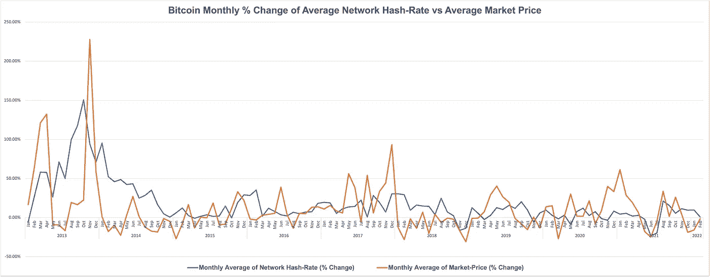
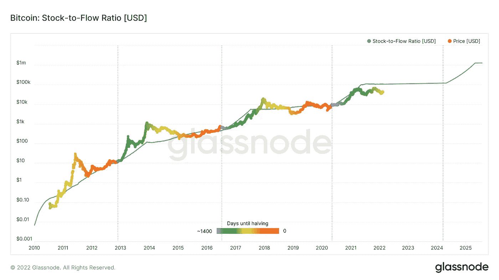
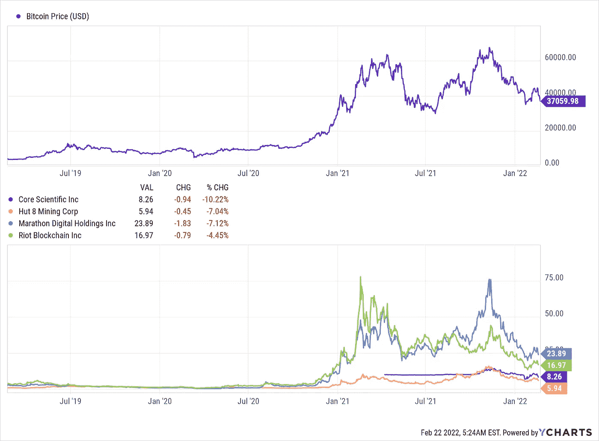
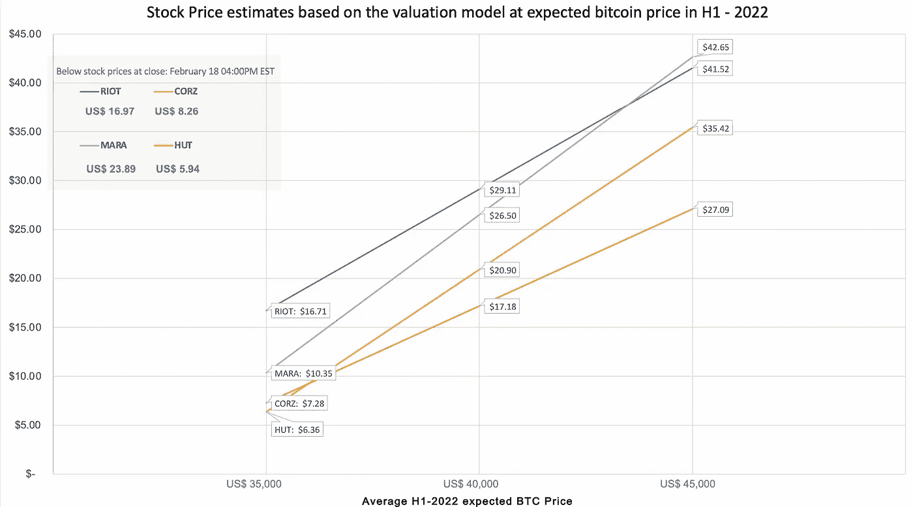

# 矿业(加密)公司估值模型

> 原文：<https://medium.com/coinmonks/mining-crypto-companies-valuation-model-925751a1dc41?source=collection_archive---------18----------------------->

过去几周，包括比特币在内的所有数字资产都面临压力，原因有很多，包括自诞生以来的高度波动性和投机性。但不断上升的通货膨胀和具有通缩效应的比特币，会成为使用比特币作为通胀对冲的理由吗，或者比特币的波动性、投机性以及没有足够长的历史会禁止它吗？当我们开始考虑比特币矿业公司的估值模型时，所有这些讨论都很重要，因为比特币的定价不仅从收入预测的角度来看很重要，从功耗的角度来看也很重要。电力或能源消耗不仅是采矿企业生存的主要因素，也是生态系统进一步发展和区块链周边新的未来使用案例的主要因素。

但为什么我只分析比特币矿业公司，因为将比特币作为区块链估值，将 BTC 作为加密货币估值非常复杂或不可能？原因是，比特币网络是最透明、最开放的网络，所有权集中度低。目前可以通过开源数据(作为公共区块链)进行网络和定价分析，并且可以利用各种可用的数据点，如网络相关的过去数据和近期/长期未来预测，如 hashrate、难度、下一个减半时间范围、交易量、流通供应量、交易数量、唯一活动地址、速度、矿工收入和费用、持有人供应和头寸变化、持有人净未实现利润/损失、MVRV 比率(经调整的已实现价值)等。

在分析比特币挖矿公司时，第一步也是关键的一步是分析比特币挖矿公司的收入，这是根据公司开采的比特币计算的。因此，比特币的价格动态非常关键。如果比特币的价格很高，那么公司可以通过增加更多的矿工和增加他们的哈希值来继续投资未来的产能扩张，从而实现相对于整个网络哈希值的更高比率。在过去，比特币价格的下降导致了无利可图的矿工的采矿设施的关闭，而比特币价格的上涨导致了更多大型和工业规模的采矿农场的建立。下图显示，当比特币价格的增长率下降时，随之而来的是总网络哈希率的下降，而价格的上升则是总网络哈希率增长率的上升。由于供应链问题，增加网络哈希值的滞后受到影响，我们可以看到，2020 年后，由于新矿工的延迟供应，有接近 5-6 个月的时滞，而之前接近 2-3 个月。而价格下降和网络价格下降的滞后时间几乎是 1 个月。

Source: Author

网络散列和难度(尽管难度也有滞后效应)相互关联，因为找到一个块的时间几乎保持在 10 分钟(即找到有效块的散列所需的时间)。每个街区目前有 6.25 个硬币的补贴和费用奖励。整体补贴大约每 4 年减半，由于可开采的 2100 万比特币数量有限(直到 2140 年)，比特币具有通缩效应。下一次减半估计发生在 2024 年 4 月左右，届时补贴将为 3.125 个硬币。估计随着每一个减半事件的发生，交易费用或费用奖励还会继续上涨。

各种分析师预测，与 2022 年 2 月 18 日相比，2024 年比特币价格将在 1.5 倍至 5.9 倍之间，这一价格排除了其他人认为 CBDC(央行数字货币)将迫使比特币最终在短时间内停止所有价值的观点。美联储 2022 年 1 月的论文[货币与支付:数字化转型时代的美元](https://www.federalreserve.gov/publications/files/money-and-payments-20220120.pdf)为关于 CBDCs 的透明公共对话迈出了良好的一步。

库存与流量(S/F)比率(2019 年由[计划](/@100trillionUSD/modeling-bitcoins-value-with-scarcity-91fa0fc03e25)引入的指标)是一个广泛使用的模型，用于解释为什么黄金和白银不同于其他商品，因为稀缺性推动了价值。减半增加了稀缺性，因此在前三次减半事件后，价格已经上涨。然而，减半的效果不是立竿见影的，可能需要 12-15 个月才能在市场价格中反映出来。

下面是来自 Glassnode 的信噪比图表。

Source: Glassnode

我相信比特币会继续存在，并将继续成为一种资产，许多上市的比特币开采公司正在将开采的比特币“打包”到资产负债表上，一些公司同时也在购买。

我们将在使用上述分析的估值模型中使用比特币价格的多个场景。

**估值模型**

对于比特币矿业公司的估值，一种不同的方法将更合适，因为比特币具有通缩效应，大多数矿业公司都采用“HODL 化”策略，因此它们将收购的比特币作为无形数字资产持有。对这些公司进行估值也可以基于比特币是它们的基础货币。一些研究人员将净硬币价值(NCV)和调整后硬币价值(ACV)作为一种估值模型，因为该模型提供了根据无形数字资产在未来给定时间点的价值以及公司基于其投资的增长能力来评估矿业公司价值的灵活性。所有现金流出(非比特币产生的估值相关费用)将在发生时按比特币价格估值。

需要分析的两个主要成本是资本支出或采矿机增加和稳定的支出(因为采矿机的使用寿命约为。第二是电力或能源的成本。

就采矿者而言，上市公司在其年度和季度文件中披露了采矿者未来交付的成本，其范围从 20 美元/秒到 103 美元/秒。除了这些价格之外，还有分阶段交付时间表，可以假设从采购预付款到 100%运营状态的时间周期为 6-15 个月(取决于采购订单的大小)。我们将需要调整每季度或每半年采购和运营的矿工人数(公司采矿哈希表的平均值)，同样，我们将调整整体网络哈希表，以得出每个时期合理计算的矿工人数。难度(因为有滞后效应)可以通过对网络散列和难度的过去数据进行回归来推断。回归的 R 平方为 98%，并考虑到了夸大的预测，即如果我们对每个新区块使用标准的 10 分钟，则每月/每季度/每年开采的比特币数量会增加。

比特币挖矿的另一项主要费用，即电力或能源成本，可以从上面计算的矿工人数及其能源效率的加权平均值中推导出来。以有吸引力的价格与电力公司或使用可再生能源的公司达成协议的公司，将在面对比特币价格波动时拥有长期优势。一些矿业公司也在使用或计划使用液体冷却技术来降低能耗，这将有助于他们提高毛利润。

上市公司在其季度和年度报告中表示，其能源协议价格从 0.022 美元到 0.05 美元不等。如果我们将可再生能源也加入到总能耗中，我们可以得出不同公司的能耗计算值，从 0.018 美元到 0.05 美元不等。许多与电力公司有长期协议的公共矿业公司也有以商定的价格将多余或未使用的容量转售给电力公司的安排。通常，该义务是至少 80%的合同电力必须作为固定成本支付。这些安排在公司 hashrate 容量减少的情况下特别有用。

房地产、冷却、安装等成本。很重要，但取决于公司的电网容量，与电力成本相比，这些成本往往会变得更小，以至于对于大型工业规模的矿区来说，在进行估价时，这些成本可能变得微不足道。但是，它们不应该被忽视，因为它们会影响未来的现金流。

预测直接采矿成本和 SG&A 的最佳代理是公司的哈希表预测、矿工人数和自采矿能力。

除了网络和公司哈希表预测、资本支出、SG&A 费用之外，需要用于调整的其他重要输入有

1.联营费(如果是采矿联营成员，通常为 2%)

2.基础设施正常运行时间百分比假设

3.比特币价格波动导致的差异

4.未来矿商价格走势

5.个人防护设备的使用寿命

许多矿业公司也在投资一些项目，这些项目可以帮助他们围绕核心矿业业务创建一个生态系统。这些投资需要单独考虑，因为有些投资可能会对业务产生“蚕食”效应，但是公司必须投资相关的协同项目，因为生态系统将增加公司未来的增长率。

我根据“比特币净价值”对估值进行了建模，公司希望将比特币持有量最大化作为其核心战略。已经采取了以下假设

1.网络散列值预计会表现出一定的季节性，冬季散列值的增长略低于夏季。假设 2021 年下半年平均网络哈希速率约为 282 EH/s

2.比特币价格 CAGR 假设为 26%(基于比特币将在 3 年内翻倍的假设)

3.减半日期假定为 2024 年 4 月 1 日

4.没有新的债务和股权融资，即公司将从资产负债表上持有的无形资产(即比特币)中自筹资金

此处提供的信息来自该公司的美国证券交易委员会的文件和 MD&A，网站，雅虎财经和其他公共来源。

我入围了 Core Scientific，Inc .(CORZ)、Hut 8 Mining Corp. (HUT)、Marathon Digital Holdings，Inc. (MARA)和 Riot Blockchain，Inc [RIOT]，使用上述的净硬币价值模型进行估值。

下图给出了比特币价格和 CORZ、HUT、MARA、RIOT 的股价走势。

Source: YCharts

这些公司的电力/能源合同从 2.4 美分到 4.2 美分不等(MARA 的 4.2 美分包括电力和托管成本)

任何比特币矿业公司的另一个关键因素是通过矿商购买和预购进行未来产能规划，因为矿商的价格会根据需求(包括交货时间表)而变化。对于不同的矿业公司，在过去的 12 个月中，已经披露了不同供应商的矿工采购价格，其范围从接近 20 美元/秒到 83 美元/秒。CORZ、MARA 和 RIOT 已经宣布到 2022 年底进行非常积极的产能扩张，即分别为 15 EH/s (CORZ)、13.3 EH/s (MARA 到 2022 年中期)和 12.8 EH/s (RIOT)。为了便于计算，我取了一个近似值。每家公司在 2022 年交付的新采购的矿业公司采购披露的加权平均值为美元/秒。

对于每家公司，我采用矿工总数、在给定时间点部署的加权平均能效作为采矿总直接成本以及 SG&A 费用的代理。

矿工的使用寿命假定为 3 年，在进行估价时，已经考虑了未来的资本支出计划(包括扩张和替换旧矿工)和旧矿工的 5%残值。

基于估值模型，计算出的股票价格见下图。

Source: Author

这种估值模型对 RIOT、Hut 8 Mining Corp. (HUT)和 Core Scientific，Inc .(CORZ)很有效，股价一直与 H1–2022 年的比特币平均估计价格 35，000 美元(此后为比特币价格的 26% CAGR)接近，但在比特币估计价格 40，000 美元(此后为比特币价格的 26% CAGR)时估值较低。马拉松数字控股有限公司(Marathon Digital Holdings，Inc .)(MARA)基于上述模型的定价似乎过高，同样估计平均比特币价格为 35，000 美元，但它与估计平均比特币价格 40，000 美元非常接近。

上述价格基于截至 2022 年 2 月 18 日的财务数据和总流通股。所使用的比特币价格是 2022 年 H1 可能的平均价格情景，此后是 26%的 CAGR。

该模型提供了查看内在估值的能力，并可以通过将其与其他估值模型(如使用销售额、预测散列倍数或其他比率)进行比较来帮助得出公允价值。

比特币价格长期停留在 35，000 美元以下将增加矿业公司通过股权或债务筹集更多资金的压力，比特币价格低于 30，000 美元将使许多矿业公司难以以可接受的成本筹集更多资金。

假设 2025 年 Q1/Q2 的比特币价格接近 80，000 美元，该估值模型涵盖的所有股票目前都被低估，根据管理层的披露及其计划执行情况，预计在一段时间内将提供健康的回报。

如前所述，管理层投资与矿业公司运营协同的高增长项目的能力将提供更高的未来增长率和公司的整体估值，包括增加增长率的稳定性。

比特币将保持波动，直到机构投资者开始将它加入他们的投资组合，用于他们的资金管理和其他战略举措。因此，无论是比特币还是相关股票，我们都将继续见证回报的波动！

*声明:我在文章中提到的任何公司中不拥有任何股票、期权或衍生头寸，所表达的观点是我自己的观点，仅供参考。截至本文发表之日，我与本文中提到的任何公司都没有商业关系。我拥有加密货币和代币的个人投资。*

> 加入 Coinmonks [电报频道](https://t.me/coincodecap)和 [Youtube 频道](https://www.youtube.com/c/coinmonks/videos)了解加密交易和投资

# 另外，阅读

*   [CryptoHopper 替代品](/coinmonks/cryptohopper-alternatives-d67287b16d27) | [HitBTC 审查](/coinmonks/hitbtc-review-c5143c5d53c2)
*   [CBET 评论](https://coincodecap.com/cbet-casino-review) | [库科恩 vs 比特币基地](https://coincodecap.com/kucoin-vs-coinbase)
*   [折叠 App 审核](https://coincodecap.com/fold-app-review) | [Kucoin 交易机器人](/coinmonks/kucoin-trading-bot-automate-your-trades-8cf0ca2138e0) | [Probit 审核](https://coincodecap.com/probit-review)
*   [如何匿名购买比特币](https://coincodecap.com/buy-bitcoin-anonymously) | [比特币现金钱包](https://coincodecap.com/bitcoin-cash-wallets)
*   [币安 vs FTX](https://coincodecap.com/binance-vs-ftx) | [最佳(索尔)索拉纳钱包](https://coincodecap.com/solana-wallets)
*   [比诺莫评论](https://coincodecap.com/binomo-review) | [斯多葛派 vs 3Commas vs TradeSanta](https://coincodecap.com/stoic-vs-3commas-vs-tradesanta)