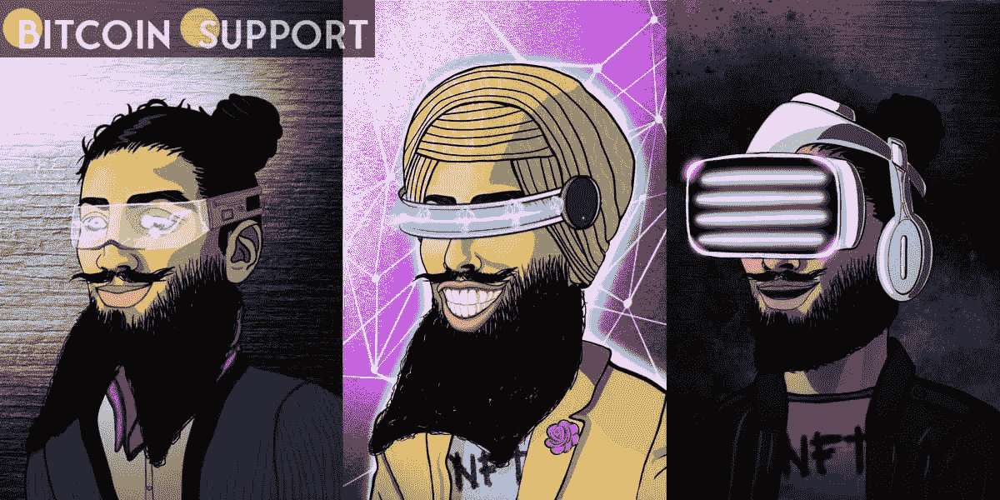
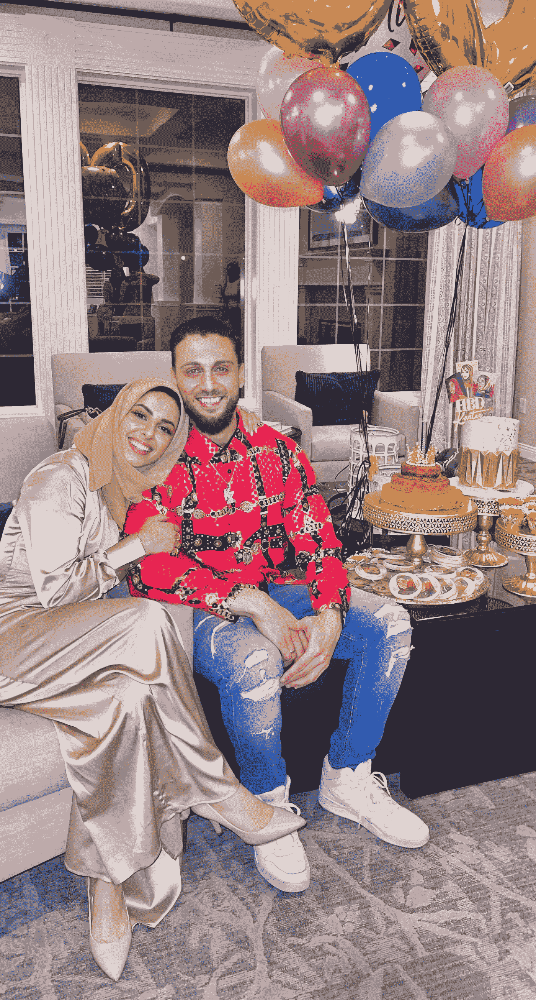
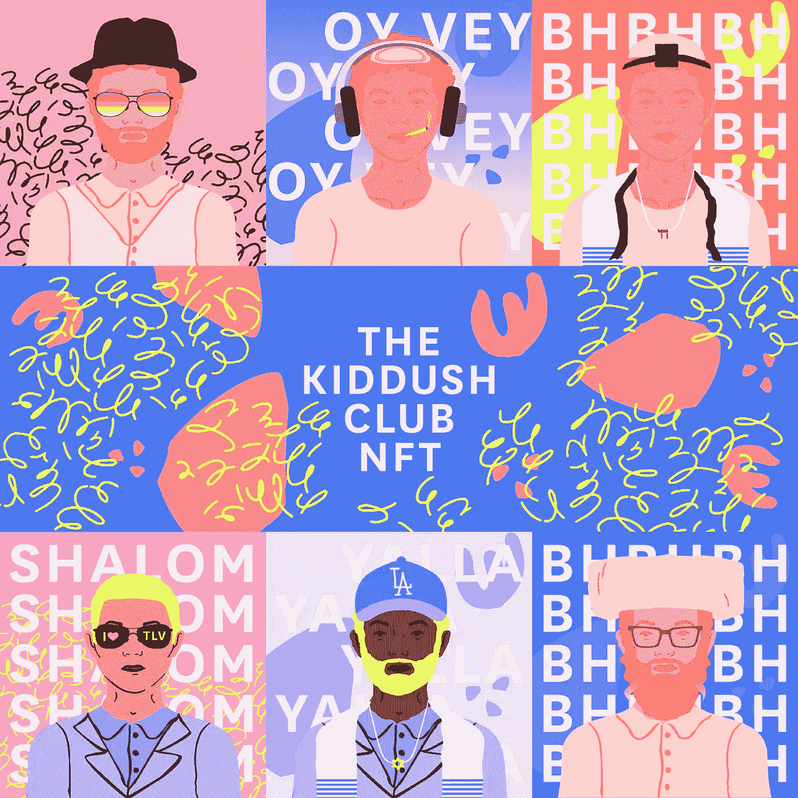

# 少数民族推广他们的文化是一个新的 NFT 群体的诞生

> 原文：<https://medium.com/coinmonks/minorities-promoting-their-cultures-is-the-birth-of-a-new-nft-grouping-6532d64e2415?source=collection_archive---------94----------------------->

**Visit our website:-** [**https://bitcoinsupports.com/**](https://bitcoinsupports.com/)

犹太人、戴头巾的男性锡克教徒和戴头巾的女性是第一批尝试身份数字化扩展的人。2021 年 7 月，阿玛尔·贝迪坐在他新加坡的家中有了一个想法。

他想象了一个看起来像他的数字身份，一个不可替代的令牌(NFT)。贝迪是一个戴着头巾的锡克教徒，一个与世界第五大宗教锡克教相关的宗教身份。

贝迪设想了一个 NFT 平台，该平台将捕捉他的人民的各种身份，并为代表不足的元宇宙社区带来代表性。MetaSikhs 是它的名字。大约在同一时间，Doaa Alhawamdeh 和 Karter Zaher 也迷恋上了类似的想法——向 NFT 世界提供代表元宇宙穆斯林的“第一个标志”。他们为 NFT 选择了希贾比女王和大胡子国王的名字。尽管缺乏协调，没有意识到对方的存在，也没有集体行动，柳文欢和他的妻子丽贝卡在蒙特利尔设想了一个惊人的相同的计划——“第一个犹太 NFT 项目”一个由 3600 件数字艺术作品组成的收藏馆被称为“Kiddush 俱乐部”这对夫妇选择了“Kiddush Club”这个名字，因为这也是一个俚语，指犹太人在安息日祈祷仪式期间或之后以有趣的方式交往，出于对隐私的考虑，他们要求不要公布自己的姓氏。支撑这些 NFT 努力的理论都是由相似的冲突历史所激发的。

**NFT 是冲突的结果。**

根据丽贝卡和柳文欢的说法，近年来的“疯狂反犹浪潮”引发了他们的想法。与此同时，俄罗斯总统弗拉基米尔·普京威胁要“去纳粹化”乌克兰，这让观察人士指出乌克兰犹太总统的讽刺意味。在战斗的迷雾中，身份和团结是这对搭档的重要激励因素。

“犹太社区有很多焦虑，我们试图教育人们，保护社区，保卫我们自己，但这很困难。”这是一个很大的挑战。这对我个人来说是个打击。所以，从有趣的角度来说，这是为了让社区团结起来，”丽贝卡解释道。对这对新婚夫妇来说，这不仅仅是表面上的冲突。在失去他们的第一个孩子，一个 4 岁的儿子后，这也是内部的。正如你将观察到的，这个项目中设计了许多不同的特征。其中一些是残疾包容性的，因此有助听器和轮椅，以及其他犹太风格。我们的儿子生来就有严重的疾病。所以他是很多事情背后的驱动力，”她解释道。

Hijabi Queens 的设计师 Alhawamdeh 和 Zaher 是一对巴勒斯坦-约旦夫妇。Alhawamdeh 的动机也是多方面的，她的“祖父母是巴勒斯坦难民”发挥了重要作用。

“他们被强行从巴勒斯坦驱逐到我父母出生的约旦，被粗暴地扔进拘留营。“我的父母在 20 世纪 90 年代去美国寻找美国梦，我出生在纽约市，”Alhawamdeh 说。

**Visit our website:-** [**https://bitcoinsupports.com/**](https://bitcoinsupports.com/)

她说他们都有“饱受战争摧残的过去”当卡特 12 岁时，他设法逃离了黎巴嫩内战。"

MetaSikhs 由贝迪、卡伦·艾莉亚和 D-jeetal(化名)组成，目标是“真正理解这个空间和 NFT 真正是如何工作的”，以及历史。

1907 年发生了针对锡克教徒的仇恨犯罪，2021 年发生了枪支暴力，2022 年偏见和暴力仍在发生。

“这是提高对锡克教认识的一个很好的例子，”贝迪评论道。

**容忍差异**

尽管这些 NFT 项目的设计者们并不知道其他类似项目的存在，但他们感受到了一种相互肯定和喜悦的感觉。

“我完全被它迷住了。事实上，我们左边和下边的邻居都是犹太人，我们和他们一起分享“家庭餐”(笑)。和他们在一起，我们有着奇妙的友谊。“我个人喜欢看到少数民族坚持他们的传统和价值观，只要他们善待他们的邻居，不试图强加给他们，”Alhawamdeh 说。

Hijabi Queens 是一项全球性计划。洛杉矶的创作者在网上寻找同事，并找到了哥伦比亚艺术家和孟加拉国的网站开发者。

这两个项目惊人地相似，因为它们都以全球代表性为目标，并鼓励社区内的亚文化。
与此同时，基德杜什俱乐部强调犹太教的许多方面。

“我们认为尝试想象所有这些不同类型的犹太人会很有趣。”无论你是德系、西班牙系、宗教或非宗教、东正教、改革派或保守派，这里都有你的一席之地。甚至那些标签也不吸引我。“对我来说，犹太人就是犹太人，不管你是谁，来自哪里，”丽贝卡说。

**Visit our website:-** [**https://bitcoinsupports.com/**](https://bitcoinsupports.com/)

Is it merely a symbol of a minority identity? Is this anything along the lines of CryptoPunk or Bored Ape, but with a new kind of art?

The architects of the NFT highlight that this is about more than merely representing a minority identity. MetaSikhs, according to Bedi, provides collectors with a colourful and vibrant expression of their identity, allowing them to “connect global communities via art influenced by culture.”

The Hijabi Queens team is inspired by the NFT’s role in “solidifying a network of Muslim artists and entrepreneurs” and how it “serves to solidify a network of Muslim creators and entrepreneurs.”

“While we hope the NFT functions as a digital identity for Jews in the same way that CryptoPunks or the Bored Ape Yacht Club acts as a social signal,” Rebecca remarked.

Holders of all three platforms are promised a variety of additional resources. For example, access to specific Discord channels, in-person events, master classes, and networking possibilities.

Holders of The Kiddush Club token (TKC) will have the power to vote on which organisations the club supports, and MetaSikhs intends to involve the community after the first collection is launched. Hijabi Queens has not yet divulged its governance rights, but it does have communication mechanisms in place to encourage strong debate in order to shape the platform’s future.

**Appropriation of a culture?**

These NFT producers have been questioned about rug pulls and profiting off cultural appropriation.

“A lot of people believe this is a hoax.” “A large part of why we’re doing this is to bring on a lot of new individuals and do a lot of teaching in the NFT sector while also instilling a feeling of Jewish pride,” Oren explained.

“For the amount of time we’ve invested, the aim was never to produce x amount of money that would send us to the moon,” Bedi explained.

Rather, the project promotes cultural pride, according to the creators. While the majority of the profits will go to the artists, a portion of the profits will be donated to charity.

Both the Kiddush Club and the MetaSikhs have dedicated 10% of their earnings to charity, as dictated by their faiths. MetaSikhs has also pledged to reinvest 5% of its primary revenues in developing artists’ NFT art.

Education is also important to their concept as a kind of decentralised representation. Rebecca mentioned that “onboarding the community into Web 3” is a significant goal, and that the majority of the instruction takes place on their social media channels.

Hijabi Queens’ creators have built in an educational plan to empower women by providing weekend workshops on wealth creation, crypto, financial freedom, and NFTs.

“We had to start at the beginning.” Our sisters have never heard of an NFT or crypto. These sisters are now educating others in less than a month,” Alhawamdeh stated.

The organisations’ tenets include the principle of educating through visual identity.

“We want each collector to think about every part of their MetaSikh and what it means to them to encourage a meaningful discourse with others about art, culture, and community,” Bedi added.

MetaSikhs is a platform for Bedi and his team to raise awareness about Sikhs, not just among the general public but also inside his own community.

“A lot of people don’t grasp what it means to be a Sikh.” While it’s simple to spot a turban, which becomes a hot topic of conversation — what does it mean to wear one and be a Sikh? — most people, regrettably, are unaware of the community’s essential ideals. “Meditation, earning an honest life, and practising charity are the three essential pillars, and this gets lost under the greater cultural effects of religion,” Bedi remarked.

The MetaSikhs NFTs show all shades of Sikhs, raising the question of which visual representation is most consistent with Sikhism. That query, in turn, leads to a knowledge of Sikhism’s essential values, and hence to consciousness.

Female Sikhs are also being represented digitally by MetaSikhs. Bearded Kings has a roadmap thanks to Hijabi Queens. The Kiddush Club also aspires to represent Jewish women.

Rebecca expressed her pride in working on NFTs to bring Jews into the metaverse as a woman in a male-dominated NFT sector. “There is now a fresh focus on women-focused programmes,” she said, citing the NFT’s World of Women (WoW) project as an example. It’s turned into a celebrity NFT craze.

**Celebrity alliances**

To spread the word about their unique NFTs, all three projects hope to partner with well-known persons from their respective faiths.

Hijabi Queens and Kiddush Club have already obtained celebrity partners, and MetaSikhs is in talks with celebs.

Rudy Rochman, a Jewish-Israeli rights activist who was violently removed from a London bus for being Jewish, has joined with the Club.

Zaher, a member of Hijabi Queens, used to be a musician. He just reconciled with his bandmate Jae Deen. Deen Squad is the name of their band. Deen is the Arabic word for faith, hence the band’s name literally means “faith squad.”

The band’s unique “Islamic” adaptations of contemporary billboard megahits — such as Drake’s “God’s Plan” and Camila Cabello’s “Havana” — went viral and received notice from the BBC and CBC. The two seek to develop a celebrity partnership by leveraging their previous efforts.

“We feel we have the celebrity know-how to develop celebrity collaborations in the future,” Alhawamdeh said.

**Dates and timetables**

Almost all of the creators have worked part-time, putting their own money into the ideas and forming partnerships to make them a reality. None of these projects have yet to launch, but they are expected to do so soon. The MetaSikhs collection of 2,112 NFTs went on sale in December 2021, with the coins being struck on February 21, 2022.

MetaSikhs claims to curate and build the community by offering a companion collection in an atmosphere where scam projects and rug pulls are common.

A debut date for 3,600 mensches is likely to be announced soon by the Kiddush Club. They, too, are working on new projects that will help to grow the present community.

“We’ve been getting a lot of requests for female mensches, which we’re planning to publish soon.” “We enjoy the notion of having a large community with sub-communities inside it,” Rebecca explained.

The NFTs can be purchased on any platform, even though some “urge their NFT holders to seek value in our Muslim networking utility,” as the Hijabi Queens do.

On March 2, 2022, the Hijabi Queens presale for 500 NFTs sold out in under two minutes.

**Visit our website:-** [**https://bitcoinsupports.com/**](https://bitcoinsupports.com/)

**Disclaimer: These are the writer’s opinions and should not be considered investment advice. Readers should do their own research.**