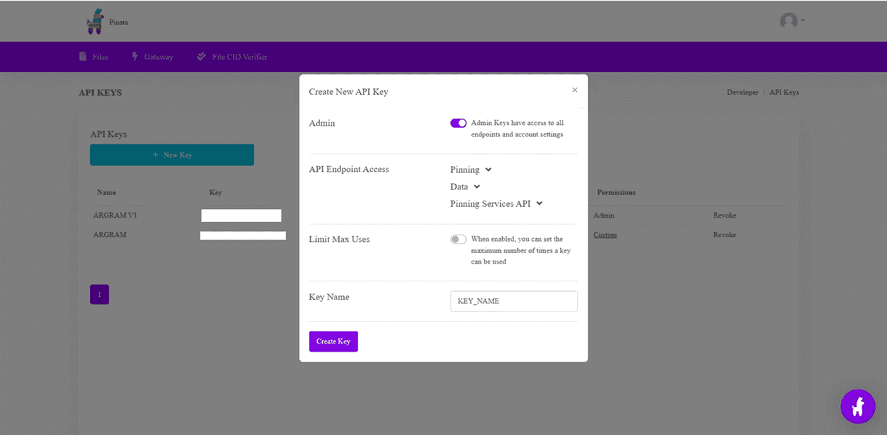

# 以分散的方式制造 NFT——使用 Alchemy，Ethers.js & Pinata APIs

> 原文：<https://medium.com/coinmonks/mint-an-nft-in-a-decentralized-manner-using-alchemy-ethers-js-pinata-apis-da69a3b83d84?source=collection_archive---------1----------------------->

## NFT 系列

## 如何使用炼金术、ethers.js 和 pinata 以分散的方式铸造 NFT 的指南

作为本文的一部分，我们试图在 Polygon Mumbai Testnet 上使用 alchemy、ethers.js 和 pinata apis 在服务器端(nodejs)创建一个 NFT。


铸造一个 NFT 就像把我们的数字资产放到区块链上，这样它们就可以在 NFT 市场上交易。

按照区块链的说法，NFT 就像是元数据的交易。显然，铸造 NFT 就是在区块链执行交易的过程。

## NFT 造币厂的建筑看起来怎么样？


NFT Architecture

## 魔力

[Alchemy](https://docs.alchemy.com/alchemy/) 是一个中间件，它使得开发人员的区块链通信更加容易。在炼金术[https://www.alchemy.com/](https://www.alchemy.com/)上创建一个免费账户，使用他们的开发平台和 API 来请求区块链。

***炼金术账户设置***


Alchemy Sign Up or Sign In

通过选择所需的区块链网络创建一个新的炼金术应用程序。


Create a new app on Alchemy

复制 HTTP URL，因为我们需要它来连接到区块链网络。


View app key details on Alchemy

*现在，我们需要将 Polygon Mumbai testnet 添加到您的 metamask 帐户中。*

添加 Alchemy URL 作为 RPC URL，并将链 ID 设置为 80001。您可以在[https://chainlist.org/](https://chainlist.org/)中验证链条 ID。MATIC 是多边形区块链中处理的令牌。


Polygon Mumbai Testnet on Metamask

## Ethers.js

Ethers.js 是一个允许我们与以太坊区块链互动的库。

安装 ethers.js，如下所示:

```
**npm install --save ethers**
```

*分散铸造 NFT，怎么做？—使用 IPFS，一个分散的存储平台，我们将在那里存储我们的 NFT 元数据。*

## IPFS &皮纳塔

[IPFS](https://docs.ipfs.io/concepts/what-is-ipfs/) (星际文件系统)是一种类似 torrent 的点对点协议。
它分散了整个文件托管过程。当我们上传一个文件到 IPFS 时，它会分布在每个节点上，然后成为一个服务器，这样就没有人能下载文件了。我们在 IPFS 托管我们的 NFT 元数据。

Pinata 是 IPFS 的一个接口，它使得在 IPFS 上保存文件变得更加容易。我们可以上传图片文件和 JSON 元数据到 Pinata。

在皮纳塔上创建一个免费账户:[https://app.pinata.cloud/signin](https://app.pinata.cloud/signin)。


Pinata Register or Sign In

创建新的 API 密钥来访问它。你将得到一个 API 密匙和一个秘密密匙。



Create API key on Pinata

*现在让我们深入研究 NFT 铸币！*

## 第一步:买一些假 MATIC

由于区块链交易必然会产生汽油费，我们需要收集一些假硬币来铸造我们的 NFT。

从这里拿一些假的 MATIC:[https://faucet.polygon.technology/](https://faucet.polygon.technology/)。

其他可用的自动水龙头:

1.  https://faucet.pearzap.com/
2.  【https://matic.supply/ 
3.  [https://www.coinclarified.com/tools/faucets/polygon](https://www.coinclarified.com/tools/faucets/polygon)
4.  [https://faucet.firebird.finance/](https://faucet.firebird.finance/)

## 步骤 2:创建一个. env 文件

的。env 文件应该包含以下详细信息:

```
**API_URL = “your alchemy URL"****PRIVATE_KEY = “metamask private key”****PUBLIC_KEY = “your metamask wallet address”****CONTRACT_ADDRESS =”deployed contract address"****PINATA_API_KEY = “pinata api key”****PINATA_SECRET_KEY = “pinata secret key”**
```

## 步骤 3:创建您的 nft.js 文件

将以下内容复制到文件中。

```
**require("dotenv").config();
const fs = require("fs");
const FormData = require("form-data");
const axios = require("axios");
const { ethers } = require("ethers");****//Grab the contract ABI
const contract = require("../artifacts/contracts/ArGram.sol/ArGram.json");****const {
 PINATA_API_KEY,
 PINATA_SECRET_KEY,
 API_URL,
 PRIVATE_KEY,
 PUBLIC_KEY,
 CONTRACT_ADDRESS
} = process.env;**
```

首先，确保您已经成功地验证了 Pinata API。

```
**const authResponse = await    axios.get("https://api.pinata.cloud/data/testAuthentication", {
        headers: {
           pinata_api_key: PINATA_API_KEY,
           pinata_secret_api_key: PINATA_SECRET_KEY,
        },
});**
```

您的 *authResponse* 应该包含一条类似于“*祝贺您！您正在与 Pinata API 通信！*”。

现在，从本地系统中读取图像文件。

```
 **const stream = fs.createReadStream(req.file.path);
 const data = new FormData();
 data.append(“file”, stream);**
```

使用 [**pinFile**](https://docs.pinata.cloud/api-pinning/pin-file) API 将图像文件上传到 IPFS。如果成功，它将返回一个 hashcode。

```
**const fileResponse = await axios.post("https://api.pinata.cloud/pinning/pinFileToIPFS", data, {
        headers: {
           “Content-Type”: `multipart/form-data; boundary=  ${data._boundary}`,
            pinata_api_key: PINATA_API_KEY,
            pinata_secret_api_key: PINATA_SECRET_KEY,
        },
 });
        const { data: fileData = {} } = fileResponse;
        const { IpfsHash } = fileData;
        const fileIPFS= `https://gateway.pinata.cloud/ipfs/${IpfsHash}`;**
```

你的 *fileIPFS* 应该像[https://gateway.pinata.cloud/ipfs/](https://gateway.pinata.cloud/ipfs/QmeK8t9Lom2AcH8s7gLpuZordcxisegwkcSJpqL46S87uC?preview=1)image-hash>

例如:[https://gateway . pinata . cloud/ipfs/qmek 8t 9 lo m2 ach 8s 7 glpuzordcxisegwkcsjpql 46s 87 UC](https://gateway.pinata.cloud/ipfs/QmeK8t9Lom2AcH8s7gLpuZordcxisegwkcSJpqL46S87uC?preview=1)

现在我们可以使用 [**pinJSON**](https://docs.pinata.cloud/api-pinning/pin-json) API 将 JSON 元数据上传到 IPFS。如果成功，它将返回一个哈希码，我们将使用这个哈希码作为 URI 到 mint 的令牌。

```
//Create NFT metadata JSON **const metadata = {
   image:** [**https://gateway.pinata.cloud/ipfs/QmeK8t9Lom2AcH8s7gLpuZordcxisegwkcSJpqL46S87uC**](https://gateway.pinata.cloud/ipfs/QmeK8t9Lom2AcH8s7gLpuZordcxisegwkcSJpqL46S87uC)**",
   name: "MyArGramNFT",
   description: "MyArGramNFT Description",
   attributes: [
        { "trait_type": "color", "value": "brown"}, 
        { "trait_type": "background", "value": "white"}
   ]
}****const pinataJSONBody = {
      pinataContent: metadata 
};
const jsonResponse = await axios.post("https://api.pinata.cloud/pinning/pinJSONToIPFS", pinataJSONBody, {
    headers: {
       “Content-Type”: `application/json`,
        pinata_api_key: PINATA_API_KEY,
        pinata_secret_api_key: PINATA_SECRET_KEY,
    },
 });
 const { data: jsonData = {} } = jsonResponse;
 const { IpfsHash } = jsonData;
 const tokenURI = `https://gateway.pinata.cloud/ipfs/${IpfsHash}`;**
```

你的 tokenURI 应该像[https://gateway.pinata.cloud/ipfs/](https://gateway.pinata.cloud/ipfs/QmeK8t9Lom2AcH8s7gLpuZordcxisegwkcSJpqL46S87uC?preview=1)JSON-hash>

例如:[https://gateway . pinata . cloud/ipfs/qmammqqqdpmk 4 auyfgja 9 ni 7 chezxekmzqlhjbgakhax](https://gateway.pinata.cloud/ipfs/QmammqqQDpmk4oAuyfgJA9Ni7ChEzxEkmzQLLhjbGAKHax?preview=1)

最后，我们可以铸造我们的令牌 URI，我们从 IPFS json 上传。调用我们在智能契约中编写的 ***mintNFT*** 方法。参考下面给出的智能合同:

[](https://coinsbench.com/erc-721-nft-smart-contract-deployment-using-hardhat-97c74ce1362a) [## ERC-721 (NFT)智能合同部署—使用安全帽

### 关于如何编写和部署 ERC-721 标准智能合同的指南

coinsbench.com](https://coinsbench.com/erc-721-nft-smart-contract-deployment-using-hardhat-97c74ce1362a) 

使用您的私钥签署交易。

```
**const provider = new ethers.providers.JsonRpcProvider(API_URL);
const wallet = new ethers.Wallet(PRIVATE_KEY, provider);
const etherInterface = new ethers.utils.Interface(contract.abi);**// Get latest nonce **const nonce = await provider.getTransactionCount(PUBLIC_KEY, "latest");**// Get gas price **const gasPrice = await provider.getGasPrice();**// Get network **const network = await provider.getNetwork();
const { chainId } = network;**//Transaction object **const transaction = {
   from: PUBLIC_KEY,
   to: CONTRACT_ADDRESS,
   nonce,
   chainId,
   gasPrice,
   data: etherInterface.encodeFunctionData("mintNFT", 
         [ PUBLIC_KEY, tokenURI ]) 
};**//Estimate gas limit **const estimatedGas = await provider.estimateGas(transaction);
transaction["gasLimit"] = estimatedGas;**//Sign & Send transaction **const signedTx = await wallet.signTransaction(transaction);
const transactionReceipt = await provider.sendTransaction(signedTx);
await transactionReceipt.wait();
const hash = transactionReceipt.hash;
console.log("Your Transaction Hash is:", hash);**// Get transaction receipt **const receipt = await provider.getTransactionReceipt(hash);
const { logs } = receipt;**// Get token ID **const tokenInBigNumber = ethers.BigNumber.from(logs[0].topics[3]);
const tokenId = tokenInBigNumber.toNumber();
console.log("Token ID minted:", tokenId);**
```

您将会得到类似这样的回应:

```
**Your Transaction Hash is: 0x9732ca53cfb6b8e29e13873b51407f431bc798cbe3abe82ea110c0e5924506c8** **Token ID minted: 1**
```

你可以在孟买[的 polygonscan](https://mumbai.polygonscan.com/) 上搜索这个交易散列。


Transaction on Mumbai Polygonscan

太好了！您已经在多边形孟买测试网上成功铸造了您的第一个 NFT。

**造币快乐:)**

> *加入 Coinmonks* [*电报频道*](https://t.me/coincodecap) *和* [*Youtube 频道*](https://www.youtube.com/c/coinmonks/videos) *了解加密交易和投资*

# 另外，阅读

*   [Bookmap 评论](https://coincodecap.com/bookmap-review-2021-best-trading-software) | [美国 5 大最佳加密交易所](https://coincodecap.com/crypto-exchange-usa)
*   最佳加密[硬件钱包](/coinmonks/hardware-wallets-dfa1211730c6) | [Bitbns 评论](/coinmonks/bitbns-review-38256a07e161)
*   [新加坡十大最佳加密交易所](https://coincodecap.com/crypto-exchange-in-singapore) | [购买 AXS](https://coincodecap.com/buy-axs-token)
*   [红狗赌场评论](https://coincodecap.com/red-dog-casino-review) | [Swyftx 评论](https://coincodecap.com/swyftx-review) | [CoinGate 评论](https://coincodecap.com/coingate-review)
*   [投资印度的最佳密码](https://coincodecap.com/best-crypto-to-invest-in-india-in-2021)|[WazirX P2P](https://coincodecap.com/wazirx-p2p)|[Hi Dollar Review](https://coincodecap.com/hi-dollar-review)
*   [加拿大最好的加密交易机器人](https://coincodecap.com/5-best-crypto-trading-bots-in-canada) | [库币评论](https://coincodecap.com/kucoin-review)
*   [用于 Huobi 的加密交易信号](https://coincodecap.com/huobi-crypto-trading-signals) | [HitBTC 审核](/coinmonks/hitbtc-review-c5143c5d53c2)