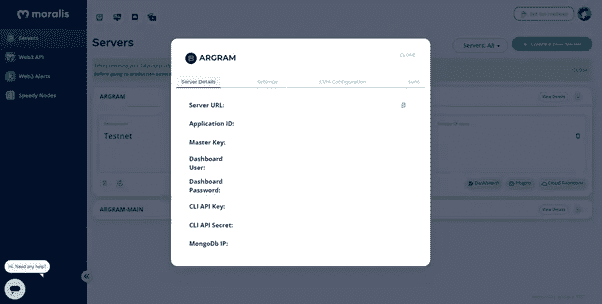

# 以分散的方式打造 NFT——使用 Moralis 和 Web3js

> 原文：<https://medium.com/coinmonks/mint-an-nft-in-a-decentralized-manner-using-moralis-web3js-9e9c12abda05?source=collection_archive---------6----------------------->

## NFT 系列

## 如何在 moralis 和 web3js 的帮助下以分散的方式铸造 NFT 的指南

作为本教程的一部分，我们正试图在 Polygon Mumbai Testnet 上使用 Moralis 和 Web3js 创建一个 NFT。


铸造一个 NFT 就像把我们的数字资产放到区块链上，这样它们就可以在 NFT 市场上交易。

按照区块链的说法，NFT 就像是元数据的交易。显然，铸造 NFT 就是在区块链执行交易的过程。

## 道德

一个人可以通过许多方式向区块链提出要求。但是 Moralis 提供了连接到交叉链的最容易和最简单的方法。 [Moralis](https://docs.moralis.io/introduction/readme) 是一个帮助我们快速构建跨链 dapps 的软件或中间件。使用 moralis，我们可以在以太坊、多边形、Solana、BSC 和 Avalanche 等任何区块链上构建和部署 dapps。作为开发人员，我们不需要为每个区块链定制我们的 dapp，因为 moralis 会做必要的工作。通过使用 Moralis，创建 NFT 的整个过程可以变得尽可能简单。

**T5【道德家账号和服务器设置】T6**

1.  创建一个免费的道德账户:[https://admin.moralis.io/login](https://admin.moralis.io/login)


Moralis Sign Up or Sign In

2.创建新的服务器取决于处理 testnet 或 mainnet 的要求。首先，在进入 mainnet 之前探索一下 testnet。


Moralis Server

3.通过给 testnet 服务器命名并选择要使用的地区和区块链，创建一个 Moralis 实例。


Moralis Instance

4.复制服务器 URL、应用程序 ID 和主密钥，因为我们需要这些服务器详细信息来连接 Moralis。



Moralis Server Details

*现在，我们的 Moralis 服务器启动了，接下来呢？—我们需要将 Polygon Mumbai testnet 添加到您的 metamask 帐户。*

Moralis 提供了快速节点来快速连接到相应的区块链。


Moralis Speedy Nodes Endpoints

使用多边形孟买快速节点端点作为 RPC URL。多边形孟买测试网的链 ID 是 80001。您可以在[https://chainlist.org/](https://chainlist.org/)中验证链条 ID。MATIC 是多边形区块链中处理的令牌。


Mumbai Testnet in Metamask

## Web3js

Web3js 是一个允许我们与以太坊区块链互动的库。

按如下方式安装 web3:

```
npm install web3
```

*如何分散铸造 NFT？—使用 IPFS 分散存储解决方案。向 Moralis 致敬，因为它为 IPFS 提供了本地支持，这样我们就不需要单独处理 IPFS 了。*

## IPFS

[IPFS](https://docs.ipfs.io/concepts/what-is-ipfs/) (星际文件系统)是一种类似 torrent 的点对点协议。
它分散了整个文件托管过程。当我们上传一个文件到 IPFS 时，它会分布在每个节点上，成为一个服务器，这样就没有人能下载文件。我们在 IPFS 托管我们的 NFT 元数据。

*现在让我们进入铸造 NFT 的过程。*

## 步骤 1:在 nodejs 项目中安装 Moralis 包

```
npm install moralis/node
```

## 步骤 2:初始化您的 Moralis 服务器

```
require("dotenv").config();
const express = require("express");
const Moralis = require(“moralis/node”);
const app = express();const { PORT, MORALIS_SERVER_URL, MORALIS_APP_ID, MORALIS_MASTER_KEY,} = process.env;app.listen(port, async () => { await Moralis.start({ serverUrl: MORALIS_SERVER_URL, appId: MORALIS_APP_ID, masterKey: MORALIS_MASTER_KEY, });});
```

## 第三步:创建。环境文件

你的。env 文件应该如下所示:

```
MORALIS_SERVER_URL = "moralis server URL"MORALIS_APP_ID = "moralis app Id"MORALIS_MASTER_KEY = "moralis master key"PORT = "port"PRIVATE_KEY = "metamask private key"PUBLIC_KEY = "your metamask wallet address"CONTRACT_ADDRESS = "deployed contract address"POLYGON_MUMBAI_RPC_PROVIDER = "moralis Mumbai Speedy Node RPC URL"
```

## 步骤 2:创建您的 nft.js 文件

将以下内容复制到文件中。

```
require("dotenv").config();const Web3 = require("web3");const request = require("request-promise");const fs = require("fs");const contract = require("../artifacts/contracts/ArGram.sol/ArGram.json");const provider = new Web3.providers.HttpProvider(POLYGON_MUMBAI_RPC_PROVIDER);const web3 = new Web3(provider);web3.eth.accounts.wallet.add(PRIVATE_KEY);const nftContract = new web3.eth.Contract(contract.abi, CONTRACT_ADDRESS);fs.readFile(req.file.path, async (err, buffer) => { const image = buffer.toString("base64");
    const contentType = req.file.mimetype; //Upload image file to IPFS
    const file = new Moralis.File("file", image, contentType);
    await file.saveIPFS({ useMasterKey: true });
    const fileIPFS = file.ipfs(); //Create JSON metadata
    const metadata = {
       name: "MyNFT",
       description: "MyNFT Description",
       image: fileIPFS,
    }; //Upload JSON metadata to IPFS
    const toBtoa = Buffer.from(JSON.stringify(metadata)).toString("base64");
    const json = new Moralis.File(`MyNFT-meta.json`, { base64: toBtoa });
    await json.saveIPFS({ useMasterKey: true });
    const tokenURI = json.ipfs(); //Mint NFT
    const nonce = await web3.eth.getTransactionCount(PUBLIC_KEY, “latest”);
    const transaction = {
        from: PUBLIC_KEY,
        to: CONTRACT_ADDRESS,
        nonce: nonce,
        gas: 500000,
        data: nftContract.methods
                     .mintNFT(PUBLIC_KEY, tokenURI)
                     .encodeABI(),
    };
    const signPromise = await web3.eth.accounts.signTransaction(
        transaction,
        PRIVATE_KEY
    );
    const signedTransaction = await web3.eth.sendSignedTransaction(
        signPromise[“rawTransaction”]
    );
    const hash = signedTransaction[“transactionHash”];
    console.log('The transaction hash is:', hash);
}
```

您将得到一个事务哈希，如下所示:0x 9732 ca 53 CFB 6 b 8 e 29 e 13873 b 51407 f 431 BC 798 CBE 3 Abe 82 ea 110 c 0 e 5924506 c 8

你可以在 mumbai [polygonscan](https://mumbai.polygonscan.com/) 上搜索这笔交易。


Transaction on Mumbai Polygonscan

太好了！您已经成功地铸造了您的第一个多边形孟买网络 NFT。

## **造币快乐！**

> 加入 Coinmonks [电报频道](https://t.me/coincodecap)和 [Youtube 频道](https://www.youtube.com/c/coinmonks/videos)了解加密交易和投资

# 另外，阅读

*   [如何在 FTX 交易所交易期货](https://coincodecap.com/ftx-futures-trading) | [OKEx vs 币安](https://coincodecap.com/okex-vs-binance)
*   [CoinLoan 评论](https://coincodecap.com/coinloan-review) | [YouHodler 评论](/coinmonks/youhodler-4-easy-ways-to-make-money-98969b9689f2) | [BlockFi 评论](https://coincodecap.com/blockfi-review)
*   [XT.COM 评论](https://coincodecap.com/profittradingapp-for-binance)币安评论 |
*   [SmithBot 评论](https://coincodecap.com/smithbot-review) | [4 款最佳免费开源交易机器人](https://coincodecap.com/free-open-source-trading-bots)
*   [比特币基地僵尸程序](/coinmonks/coinbase-bots-ac6359e897f3) | [AscendEX 审查](/coinmonks/ascendex-review-53e829cf75fa) | [OKEx 交易僵尸程序](/coinmonks/okex-trading-bots-234920f61e60)
*   [如何在印度购买比特币？](/coinmonks/buy-bitcoin-in-india-feb50ddfef94) | [瓦济克斯评论](/coinmonks/wazirx-review-5c811b074f5b)