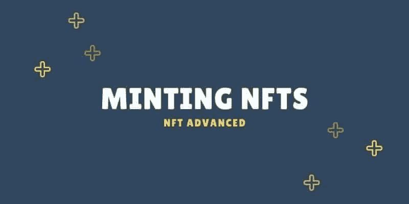
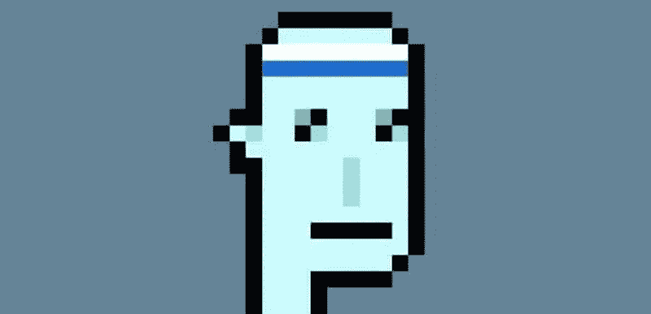
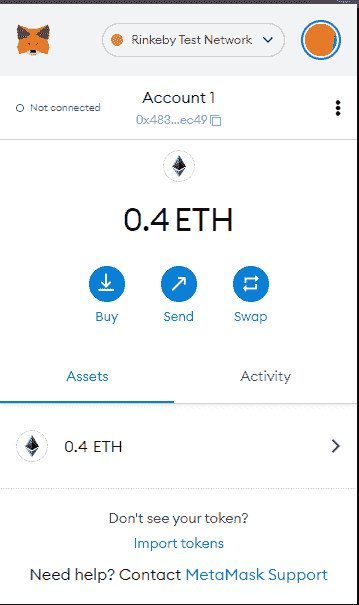
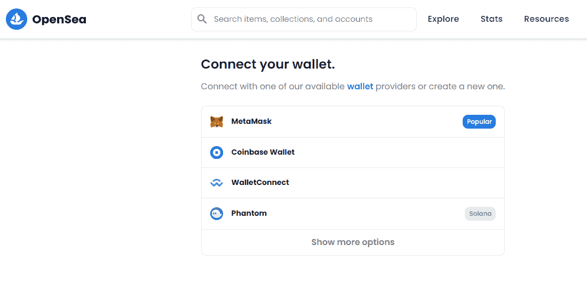
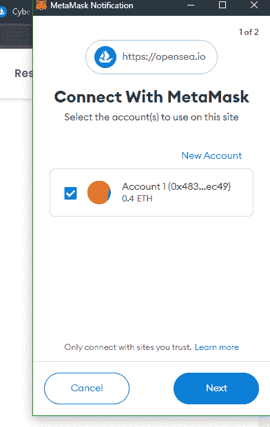
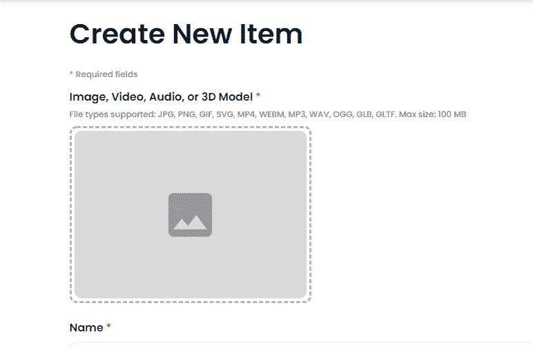
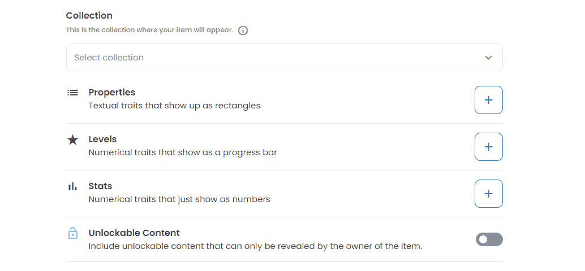

# 如何在 OPENSEA 铸造你的第一个 NFT

> 原文：<https://medium.com/coinmonks/mint-your-first-nft-on-open-sea-771c04c187cf?source=collection_archive---------36----------------------->

NFT 是去中心化世界的新未来，虽然许多人认为这只是另一个被过度宣传的游戏，但我不得不反对交易市场的数量，如 [Opensea](https://opensea.io/) 、[币安市场](https://accounts.binance.com/en/registerFlow?ref=BD0UHTG3&msclkid=6cb19229d83512f0e4f2f07737e48438)和许多其他市场。NFT 是去中心化世界的新未来。与此同时，许多人觉得这只是另一个被夸大的玩物。

[皮普尔](https://onlineonly.christies.com/s/beeple-first-5000-days/beeple-b-1981-1/112924)以 6900 万美元的价格卖出了第一个 5000 天NFT。

赛博朋克是销量最高的非功能型电脑之一，其最便宜的 NFT 价格约为 193，000 美元，所以非功能型电脑会一直存在，你越早加入越好。

为了证明未来就在眼前，我不得不同意交易市场的交易量

赛博朋克是销量最高的非功能性摇滚乐队之一，其最便宜的 NFT 大约为 193，000 美元，所以非功能性摇滚乐队会一直存在，越早加入越好。

这篇文章将分解创建你的第一个 NFT 的步骤，但是如果你害怕编码，那么不要担心。我们掩护你。

如果你是初学者，并且希望现在就进入，请阅读下面的步骤。

# 什么是铸造

铸造 NFT 是指将数字文件转化为以太坊或任何其他网络上的加密收藏品或数字资产。数字文件存储在分散的数据库中。

# 我们如何造币

NFT 是储存在区块链网络上的数字资产，要开始铸造，你需要有一个钱包，但不要担心；有这么多钱包供你选择。

*   [信任钱包](http://ttps://trustwallet.com)
*   [Metamask 钱包](https://duckduckgo.com/?q=metamask+download&atb=v316-1&ia=web)
*   Trezor
*   [出埃及记](https://www.exodus.com/)
*   [Luno](https://www.luno.com/wallet/)

对于这篇文章，我将使用 [Metamask 钱包，](https://duckduckgo.com/?q=metamask+download&atb=v316-1&ia=web)我也将在最重要的市场 [Opensea](https://opensea.io/) 上传我的 NFT

*   第一步

转到[元掩码](http://metamask.io/)并下载扩展。钱包将作为浏览器扩展应用程序下载。

下载后，这些步骤很容易遵循，因为你需要设置你的种子短语，这是非常重要的，你保持隐私，因为任何人都可以得到它拿走你所有的钱。

*   第二步

进入右边的 Opensea，点击连接钱包，会出现一个下拉菜单，点击 metamask，将你的钱包连接到 Opensea。

*   第三步

将 Metamask 钱包连接到 OpenSea 平台后，让我们创建第一个 NFT。

点击“创建”按钮，你就上路了。

点击创建后，系统会要求您从绑定到市场的钱包中为交易签名。

从您的设备添加您的 NFT，请记住，这可能是一个简单的图片从你的画廊，一个视频，gif 你创建或只是一个随机的音频，你想创建一个 NFT

在铸造你的 NFT 之前，你必须回顾以下几个细节。

*   属性:NFT 的纹理
*   水平:这意味着你的 NFT 的特点大多是当它是一个集合
*   可解锁的内容:隐藏的宝藏，只有当你购买 NFT 才能发现。这在你的 NFT 周围制造了一个嗡嗡声
*   供应商:你可以复制更多你的 NFT

# 结论

你已经成功铸造了一个 NFT。

哇哦。

铸造 NFT 是非常第一步，但学习如何营销你的 NFT 是一个新的市场，但今天你刚刚开始你的第一步进入世界加密和区块链。

> 加入 Coinmonks [电报频道](https://t.me/coincodecap)和 [Youtube 频道](https://www.youtube.com/c/coinmonks/videos)了解加密交易和投资

# 另外，阅读

*   [分散交易所](https://coincodecap.com/what-are-decentralized-exchanges) | [比特 FIP](https://coincodecap.com/bitbns-fip) | [宾邦评论](https://coincodecap.com/bingbon-review)
*   [用信用卡购买密码的 10 个最佳地点](https://coincodecap.com/buy-crypto-with-credit-card)
*   [加拿大最佳加密交易机器人](https://coincodecap.com/5-best-crypto-trading-bots-in-canada) | [Bybit vs 币安](https://coincodecap.com/bybit-binance-moonxbt)
*   [阿联酋 5 大最佳加密交易所](https://coincodecap.com/best-crypto-exchanges-in-uae) | [SimpleSwap 评论](https://coincodecap.com/simpleswap-review)
*   购买 Dogecoin 的 7 种最佳方式 | [ZebPay 评论](https://coincodecap.com/zebpay-review)
*   [最佳期货交易信号](https://coincodecap.com/futures-trading-signals) | [流动性交易回顾](https://coincodecap.com/liquid-exchange-review)
*   【Huobi 的加密交易信号 | [Swapzone 审查](/coinmonks/swapzone-review-crypto-exchange-data-aggregator-e0ad78e55ed7)