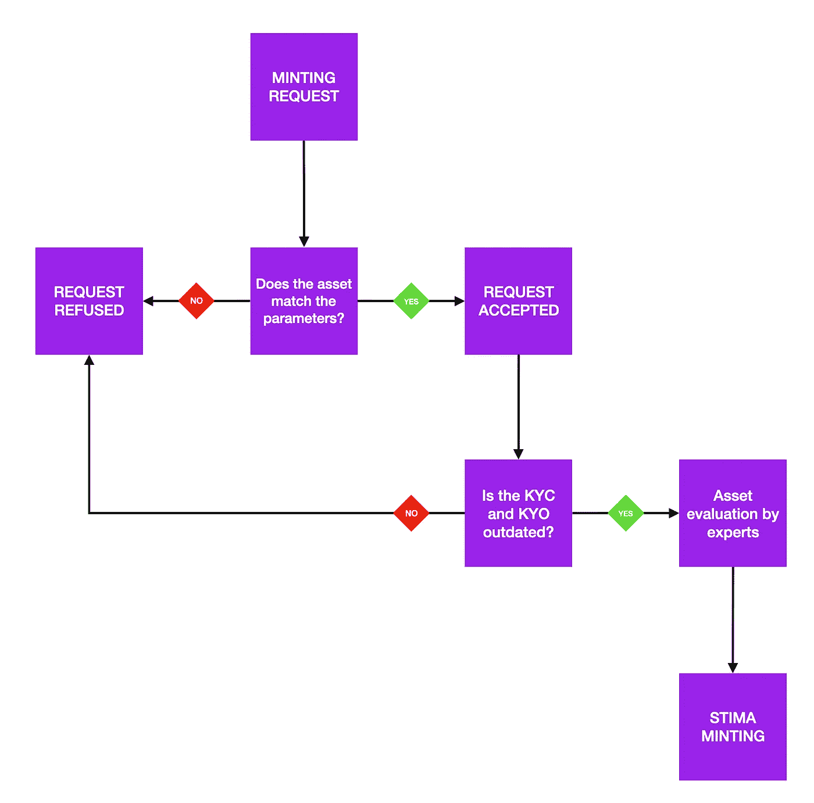

# 铸造过程

> 原文：<https://medium.com/coinmonks/minting-process-ad877f61c9e8?source=collection_archive---------89----------------------->

铸造代币的决策过程

Decision-making process for minting tokens

**任何拥有有价值资产的人都可以在我们的网站上申请评估:www.stima.io**

每当我们收到采矿请求时，都会遵循图表中所示的决策流程:

**a)资产与参数匹配吗？**
-资产必须属于 STIMA 认可的类别。
-为资产分配一个等级
如果资产不符合所需的参数，如果您进入下一步，该资产将被拒绝

**b)反洗钱程序:**
-所有人必须通过 KYC 程序(了解你的客户)
-资产必须通过 KYO 程序(了解你的对象)
如果所提供的信息符合圣马力诺金融监管机构规定的标准，申请将进入下一步。

**c)资产评估:**
资产由该领域的专家进行分析，目的是确定特定时刻的市场价值。

**d)代币铸造**
资产的价值是固定的，代币根据其当前市场价值进行印刷。
例:资产价值量化为 1000 美元，此时估计价值为 2 美元。
我们在钱包上存入 500 个 STIMA 锁定代币。

查看我们的网站了解更多信息:https://stima.io/🟣

关注我们:
insta gram:[https://www.instagram.com/stima.io](https://www.instagram.com/stima.io)
脸书:[https://www.facebook.com/stima.io](https://www.facebook.com/stima.io)
推特:[https://twitter.com/STIMA_Crypto](https://twitter.com/STIMA_Crypto)
Reddit:[https://www.reddit.com/r/stima](https://www.reddit.com/r/stima)

> 加入 Coinmonks [电报频道](https://t.me/coincodecap)和 [Youtube 频道](https://www.youtube.com/c/coinmonks/videos)了解加密交易和投资

# 另外，阅读

*   [3 商业评论](/coinmonks/3commas-review-an-excellent-crypto-trading-bot-2020-1313a58bec92) | [Pionex 评论](https://coincodecap.com/pionex-review-exchange-with-crypto-trading-bot) | [Coinrule 评论](/coinmonks/coinrule-review-2021-a-beginner-friendly-crypto-trading-bot-daf0504848ba)
*   [莱杰 vs Ngrave](/coinmonks/ledger-vs-ngrave-zero-7e40f0c1d694) | [莱杰 nano s vs x](/coinmonks/ledger-nano-s-vs-x-battery-hardware-price-storage-59a6663fe3b0) | [币安评论](/coinmonks/binance-review-ee10d3bf3b6e)
*   [Bybit Exchange 评论](/coinmonks/bybit-exchange-review-dbd570019b71) | [Bityard 评论](https://coincodecap.com/bityard-reivew) | [Jet-Bot 评论](https://coincodecap.com/jet-bot-review)
*   [3 commas vs crypto hopper](/coinmonks/3commas-vs-pionex-vs-cryptohopper-best-crypto-bot-6a98d2baa203)|[赚取加密利息](/coinmonks/earn-crypto-interest-b10b810fdda3)
*   最好的比特币[硬件钱包](/coinmonks/hardware-wallets-dfa1211730c6) | [BitBox02 回顾](/coinmonks/bitbox02-review-your-swiss-bitcoin-hardware-wallet-c36c88fff29)
*   [BlockFi vs 摄氏](/coinmonks/blockfi-vs-celsius-vs-hodlnaut-8a1cc8c26630) | [Hodlnaut 点评](/coinmonks/hodlnaut-review-best-way-to-hodl-is-to-earn-interest-on-your-bitcoin-6658a8c19edf) | [KuCoin 点评](https://coincodecap.com/kucoin-review)
*   [Bitsgap 审查](/coinmonks/bitsgap-review-a-crypto-trading-bot-that-makes-easy-money-a5d88a336df2) | [Quadency 审查](/coinmonks/quadency-review-a-crypto-trading-automation-platform-3068eaa374e1) | [Bitbns 审查](/coinmonks/bitbns-review-38256a07e161)
*   [密码本交易平台](/coinmonks/top-10-crypto-copy-trading-platforms-for-beginners-d0c37c7d698c) | [Coinmama 审核](/coinmonks/coinmama-review-ace5641bde6e)
*   [印度的加密交易所](/coinmonks/bitcoin-exchange-in-india-7f1fe79715c9) | [比特币储蓄账户](/coinmonks/bitcoin-savings-account-e65b13f92451)