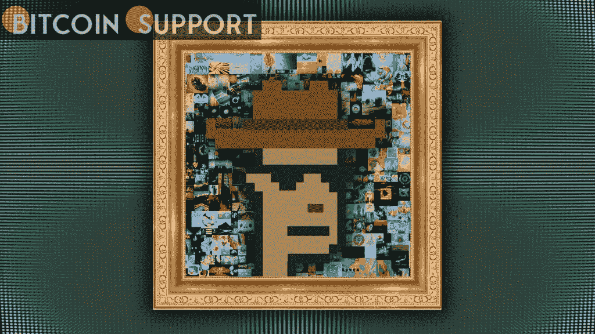

# 苏富比拍卖前几分钟，卖家拍卖了价值 3000 万美元的 crypto 朋克收藏品

> 原文：<https://medium.com/coinmonks/minutes-before-sothebys-seller-rugs-30m-cryptopunks-collection-949e36087ecc?source=collection_archive---------35----------------------->

[**https://bitcoinsupports.com/**](https://bitcoinsupports.com/)

这位神秘的 NFT 收藏家在推特上取笑这家奢侈艺术品拍卖公司，他在苏富比 3000 万美元的拍卖开始前几分钟退出了拍卖。估价超过 3000 万美元的 104 件密码朋克收藏品的拍卖在最后一刻被取消，这让 NFT 的粉丝和艺术收藏家感到困惑。

直到‘朋克它’的假名主人藏品突然退出拍卖，这场由著名的精品拍卖商苏富比举办的拍卖会有望成为历史上最大的 NFT 拍卖会之一。

在拍卖停止后，名为“0x650d”的匿名所有者向他的 1.2 万名粉丝发出了一条看似漫不经心的信息，评论道“nvm，选择 hodl。”

[https://twitter.com/0x650d/status/1496646517003800578](https://twitter.com/0x650d/status/1496646517003800578)虽然这不是真正的“拉地毯”，投资者的钱被抢走了，但它确实让苏富比和其他人蒙在鼓里。

[https://twitter.com/0x650d/status/1496663918927925253](https://twitter.com/0x650d/status/1496663918927925253)

这位收藏家被达拉斯小牛队的定量研究员哈拉洛博斯·沃尔加里斯戏称为“小丑”。

“可能是通过选择嘲讽苏富比这样的拍卖行收取的过高费用，让他们抽身的意图更清晰一点。”

[https://twitter.com/0x650d/status/1496653852321402882](https://twitter.com/0x650d/status/1496653852321402882)

2021 年，NFT 业务预计将以接近指数的速度发展，幼虫实验室的密码朋克自推出以来产生了超过 20 亿美元的销售额。尽管这可能是苏富比第一次完全专注于 NFT 的活动，这家拍卖行已经展示了在利润丰厚的 NFT 市场上赚钱的诀窍，仅去年一年就卖出了超过 1 亿美元的 NFT，其中 2400 万美元来自一场拍卖。最近的这场斗争凸显了 Web 3 的非正统“赛博朋克”文化和老机构的更沉稳、“高雅”文化之间的意识形态分歧。

**访问我们的网站:-**[**https://bitcoinsupports.com/**](https://bitcoinsupports.com/)

**免责声明:以上为作者观点，不应视为投资建议。读者应该自己做研究。**

> *加入 Coinmonks* [*电报频道*](https://t.me/coincodecap) *和* [*Youtube 频道*](https://www.youtube.com/c/coinmonks/videos) *了解加密交易和投资*

# 另外，阅读

*   [折叠 App 回顾](https://coincodecap.com/fold-app-review) | [本地比特币回顾](/coinmonks/localbitcoins-review-6cc001c6ed56) | [Bybit vs 币安](https://coincodecap.com/bybit-binance-moonxbt)
*   [加密保证金交易交易所](/coinmonks/crypto-margin-trading-exchanges-428b1f7ad108) | [赚取比特币](/coinmonks/earn-bitcoin-6e8bd3c592d9) | [Mudrex 投资](https://coincodecap.com/mudrex-invest-review-the-best-way-to-invest-in-crypto)
*   [WazirX vs CoinDCX vs bit bns](/coinmonks/wazirx-vs-coindcx-vs-bitbns-149f4f19a2f1)|[block fi vs coin loan vs Nexo](/coinmonks/blockfi-vs-coinloan-vs-nexo-cb624635230d)
*   [比斯勒评论](https://coincodecap.com/bitsler-review)|[WazirX vs coin switch vs coin dcx](https://coincodecap.com/wazirx-vs-coinswitch-vs-coindcx)
*   [7 大副本交易平台](https://coincodecap.com/copy-trading-platforms) | [BuyCoins 点评](https://coincodecap.com/buycoins-review)
*   [XT.COM 评论](https://coincodecap.com/profittradingapp-for-binance)币安评论 |
*   [SmithBot 评论](https://coincodecap.com/smithbot-review) | [4 款最佳免费开源交易机器人](https://coincodecap.com/free-open-source-trading-bots)
*   [杠杆令牌](/coinmonks/leveraged-token-3f5257808b22) | [最佳密码交易所](/coinmonks/crypto-exchange-dd2f9d6f3769) | [Paxful 点评](/coinmonks/paxful-review-4daf2354ab70)