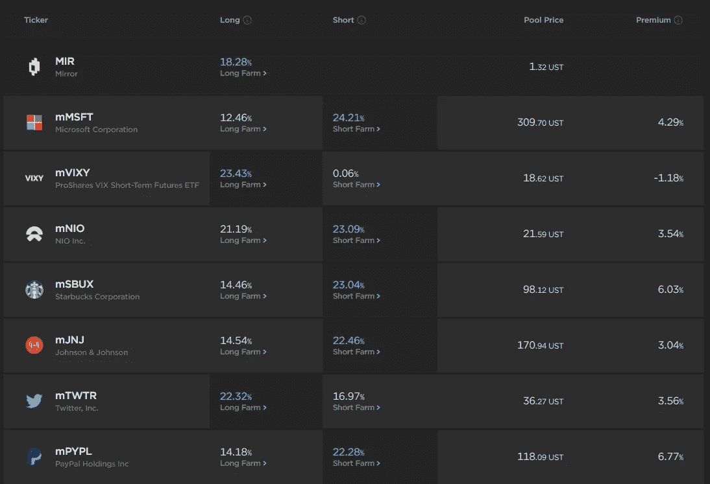

# 镜子和星云——两个协议的故事

> 原文：<https://medium.com/coinmonks/mirror-and-nebula-a-tale-of-two-protocols-cbd544fa650?source=collection_archive---------19----------------------->

什么是镜像协议？

曾几何时，每个人都批评锚协议和镜像协议之间的 Terra 生态系统的二分法。虽然前者锁定的总价值(TVL)远远超过后者，但 still Mirror Protocol 是一个实际交付了产品、人们知道并实际使用的项目。

镜像协议的目的是创建模拟代表性资产价格行为的链上合成资产(mAssets)。大众通过抵押来保持他们的价值，就像许多抵押稳定的硬币一样。如果投资者想在不将他们的 UST 兑换成美元或任何其他法定货币的情况下在链外资产中建仓，这可能会很方便——特别是对于韩国投资者，他们的提款被规定延迟 24 小时。

然而，镜像协议具有内在的钉住机制，可能会阻碍投资者的决策。

A screenshot of Mirror Protocol

你可以在右边看到大众的“溢价”,或者 oracle 价格和 Terraswap 价格之间的差价，很容易就在-10%到 10%之间。溢价的存在可能是有利的，也可能是不利的，这取决于你愿意采取的立场，但总的来说溢价不鼓励交易。

例如，mBTC 目前的交易价格为 41，700 美元，而甲骨文的价格据报道为 39，300 美元，相差 6%。如果你希望通过镜像协议建立对$BTC 的长期敞口，从长远来看，你不会愿意看到溢价消失。即使你想做空$mBTC，你也永远不知道价差是会变窄还是变宽，因为所有可用的交易量都存在长期溢价。

为什么会出现这样的现象？我们需要查看镜像协议的跟踪机制来找出答案。

镜像协议文档写道，它有 3 层价格挂钩:

1.  铸造清算:
    让我们说 t = 0 时$ AAPL = $ 200 = $苹果。我们亲爱的朱莉在 t = 0 时也开了一个$mAAPL 空头头寸，这意味着她存入了$UST，铸造了$mAAPL，并在市场上公布。
    1 美元 mAAPL 由 400 美元 UST 支持，以 150%的最低抵押率(MCR)保值。
    t = 1 时，$AAPL 突然涨到 300 美元，但$mAAPL 仍在 200 美元交易。现在甲骨文报告为 300 美元，因此 1 美元的 mAAPL 所需的抵押品也上升到 450 美元。
    $mAAPL 的提供者没有填满她的$UST 抵押品，因此她的$UST 被出售以从市场购买$mAAPL，这反过来将$ ma APL 的价格升值到$300。
2.  套利者
    当 t = 1 时$ AAPL = 300 美元和$马阿普= 200 美元时，套利者可能会在假设$马阿普将通过 1 重新获得其盯住权的情况下买入$马阿普。
3.  治理
    治理可以改变 MCR，使清算门槛更严格，从而保持更严格的挂钩。

Mirror Protocol 在其文件中明确指出，大众**与甲骨文价格反馈**软挂钩，因此**其价格偏差是有意的特征，而不是错误的缺陷**。Docs 写道**‘理论上，如果 MCR 设定为 150%，一个群体可以以 50%的溢价交易。’**

我个人不知道为什么挂钩是这样设计的，但无论如何，它至少打消了我之前建立大量头寸的念头。

**什么是星云协议？**

星云协议是 Terra 网络上的一个协议，用来创建连锁指数基金。星云协议在 2 月 27 日发布了它的[文档](https://docs.neb.money/)。

星云协议去掉了 TradFi 指数基金中必不可少的‘第三人’；称为集群的星云指数基金具有灵活的参数，不需要主动管理来维持分配。

为了开放集群，社区在 Nebula 论坛上讨论投资策略，为策略投票，如果策略通过投票，那么它就被投入运营。

集群可以指定**目标 Oracle**来更新集群的资产分配。简单来说，target oracles 就是 TradFi 中增强型指数基金的主动管理人。资产配置接受多种策略——可能是简单的 5:5 BTC:卢纳，也可能是需要通过 20 种资产不断重新平衡的复杂交易策略。

群集表示群集份额的群集令牌(CT)。当然，联系类型是可在 Astroport 中交易的 CW20 令牌，因此联系类型的价格可能会偏离集群的净资产值(NAV)。

在这种情况下,《星云协议》激励有助于重获“挂钩”的交易活动，惩罚相反的行为。

假设集群 A 的资产净值为 100 美元，并且在 t = 0 时创造了 100 个 CTs。
在 t = 1 时，集群 A 已经增长到$110，但是联系类型仍然以$1 交易。
Julie 可以获得她的 CT，将其兑换为价值 1.1 美元的集群 A 中的基础资产，在市场上出售，获得 0.1 美元的利润。
由于她正在套利以保持钉住汇率，Nebula Protocol 将奖励她折扣和$NEB 以激励积极的套利活动。

**镜面星云互补**

现在想象一下，如果我们打开一个星云星团，它管理着一只由大众组成的指数基金，目标甲骨文设定为链外市场。

换句话说，如果现实世界有两家公司，$AAPL 和$COIN，每家都有 50%的股票市场份额，集群将以 5:5 的比例购买$mAAPL 和$mCOIN，并试图在整个生命周期内保持这一比例。

$mAAPL 和$mCOIN 的交易可以高于或低于其公平价格，但如果$mAAPL:mco in 以 6:4 的比例交易，星云星团将对$ ma APL 形成抛售压力，对$mCOIN 形成买入压力，使其资产净值构成为 5:5——有助于重新获得最大挂钩。

随着大众交易更接近挂钩，投资者将更有信心利用 Terra 网络上没有的镜像长/短资产。

虽然星云协议刚刚发布了它的文档，它的应用还有很长的路要走，但镜像星云是一个有趣的思想实验。

> *加入 Coinmonks* [*电报频道*](https://t.me/coincodecap) *和* [*Youtube 频道*](https://www.youtube.com/c/coinmonks/videos) *了解加密交易和投资*

# 另外，阅读

*   [有哪些交易信号？](https://coincodecap.com/trading-signal) | [Bitstamp vs 比特币基地](https://coincodecap.com/bitstamp-coinbase) | [买索拉纳](https://coincodecap.com/buy-solana)
*   [ProfitFarmers 点评](https://coincodecap.com/profitfarmers-review) | [如何使用 Cornix 交易机器人](https://coincodecap.com/cornix-trading-bot)
*   [十大最佳加密货币博客](https://coincodecap.com/best-cryptocurrency-blogs) | [YouHodler 评论](https://coincodecap.com/youhodler-review)
*   [my constant Review](https://coincodecap.com/myconstant-review)|[8 款最佳摇摆交易机器人](https://coincodecap.com/best-swing-trading-bots)
*   [MXC 交易所评论](/coinmonks/mxc-exchange-review-3af0ec1cba8c) | [Pionex vs 币安](https://coincodecap.com/pionex-vs-binance) | [Pionex 套利机器人](https://coincodecap.com/pionex-arbitrage-bot)
*   [我的密码交易经验](/coinmonks/my-experience-with-crypto-copy-trading-d6feb2ce3ac5) | [比特币基地评论](/coinmonks/coinbase-review-6ef4e0f56064)
*   [CoinFLEX 评论](https://coincodecap.com/coinflex-review) | [AEX 交易所评论](https://coincodecap.com/aex-exchange-review) | [UPbit 评论](https://coincodecap.com/upbit-review)