# 魔镜魔镜，谁是最稳定的

> 原文：<https://medium.com/coinmonks/mirror-mirror-on-the-wall-whos-the-most-stable-of-em-all-35815b9d17bf?source=collection_archive---------24----------------------->

你进入一个位置后就去睡觉

你醒来，发现它已经变绿了。

8000 美元的利润

很高兴你去卫生间洗漱，开始新的一天。

千美元利润

吃你的早餐

2000 美元利润

你懂了吗……

不言而喻，我们都知道加密货币的波动性。如果这个空间里存在更稳定的东西就好了。

输入 stablecoins。

稳定币在密码世界中扮演着重要的角色。它们有助于增加生态系统的容量和流动性，并在你需要时带来稳定性。

固定汇率，一种货币与另一种货币如美元挂钩，因为它被广泛使用且更稳定。这通常是为了给那些更不稳定的经济体带来稳定。

因此，在加密领域，这意味着稳定的硬币与美元挂钩。

**背靠** =顾名思义，它实际上会像什么东西一样背靠着。就像我们的法定货币最初是由黄金支持的，直到他们违反了协议，不再支持它。

因此，在加密空间中，这个稳定的硬币会被其他资产收回，无论是真实世界的资产还是加密资产。

> *更新:过去 5 天左右发生了很多事情。来自 Terra 的 LUNA 硬币的不幸崩溃和它的稳定硬币 UST 的脱钩。
> 请注意，下面是对提到的每个稳定图标的快速介绍。在选择哪种 stablecoin 更适合您的使用时，请自行判断。*
> 
> 我同情所有投资/参与 Terra 生态系统的人。🙏

好了，让我们快速浏览几个最受欢迎的 stablecoins，以便更好地了解它们之间的区别。像往常一样，请记得用一大汤匙盐来记录下面的信息，尤其是总分。

请考虑留下评论或关注，谢谢！作为回报，我会给你看一张可爱狗狗的照片😆

Photo by [Gabriel Yuji](https://unsplash.com/@gabrielyuji?utm_source=medium&utm_medium=referral) on [Unsplash](https://unsplash.com?utm_source=medium&utm_medium=referral) — I’ll probably need to find someone who looks at me like that

# 泰达币

**总结**:第一个也是最大的一个。市值 830 亿美元，其他稳定的公司都望尘莫及。

**工作原理**:用户，无论是个人、企业还是交易所，都将把他们的订单存入 Tether 的银行账户。然后，Tether 会将 USDT 发送到他们的钱包地址中。
为了赎回回菲亚特，他们把他们的 USDT 送回系绳他们将烧掉那些 USDT。

> 顾名思义，它的作用就像是对美元的束缚。我们很稳定，储备了足够的资产，但你必须相信我们。

市值:8316 亿美元

**类型**:̶f̶i̶a̶t̶̶b̶a̶c̶k̶e̶d̶̶s̶t̶a̶b̶l̶e̶c̶o̶i̶n̶资产支持稳定币(真实世界资产)

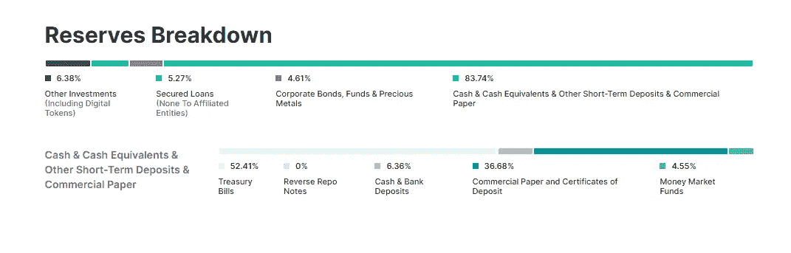

What Tether claims they are currently holding in their reserves

**集中**:是

**稳定性**:联系汇率保持相当稳定，与美元挂钩。当它得到现实世界资产的支持时，肯定会有所帮助。
从图表中，我们看到它的最高价和最低价是 1.001 & 0.997 (0.1% - 0.3%)

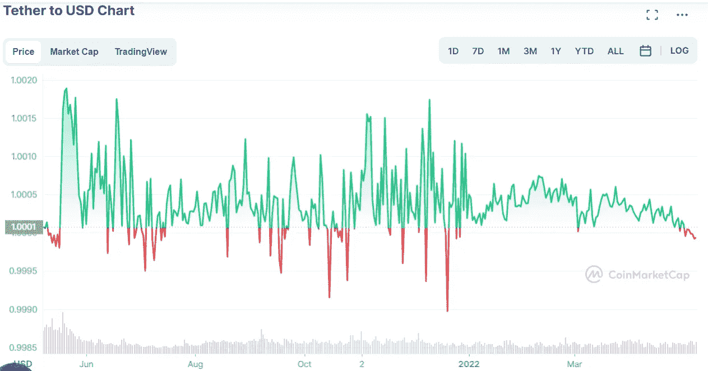

1 year chart from CMC

**总分** : 4 / 5💰

美元系链是一种集中稳定的货币。发生了要求他们冻结资金的事件。
[向往金融剥削](https://cryptopotato.com/tether-freezes-1-7m-in-usdt-stolen-in-yearn-finance-exploit/)
[冻结在以太坊上的区块链](https://www.coindesk.com/markets/2022/01/13/tether-freezes-160m-of-usdt-stablecoin-on-ethereum-blockchain/)

**注意事项:**

*   作为第一种被创造出来的稳定币，它的采用率非常高。(先发优势)它还成功地在不同的连锁店、交易所和各种 DeFi 项目中实现了深度整合。
*   由于这是一种资产支持的稳定货币，关于其储备和这些资产质量的透明度仍然是维持信任和稳定的更重要的一点。
*   围绕系绳的争议

# USDC

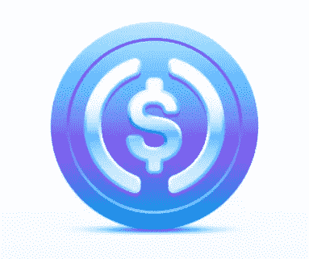

**概要:** USDC 由一个名为“圆圈和比特币基地”的财团管理，因此得名“USDC”。除了遵守法规，Circle 是唯一一家可以制造和焚烧 USDC 的公司。

工作原理:类似于 USDT 的工作原理。USDC 表示，他们完全由外汇储备支持，并且永远可以 1:1 的比例兑换美元。

> 与其对手 USDT 没有太大区别，但更加透明

市值:493 亿美元

**类型:**资产支持稳定币(现金和短期美国政府债券)

**一言堂:**是的

稳定:由于支持资产有助于实现价格稳定，我们应该不会看到大幅波动。从图表中我们可以看到，它的最高价和最低价分别是 1.0006 和 0.9996 (0.04% — 0.06%)

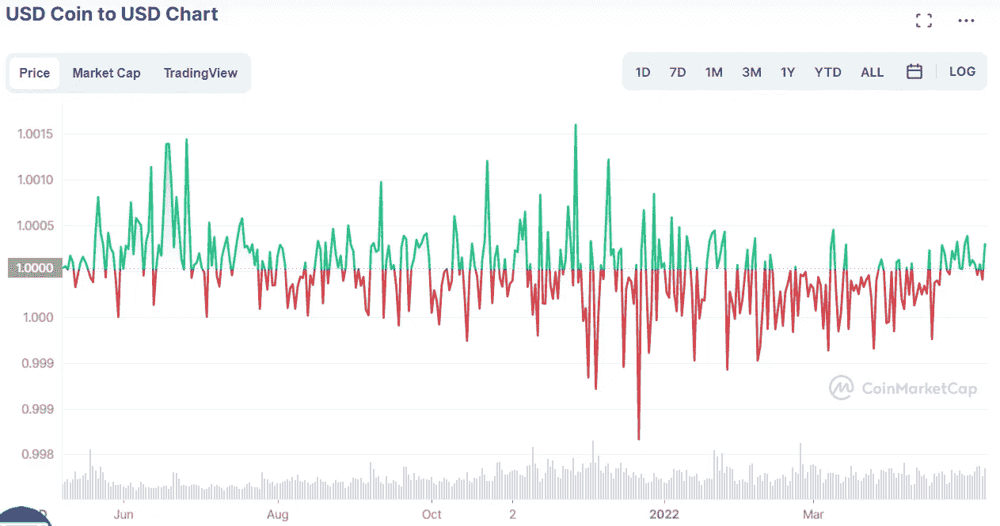

**总分:** 4.5/ 5 **💰**

**注意事项:**

*   USDT 和 USDC 都声称他们铸造的硬币总是与美元 1:1 挂钩，但只有他们自己最清楚。在这方面，至少我们可以说 USDC 定期对他们当前的持股做更多的证明(虽然不是审计)。(每月)透明度和问责制在中央集权的稳定中心发挥着巨大的作用。
*   [冻结 USDC 100k](https://www.nasdaq.com/articles/circle-confirms-freezing-%24100k-in-usdc-at-law-enforcements-request-2020-07-08)
*   在许多生态系统中采用是有益的

# 奶妈

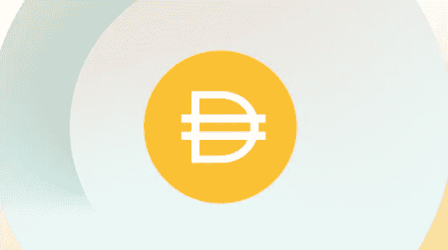

**概要:**马克道管理的基于以太坊的 stablecoin。与美元软挂钩。

**如何工作:**用户可以通过将被视为抵押品的资产存入 DAI 的金库来生成 DAI。尽管借款被过度抵押，仍然有被清算的风险。

> 把你的资产给我，这样你就可以把它换成比原来资产价值低的稳定货币

**市值:**:80.8 亿美元

**类型:**超抵押稳定币

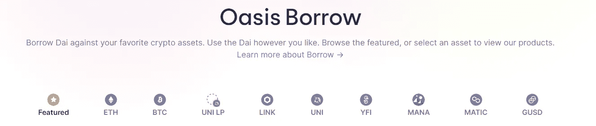

List of assets that can be used to borrow DAI

**集中:**否

**稳定性:**从图表中我们看到，最高和最低分别为 1.0098 & 0.9878 (0.98% — 1.22%)

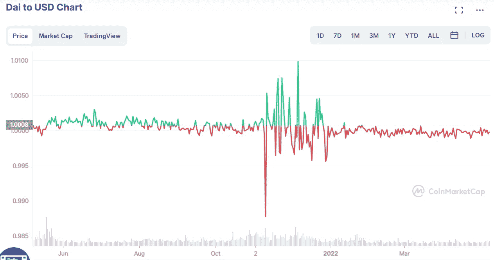

**总分:** 3.5/ 5 **💰**

**注意事项:**

*   进入金库的资产需要具有某种形式的“质量”
*   市场状况可能会导致他们金库中的资产价值大幅变动，从而影响其保持盯住汇率的稳定性。
*   戴面临着可扩展性问题。在发行更多的 DAI 之前，它需要先存放抵押品。因为它需要超额抵押，锁定的资本会比戴创造的资本多。(资本效率低下)

# UST

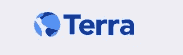

**概要:**̶a̶n̶̶a̶l̶g̶o̶r̶i̶t̶h̶m̶i̶c̶̶s̶t̶a̶b̶l̶e̶̶c̶o̶i̶n̶̶f̶r̶o̶m̶̶t̶e̶r̶r̶a̶.̶̶p̶e̶g̶g̶e̶d̶̶t̶o̶̶t̶h̶e̶̶u̶s̶d̶.̶̶a̶s̶̶i̶t̶̶i̶s̶̶n̶o̶t̶̶b̶a̶c̶k̶e̶d̶̶b̶y̶̶a̶n̶y̶t̶h̶i̶n̶g̶,̶̶i̶t̶̶u̶t̶i̶l̶i̶z̶e̶s̶̶a̶̶m̶i̶n̶t̶̶a̶n̶d̶̶b̶u̶r̶n̶̶m̶e̶c̶h̶a̶n̶i̶s̶m̶̶t̶o̶̶s̶t̶a̶b̶i̶l̶i̶z̶e̶s̶̶i̶t̶s̶̶p̶r̶i̶c̶e̶s̶.̶

工作原理:̶u̶s̶i̶n̶g̶̶t̶h̶e̶̶o̶n̶̶c̶h̶a̶i̶n̶̶m̶i̶n̶t̶̶a̶n̶d̶̶b̶u̶r̶n̶̶m̶e̶c̶h̶a̶n̶i̶s̶m̶,̶̶w̶h̶e̶n̶e̶v̶e̶r̶̶s̶o̶m̶e̶o̶n̶e̶̶w̶a̶n̶t̶s̶̶1̶̶u̶s̶t̶,̶̶t̶h̶e̶y̶̶w̶o̶u̶l̶d̶̶n̶e̶e̶d̶̶t̶o̶̶b̶u̶r̶n̶̶1̶̶u̶s̶d̶̶w̶o̶r̶t̶h̶̶o̶f̶̶l̶u̶n̶a̶.̶̶i̶f̶̶t̶h̶e̶y̶̶w̶a̶n̶t̶̶m̶i̶n̶t̶̶1̶̶u̶s̶d̶̶w̶o̶r̶t̶h̶̶o̶f̶̶l̶u̶n̶a̶̶t̶h̶e̶n̶̶1̶̶u̶s̶t̶̶w̶i̶l̶l̶̶b̶e̶̶b̶u̶r̶n̶t̶.̶̶(̶1̶̶:̶̶1̶)̶

̶i̶n̶̶t̶h̶e̶̶e̶v̶e̶n̶t̶̶w̶h̶e̶r̶e̶̶t̶h̶e̶̶p̶r̶i̶c̶e̶̶o̶f̶̶u̶s̶t̶̶i̶s̶̶n̶o̶t̶̶a̶t̶̶1̶$̶,̶̶a̶r̶b̶i̶t̶r̶a̶g̶e̶u̶r̶s̶̶w̶i̶l̶l̶̶c̶o̶m̶e̶̶i̶n̶̶t̶o̶̶t̶a̶k̶e̶̶a̶d̶v̶a̶n̶t̶a̶g̶e̶̶o̶f̶̶t̶h̶i̶s̶̶o̶p̶p̶o̶r̶t̶u̶n̶i̶t̶y̶̶a̶n̶d̶̶p̶u̶s̶h̶̶p̶r̶i̶c̶e̶s̶̶b̶a̶c̶k̶̶t̶o̶̶t̶h̶e̶̶e̶q̶u̶i̶l̶i̶b̶r̶i̶u̶m̶.̶

> 它稳定直到不再稳定

市值: ̶$̶1̶8̶.̶5̶1̶B̶

**类型:**算法稳定

**集中:**否

**稳定:**̶f̶r̶o̶m̶̶t̶h̶e̶̶c̶h̶a̶r̶t̶,̶̶w̶e̶̶s̶e̶e̶̶t̶h̶a̶t̶̶t̶h̶e̶̶h̶i̶g̶h̶e̶s̶t̶̶a̶n̶d̶̶l̶o̶w̶e̶s̶t̶̶i̶t̶̶g̶o̶t̶̶t̶o̶̶w̶a̶s̶̶1̶.̶0̶0̶9̶8̶̶&̶̶0̶.̶9̶4̶5̶7̶̶(̶0̶.̶9̶8̶%̶̶-̶̶5̶.̶4̶3̶%̶)̶

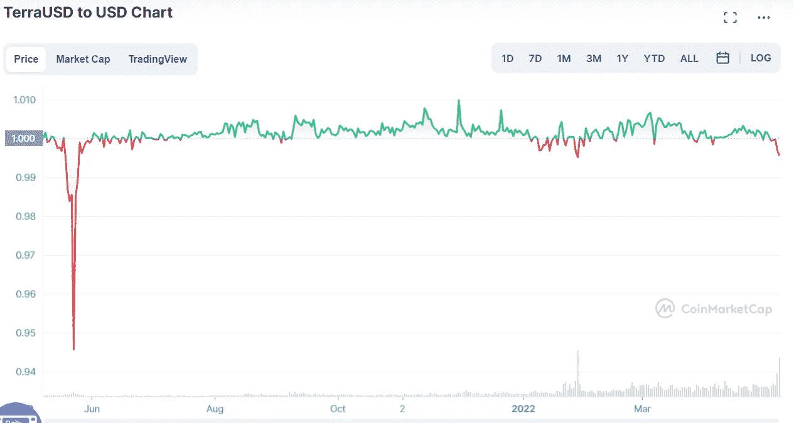

**总分:** 3.5 / 5💰

**注意事项:**

*   ̶a̶s̶̶t̶h̶i̶s̶̶s̶t̶a̶b̶l̶e̶c̶o̶i̶n̶̶i̶s̶̶n̶o̶t̶̶b̶a̶c̶k̶e̶d̶̶b̶y̶̶a̶n̶y̶̶c̶o̶l̶l̶a̶t̶e̶r̶a̶l̶,̶̶i̶t̶̶r̶e̶l̶i̶e̶s̶̶h̶e̶a̶v̶i̶l̶y̶̶o̶n̶̶t̶h̶e̶̶b̶e̶l̶i̶e̶f̶̶t̶h̶a̶t̶̶t̶h̶e̶r̶e̶̶w̶i̶l̶l̶̶s̶t̶i̶l̶l̶̶b̶e̶̶a̶̶d̶e̶m̶a̶n̶d̶̶f̶o̶r̶̶b̶o̶t̶h̶̶u̶s̶t̶̶a̶n̶d̶̶l̶u̶n̶a̶̶d̶u̶r̶i̶n̶g̶̶b̶a̶d̶̶m̶a̶r̶k̶e̶t̶̶c̶o̶n̶d̶i̶t̶i̶o̶n̶s̶
*   ̶a̶r̶b̶i̶t̶r̶a̶g̶e̶u̶r̶s̶̶w̶i̶l̶l̶̶n̶e̶e̶d̶̶t̶o̶̶b̶e̶l̶i̶e̶v̶e̶̶t̶h̶e̶r̶e̶̶i̶s̶̶a̶̶p̶o̶i̶n̶t̶̶(̶v̶a̶l̶u̶e̶)̶i̶n̶̶d̶o̶i̶n̶g̶̶t̶h̶e̶̶a̶r̶b̶i̶t̶r̶a̶g̶e̶̶o̶r̶̶t̶i̶l̶l̶̶t̶h̶e̶̶p̶o̶i̶n̶t̶̶w̶h̶e̶r̶e̶̶t̶h̶e̶r̶e̶̶i̶s̶̶n̶o̶̶p̶r̶o̶f̶i̶t̶̶t̶o̶̶b̶e̶̶m̶a̶d̶e̶
*   ̶b̶a̶d̶̶m̶a̶r̶k̶e̶t̶̶c̶o̶n̶d̶i̶t̶i̶o̶n̶s̶̶/̶̶b̶l̶a̶c̶k̶̶s̶w̶a̶n̶̶e̶v̶e̶n̶t̶s̶̶c̶a̶n̶̶m̶a̶k̶e̶̶i̶t̶̶g̶o̶̶i̶n̶t̶o̶̶a̶̶d̶e̶a̶t̶h̶̶s̶p̶i̶r̶a̶l̶̶w̶h̶e̶r̶e̶̶t̶h̶e̶̶s̶u̶p̶p̶o̶r̶t̶i̶n̶g̶̶t̶o̶k̶e̶n̶̶c̶a̶n̶̶n̶o̶̶l̶o̶n̶g̶e̶r̶̶s̶u̶p̶p̶o̶r̶t̶̶t̶h̶e̶̶s̶t̶a̶b̶l̶e̶c̶o̶i̶n̶
*   ̶̶̶m̶̶̶o̶̶̶s̶̶̶t̶̶̶̶̶̶t̶̶̶h̶̶̶e̶̶̶̶̶̶u̶̶̶s̶̶̶t̶̶̶̶̶̶i̶̶̶n̶̶̶̶̶̶c̶̶̶i̶̶̶r̶̶̶c̶̶̶u̶̶̶l̶̶̶a̶̶̶t̶̶̶i̶̶̶o̶̶̶n̶̶̶̶̶̶i̶̶̶s̶̶̶̶̶̶d̶̶̶e̶̶̶p̶̶̶o̶̶̶s̶̶̶i̶̶̶t̶̶̶e̶̶̶d̶̶̶̶̶̶i̶̶̶n̶̶̶t̶̶̶o̶̶̶̶̶̶a̶̶̶n̶̶̶c̶̶̶h̶̶̶o̶̶̶r̶̶̶̶̶̶p̶̶̶r̶̶̶o̶̶̶t̶̶̶o̶̶̶c̶̶̶o̶̶̶l̶̶̶̶̶̶t̶̶̶o̶̶̶̶̶̶g̶̶̶e̶̶̶t̶̶̶̶̶̶t̶̶̶h̶̶̶e̶̶̶̶̶̶a̶̶̶t̶̶̶t̶̶̶r̶̶̶a̶̶̶c̶̶̶t̶̶̶i̶̶̶v̶̶̶e̶̶̶̶̶̶b̶̶̶u̶̶̶t̶̶̶̶̶̶u̶̶̶n̶̶̶s̶̶̶u̶̶̶s̶̶̶t̶̶̶a̶̶̶i̶̶̶n̶̶̶a̶̶̶b̶̶̶l̶̶̶e̶̶̶̶̶̶2̶̶̶0̶̶̶%̶̶̶̶̶̶a̶̶̶p̶̶̶y̶̶̶.̶̶s̶o̶̶w̶h̶e̶r̶e̶̶i̶s̶̶t̶h̶e̶̶a̶c̶t̶u̶a̶l̶̶d̶e̶m̶a̶n̶d̶̶o̶f̶̶u̶s̶t̶̶c̶o̶m̶i̶n̶g̶̶f̶r̶o̶m̶？̶

# 假正经的

Wooo! Cast a spell and get MIM!

通过制造流动性差的资产(有息代币),流动性好但形式稳定的货币，MIM。

**如何运作:**用户将他们的计息代币存入 Abracadabra，作为回报，他们将在选择自己的清算价格的同时借入 MIM。
这笔借款也需要支付利息，但那将是你最终选择逆转“咒语”的时候。(从 MIM 返回到您的原始资产)

另一方面，如果用户注意到 MIM 高于 1 美元。他们可以根据协议建立头寸，借入 MIM，然后卖出 MIM 获利。
MIM 供应量的增加将使价格降至 1 美元。

如果 MIM 的价格低于 1 美元，从协议中借款的用户将被激励以更低的价格购买 MIM 来偿还他们的债务。
随着需求的增加，这将推动最低金属价格回到 1 美元。

> 神奇的互联网货币，多么合适。毕竟，所有的密码都是凭空产生的。😆
> 
> 今天就学习一个咒语，把你的非流动资产变成流动资产！！

市值::19.3 亿美元

**类型:**担保稳定币

**集中:**否

**稳定性:**从图表中我们看到，最高和最低分别为 0.9736 & 1.0347 (2.64% — 3.47%)

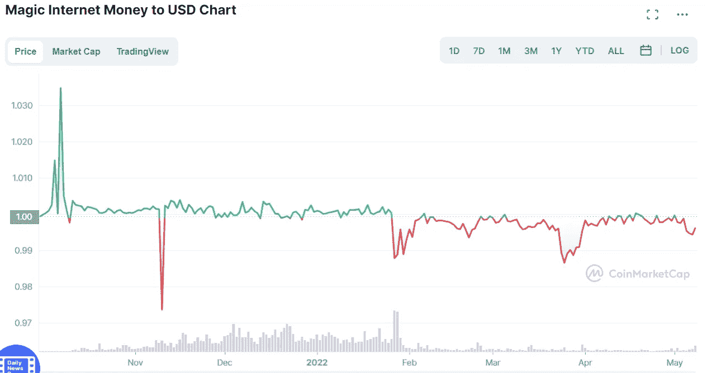

**总分:** 3 / 5💰

**注意事项:**

*   MIM 的稳定性将取决于所接受资产的质量，因为这将直接影响稳定货币的挂钩。在资产价格下跌的情况下，许多用户将被清算

# FRAX

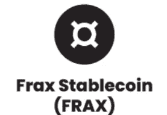

**工作原理:**该协议有两个令牌，FRAX (stablecoin)和 FXS (Frax Shares)，这是他们的治理令牌。

一开始，Frax 是 100%抵押的。如果有人想铸造稳定币，他们必须先存入 1:1 的链上稳定币作为抵押。
最终，Frax 将进入分数阶段，用户将根据抵押品比率铸造 FRAX 和焚烧 FXS。

(98%抵押品比率= **造币厂** $0.98 FRAX + **烧钱**$ 0.02 FXS)
**或**
(98%抵押品比率= **赎回** $0.98 FRAX + **造币厂**$ 0.02 FXS)

抵押品比率(CR)不是固定的，仅根据需求和 FRAX 价格的变化进行相应调整。在 FRAX 承受看跌压力的情况下，该协议可以推高该比率，以增加对 FRAX 的支持(抵押品)，直到信心得到恢复。
因此，除了依靠套利者之外，责任准备金是帮助维持联系汇率稳定的另一个机制。

一旦协议的速度增加，他们将过渡到接受更不稳定的密码，如 ETH 或 wBTC 作为抵押品。

**回购和再抵押**

由于抵押品比率(CR)的变化，有时协议会有过多的抵押品，或者需要增加更多的抵押品。

他们增加了这个 2 交换功能。(回购和再抵押)将价值重新分配给 FXS 持有者或增加系统内的抵押品

**再抵押化** =如果系统内的抵押品低于 CR，系统允许用户充值，同时以奖金率奖励他们新铸造的 FXS。(0.20%，可通过治理进行调整)

**回购** =系统中多余的抵押品由于，

*   协议不断降低 CR 以保持 FRAX 的价格稳定
*   协议中增加了附息抵押品
*   铸造和赎回产生的费用

FXS 持有者也将使用回购功能。实际情况是，这些多余的钱将被用来购买 FXS，然后被烧掉。这给 FXS 持有者带来了回报，而不需要他们积极参与就能从中受益。

> 无法决定是算法币还是抵押币更好？没问题，为什么不两者兼得呢？

市值:26.9 亿美元

**类型:**分数算法稳定币

**集中:**否

**稳定性:**从图表中我们看到，最高和最低分别为 0.9871 & 1.0682 (1.29% — 6.82%)

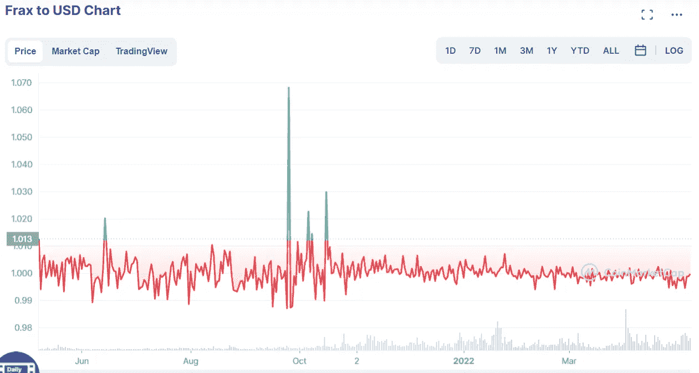

**总分:**3.5**/5💰**

**注意事项:**

*   如果 FRAX 目前有 50%的抵押。在造币方面，其中 50%将通过抵押品收回。另外 50%将一无所获，因为我们正在烧掉 FXS 去铸造那些 FRAX。
*   治理令牌的效用/用例，FXS 变得很重要。否则在赎回时，你将得到你的抵押品价值的一部分和一个 FXS 代币，如果它什么也不做，就不能保持它的价值。( [FXS1559](https://messari.io/governor/proposal/d8780def-fcb1-404e-a570-e12ba26a5610) )
*   如果 FXS 出现大规模倾销，且 CR %较低或健康，FRAX 仍将得到协议中大多数抵押品的支持。
*   Frax 使用来自 Chainlink 和 Uniswap 的价格反馈，以获得准确的 Frax 美元和 FXS-美元价格。目的是跟随美元的真实价格，而不是依赖于一篮子 onchain stablecoins
    链链接提要每小时更新一次，我不确定这是否足够

Photo by [Markus Spiske](https://unsplash.com/@markusspiske?utm_source=medium&utm_medium=referral) on [Unsplash](https://unsplash.com?utm_source=medium&utm_medium=referral)

**结论**

那么，哪一种是最好的稳定币呢？(虽然不是上面的完整列表)
不管市场状况如何，保持稳定肯定有所帮助，但我认为在考虑稳定的收入时，还有其他几点也很重要。

*   高流动性，稳定
*   易于使用，易于理解(这不是一场看谁能创造出有史以来最复杂的硬币的比赛)
*   被大多数平台接受(采用)
*   无论市场状况如何，中国都有一个稳健的计划来维持人民币盯住美元的汇率制度，尤其是在熊市中

话虽如此，即使完美的稳定币被创造出来或者已经被创造出来。在市场下跌、上述机制很好地捍卫联系汇率的时候，看到它发挥作用(经过压力测试)仍然是件好事。虽然许多 stablecoin 声称解决了 stable coin 三难问题(去中心化、稳定性和效率)，但许多人已经尝试过，许多人失败了。

即便如此，我们可以肯定的是，将来会有更多的发现。就像世界上有许多不同的货币一样。最终，我认为在经受住所有的考验和障碍之后，只有少数稳定的竞争对手会屹立不倒。无论如何，在密码领域仍然需要稳定的密码，这是一个值得解决的问题。

> 加入 Coinmonks [电报频道](https://t.me/coincodecap)和 [Youtube 频道](https://www.youtube.com/c/coinmonks/videos)了解加密交易和投资

# 另外，阅读

*   [OKEx vs KuCoin](https://coincodecap.com/okex-kucoin) | [摄氏替代度](https://coincodecap.com/celsius-alternatives) | [如何购买 VeChain](https://coincodecap.com/buy-vechain)
*   [币安期货交易](https://coincodecap.com/binance-futures-trading)|[3 commas vs Mudrex vs eToro](https://coincodecap.com/mudrex-3commas-etoro)
*   [如何购买 Monero](https://coincodecap.com/buy-monero) | [IDEX 评论](https://coincodecap.com/idex-review) | [BitKan 交易机器人](https://coincodecap.com/bitkan-trading-bot)
*   [CoinDCX 评论](/coinmonks/coindcx-review-8444db3621a2) | [加密保证金交易交易所](https://coincodecap.com/crypto-margin-trading-exchanges)
*   [红狗赌场评论](https://coincodecap.com/red-dog-casino-review) | [Swyftx 评论](https://coincodecap.com/swyftx-review) | [CoinGate 评论](https://coincodecap.com/coingate-review)