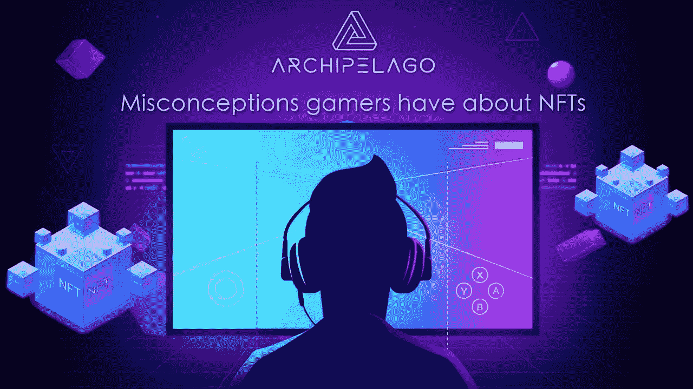

# 游戏玩家对 NFTs 的误解

> 原文：<https://medium.com/coinmonks/misconceptions-gamers-have-about-nfts-94b00a403c6f?source=collection_archive---------45----------------------->

在过去的几年里，非专利技术引起了人们的注意，这导致了一系列关于它们的信息被发布到公共领域，有些是好的，有些是坏的。如果你认同“所有的宣传都是好的宣传”这种说法，那么你会很高兴主流媒体和各种公共信息渠道都在不分角度地谈论 NFTs。但这反过来也导致了包括全球游戏社区在内的众多社区对这种新的数字资产类别的误解。

当主流媒体和各种高调的个人和实体谈论 NFT 时，他们通常没有很好地解释它们的基本价值，它们如何工作，以及它们实际上是什么。这使得许多人对他们背后的总体评价是负面的，并怀疑他们是否真的值得？或者只是时代的另一个时尚。考虑到这一点，我们认为我们应该借此机会消除游戏社区对 NFTs 的一些最常见的误解，以便您可以为自己做出更明智的决定。他们在这里:

**NFT 艺术和替身的效用为零**

许多传统游戏玩家认为 NFT 只不过是数字艺术或 3D 化身，除此之外没有什么用处。尽管所有 NFT 交易中有很大一部分是针对数字艺术和虚拟形象的，但这并不意味着它们毫无用处。事实上，NFT 被用于各种不同目的的例子数不胜数，包括验证游戏中的所有权、为游戏中的经济提供动力，甚至代表现实世界的资产。

游戏中 NFTs 的一个流行用例是游戏中的所有权和验证。在分散土地、沙盒和隐体素等游戏中，玩家可以购买土地或财产作为 NFT，然后他们可以在其上建造、出售或与其他玩家交易。NFTs 的这个用例为游戏玩家提供了许多好处，包括真正的所有权、建立资产净值的能力，甚至是赚钱的可能性。

**NFT 只不过是可以复制的图像文件**。

这是另一个关于 NFTs 的常见误解，是那些不了解它们如何工作的人造成的。仅仅因为 NFT 是一个数字文件，并不意味着它可以像 JPEG 图像一样容易地复制和粘贴。NFT 不能被复制的原因是由于它们在区块链上的存储方式。生成 NFT 时，会生成该文件的加密哈希。每当 NFT 转手时，这个散列就可以用来验证它的真实性。因此，如果有人试图复制一个 NFT，哈希将是不同的，NFT 将被视为无效。

**NFT 之所以有价值，是因为人们认为它们有价值**

这可能是游戏玩家对 NFTs 最常见的误解，而且这种误解是由那些不理解它们如何工作或什么给了它们价值的人延续下来的。事实是，NFT 的价值与法定货币、黄金和其他资产的价值一样，因为人们认为它们有价值。

非金融信托的不同之处在于，它们的价值不是基于像政府或中央银行这样的中央集权。相反，它们的价值来自于它们的稀缺、耐用和实用性。因为它们是由区块链技术驱动的，它们还具有不可变和透明的额外优势。

**NFT 都是骗局**

这可能是对 NFTs 最具破坏性的误解，因为它阻止了人们将它们视为合法的资产类别。事实是，每种类型的资产都有骗局，包括非金融资产。但这并不意味着所有的 NFT 都是骗局。

避免被 NFTs 欺骗的关键是做好你的研究，只投资你相信的项目。如果你对一个项目没有把握，那么最好远离它。你可以投资很多其他合法的项目。

现在你有了，一些关于 NFT 的真理和它们的全部内容。我们希望这些信息对你有用。

在 Archipelago，我们坚信 NFT 是迄今为止最具突破性的发明之一。考虑到这一点，它们将以各种形状和大小在我们自己的豪华元宇宙平台上大量展示，在这里，您可以在 crypto 最令人惊叹的分散虚拟世界中见面、社交和放松。敬请关注更新！

**关于群岛** 群岛是一个建立在以太坊区块链上的奢华去中心化 Web3 元宇宙。

令人惊叹的超真实图形带来了 Metaverses 第一次迭代中尚未体验到的惊奇和快乐感。

由 Steven Brodie 和 Chris Brady 于 2021 年 12 月创建，他们在 2002 年创建 Ai3D 时拥有超过 20 年的虚拟世界创作经验。

关注我们:
[网站](http://www.archipelago.land) | [推特](http://@archipelagometa) | [媒体](https://archipelago-land.medium.com/) | [不和谐](https://discord.gg/VVPsdK5pwh)

> 加入 Coinmonks [电报频道](https://t.me/coincodecap)和 [Youtube 频道](https://www.youtube.com/c/coinmonks/videos)了解加密交易和投资

# 另外，阅读

*   [3 商业评论](/coinmonks/3commas-review-an-excellent-crypto-trading-bot-2020-1313a58bec92) | [Pionex 评论](https://coincodecap.com/pionex-review-exchange-with-crypto-trading-bot) | [Coinrule 评论](/coinmonks/coinrule-review-2021-a-beginner-friendly-crypto-trading-bot-daf0504848ba)
*   [莱杰 vs n rave](/coinmonks/ledger-vs-ngrave-zero-7e40f0c1d694)|[莱杰 nano s vs x](/coinmonks/ledger-nano-s-vs-x-battery-hardware-price-storage-59a6663fe3b0) | [币安评论](/coinmonks/binance-review-ee10d3bf3b6e)
*   [加密交易机器人](/coinmonks/crypto-trading-bot-c2ffce8acb2a) | [Bingbon 评论](https://coincodecap.com/bingbon-review)
*   [Bybit Exchange 审查](/coinmonks/bybit-exchange-review-dbd570019b71) | [Bityard 审查](https://coincodecap.com/bityard-reivew) | [Jet-Bot 审查](https://coincodecap.com/jet-bot-review)
*   [3 commas vs crypto hopper](/coinmonks/3commas-vs-pionex-vs-cryptohopper-best-crypto-bot-6a98d2baa203)|[赚取加密利息](/coinmonks/earn-crypto-interest-b10b810fdda3)