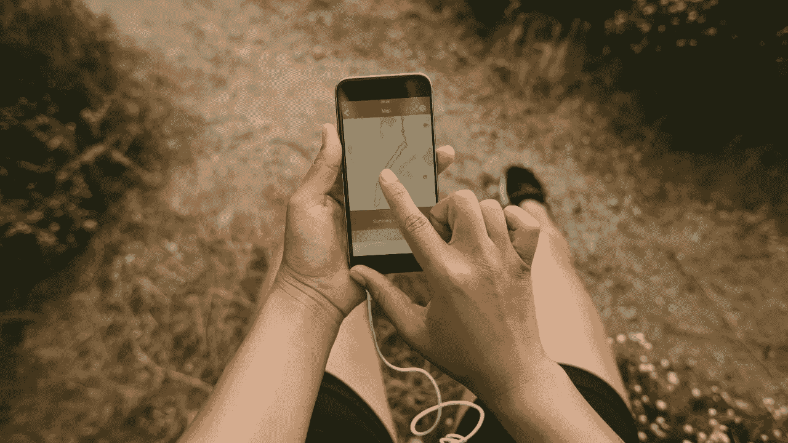

# 移动健身应用和刻录赚取收入

> 原文：<https://medium.com/coinmonks/mobile-fitness-apps-and-burn-to-earn-576560d1f113?source=collection_archive---------42----------------------->

Mobile Fitness Apps are growing day by day

锻炼是人体的必需品。通过锻炼，我们身体上保持健康，精神上感觉更好。尽管锻炼有这些积极的方面，但锻炼是最难坚持做的事情之一。很多时候，我们缺乏去健身房的动力和时间。有时候你会觉得即使你已经做了一段时间的健身，但你在这个旅程中并没有取得太大的进步。在这种情况下，你应该尝试寻找不同的动力来源来继续健身。锻炼时赚取代币是一个很好的激励工具。在这篇文章中，我将重点介绍在你锻炼、散步或健身时可以为你赢得代币的移动应用程序。

那么一边运动一边赚加密货币怎么样？这能提供一些动力吗？我打赌是的。谁不想在燃烧腹部脂肪的同时赢得比赛呢？在这篇文章中，我将向您介绍五款付费锻炼的应用程序。

在这篇文章中，我介绍了 7 个最好的健身应用程序，它们会为你的锻炼买单。你只需要一部智能手机和一个健身追踪器就可以开始了。

# 1.ActiFit

Actifit 移动应用程序会自动跟踪您的日常活动。您可以在走路、跑步、做家务或跟踪您所做的任何活动时赢取代币。

Actifit 应用程序有自己的令牌，称为 AFIT 令牌。根据 Coinmarketcap 的数据，1 AFIT 大约值 0.15 美元。另一方面，Actifit 包括两个核心令牌:

**1。AFIT**

**2。B-AFITX**

有了 A-AFIT，你可以购买虚拟和真实的健身产品，并在比赛中挑战你的朋友。

B-AFITX 是治理令牌，也是我们 DeFi 生态系统的核心令牌。有了这个令牌，你就有权利对 Actifit 及其生态系统的未来进行投票。最后，Actifit 目前在三个区块链运营:区块链蜂巢(https://hive.blog)、https://steemit.com Steem 和作为基地的区块链脱口而出(https://脱口而出. blog)。

# 2.莱姆波市场代币

LMT (Lympo Market Token)是一种公用令牌，旨在成为各种游戏内外以体育为主题的数字收藏品(以非真菌令牌，NFT 的形式)的购买、使用和归属货币。

LMT 生态系统预计分两个阶段发展:

1.**数字收集阶段**:据说在这个阶段，世界知名运动员和俱乐部、有影响力的人物和特殊体育人物的 NFT 将根据特定的时间表发布，该时间表定义了各种稀有 NFT 级别的供应，从更常见的卡到额外的稀有卡。

2.**内容和媒体开发阶段**:在此阶段，所有者将能够使用他们的 NFT 系列参与各种内容和媒体活动，如各种体育比赛。NFTs 将允许用户创建和升级他们自己的体育英雄角色，以加入球队并参加比赛和其他双赢的活动。最后，根据 CoinMarketCap 数据，1 LMT 目前为 0.002519 美元。

# 3.运动硬币

我在以前的文章中介绍的这个健身应用程序是基于步行的。这款应用会在你走路的时候给你付费。它有自己的虚拟货币，叫做汗币。要使用这个应用程序，你需要注册并将智能手机的健康和健身数据以及 GPS 位置链接到 Sweatcoin 应用程序。该应用程序随后会跟踪你一天走了多少步，并将其转换为 Sweatcoin。

每记录 1000 步，该应用程序将支付 0.95 的汗水币(你赚取的所有积分都有 5%的费用，因此它们的价值为 0.95)。用户可以使用这些硬币来换取书籍、健身器材、服装、健身课程等奖励。

虽然 Sweatcoin 是一种数字货币，但它的基础设施不是区块链技术。它不能被视为加密货币，因为它使用中央数据库。此外，与比特币和以太坊等大多数加密货币一样，它们不能在加密货币交易所交易。

# 4.STEPN

STEPN 是一个独特的 Web3 应用程序，在 Solana 区块链上带有 GameFi 元素。它将 play to win 的各个方面与一个健身应用程序相结合，创建了一个名为“move to win”的新类别。用户购买 NFT 运动鞋，他们可以在走路或跑步时用它来省钱。

STEPN 通过简单的代币奖励机制，鼓励用户过上更健康的生活方式。下载应用程序并创建钱包后，用户必须购买一双 NFT 运动鞋，才能在游戏的单人模式下开始赚钱。让我指出这双运动鞋有点贵！

然而，STEPN 计划增加一个马拉松模式，每周和每月进行 2.5 公里到 15 公里的比赛。马拉松参与者将能够在排行榜上赢得并比较他们的成绩，排名第一的参赛者将获得额外奖励。

# 5.Fitlich&FBute 令牌

Fitlich 是一个移动应用程序，它看到了健身市场的秘密卡路里赤字，并被开发来填补它。除了它的隐卡功能，它密切关注数字世界的发展。一个例子是可与 NFTs 和 FBute 令牌一起使用的数字服装的可用性。在这种背景下，Fitlich 和 FBute 的目标似乎是成为元宇宙的先锋，为锻炼的概念带来新的视角。

FBute 是建立在 Solana 网络上的加密卡系统。FBute token 是 Fitlich app 给用户的奖励令牌的名称。用户消耗的卡路里用 Google Fit、Apple Health Kit 或 Fitbit tracker 记录，这些设备都集成了 Fitlich。此处记录的活动和执行的练习由 Fitlich 作为 Fbute Token 奖励提供给用户。

另一方面，根据 Fbute 官方网站上发布的白皮书，Fitlich NFT 店将于 2022 年底前开业。Fitlich 商店将接受用户想象的虚拟化身服装的 FBute 令牌。

**参考文献**:

1.  https://coinmarketcap.com/
2.  [**https://pinayteenvestor . com/7-apps-that-pay-you-to-exercise-get-payed-in-cryptocurrency/**](https://pinayteenvestor.com/7-apps-that-pay-you-to-exercise-get-paid-in-cryptocurrency/)