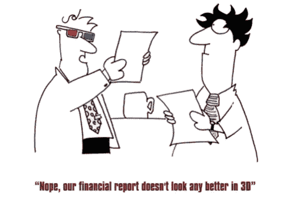
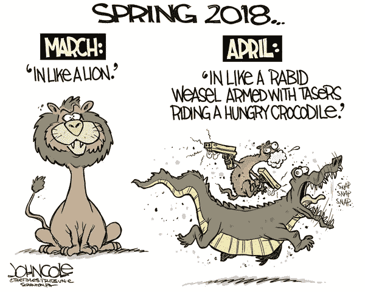

# 退休人员共同基金投资组合模型——圣杯第四部分

> 原文：<https://medium.com/coinmonks/model-mutual-fund-portfolio-for-retired-people-holy-grail-part-iv-8c2d0b63e404?source=collection_archive---------2----------------------->

嘿，伙计们……那么，我们进入了最后一类投资者，猜谜没有奖品。它的目标是退休人员。但在此之前，让我再次感谢你们的大力支持。这个系列已经收到了成千上万的观众，我知道这只是因为你的支持。让我也承认，它给了我巨大的信心，让我知道我正走在传播金融意识的正确道路上。我非常感激我的导师，他在我实习期间指导我，并在空闲时间额外努力辅导我。他的这一高尚行为激励我与尽可能多的人分享我的知识和经验，反过来也激励他们开始寻求经济独立的旅程。伙计们，不管心在哪里……最终，财务独立将使你们能够打破财务奴役的枷锁，去追求你们一生的使命，无论是在艺术、音乐、体育、科学领域的创新还是社会工作。因此，请通过分享这些帖子接触尽可能多的人。谁知道你可能是像我这样的人开始他们在这条道路上的旅程的催化剂。

好吧…回到正题。我收到了一些关于之前帖子中没有提到“解决方案基金”的问题。对于那些最近加入的人来说，解决方案共同基金只不过是长期共同基金，可能属于股票(通常是大盘股，但在少数情况下也属于中盘)、混合或债务类别。它们通常有至少 5 年的锁定期，回报因资产类别而异。到期时，税收将取决于资产类别，但股息是免税的。这些大致分为儿童计划或退休计划。但是，你有没有注意到，**除了情绪之外，它们没有什么独特之处，尤其是如果你将它们与类似的股票、混合或债务基金进行比较的话**。然而，对于大多数普通人来说，这些都是很好的投资工具，因为他们通常受情绪的影响，特别是如果他们正在为退休后的生活或子女的教育或婚姻而四处搜寻的话。这种情绪让这些人变得有规律、守纪律，不会在最短锁定期后兑现储蓄。所以，伙计们…如果你也属于这一类，那就去投资吧，但还是要提醒你…明智地选择基金，使其资产类别符合你的具体需求，最重要的是符合你的贪婪-恐惧矩阵。

现在，谈谈退休人士投资的话题。但在此之前，我们先来看看这群投资者的共同特征，总结如下:-

1.  最有可能的是，这些投资者已经偿还了他们所有的个人、房屋和汽车贷款。在极少数情况下，如果贷款仍未偿还，那是为了支持孩子的学业或商业投资。可以说，偿还这些贷款通常是这些贷款的担保者的责任。
2.  这一类别的大多数人会在自己的房子里定居，因此不会支付租金。
3.  同样，在大多数情况下，教育费用这一最大的支出项目会被常规医疗费用所取代。
4.  大多数退休的上班族会有一份稳定的养老金，而对许多其他人(不包括商业团体)来说，他们会从他们的养老金计划中受益。
5.  大部分的愿望和希望都会变成月复一月几乎相同的花费。

**总结** —总结一下，这一类的大多数人收入**有限，但同时开销也很可观**。由于几乎所有的高额费用都得到了解决(除了医疗费用)，这个群体的首要任务是保护他们的可用财富，同时确保其不受通货膨胀的侵蚀。因此，**这个群体的口头禅是零到最小的贪婪和最大的安全性和流动性，以满足紧急的计划外医疗紧急情况**。

The state of the people entering the Stock Market only in 2018, but on daily basis

在投资之前，先建立一个安全网。在我继续下一步之前，不用提醒我的老朋友们，如果到目前为止你还不愿意购买健康保险，现在肯定是认真考虑这个问题的时候了。对你辛苦赚来的和管理的财富的最大威胁将来自你或你配偶的计划外医疗紧急情况。因此，必须有一些安全网，它可能是你以前雇主的医疗保险政策，或者是你的孩子或好心人赠送的政策。如果你现在还没有任何医疗保险，请想一想，根据你的具体需求，特别是迎合你的直接健康指标，尽早选择一个。

也要让你的财务井然有序——尽管这是对任何人来说都被嗤之以鼻的建议……我仍然敢提醒你，在银行、投资机构、保险公司有一大堆无人认领的现金，这证明人们一直很鲁莽，没有注意到他们对家庭的财务责任……如果你不相信，请在谷歌上搜索一下，让自己相信。因此，请仔细检查您的所有文件，找出您拥有多少银行账户、FDs、保险或债券。组织你的财务的第一步将是**把这些削减到最低限度，如果可能的话，只有一个**。考虑到折叠银行的新规范，**使用离你最近的一家国有银行(不合作)的服务，有最友好的工作人员或与你有私人关系的银行**……可能是一些远房亲戚、熟人，如果没有人在那里……..可能会花些时间和那里的员工交朋友。@本文版权由我祖父提供…说真的，不开玩笑。还请确保所有投资和账户都有一个指定人，并及时更新最新的地址和联系方式。

**让我们现在投资** —正如我们之前看到的一般概况…..没有巨额门票支出计划，重点是保留或保护多年来创造的财富。因此，无论选择何种工具**，它都是安全的，具有零到最小的风险** **，同时应提供几乎即时的流动性以满足即时需求**。属于这些类别的工具有金融衍生工具、债务共同基金、AAA 级或更高级别的债券，以及一些高性能蓝筹股或大型共同基金。无论我们做什么，无论我们选择什么工具，我们都必须非常清楚，这群投资者的投资目标是**财富** **保值**同时获得他们所能获得的哪怕一点点利益，为此…该工具必须提供至少 6%以上的年回报率……这通常被认为是通货膨胀的基准。他们必须记住的另一点是，将他们选择的任何投资工具与 FD 进行比较，只有当收益可观时，他们才应该选择该工具。不要担心金融衍生工具是回报最少的，还会有很多其他工具，包括共同基金。但同时也要小心…..由于几乎所有工具的风险都较低……收益也会较低……

**为退休人员制作一个投资组合模型**——假设你们中的大多数人都在领取养老金……你们的储蓄潜力将会很低。因此，在规划投资时，应谨记以下指导原则

1.  因为现在最大的支出是每年的保险费，保险费可以按月支付，也可以按年一次性支付。请选择年度保费计划，并在任何蓝筹股或大盘股基金中创建一个为期 11 个月的 MF，每月 SIP 金额与您为 EMI 支付的保费相同。如果市场表现良好…这 11 个月的 SIP 将涵盖您每年的电磁干扰的全部费用，在最坏的情况下……因为每年的保险费在任何情况下都比累计电磁干扰计划少……您至少节省了额外的费用，同时没有损失任何东西。
2.  如果你至少能存下超过 20%的退休收入，那么就只计划更长期的投资工具，而且也仅限于 3 到 5 年。否则，计划 1 至 3 年的短期投资。
3.  保持至少 60%的流动性。这条规则更适用于 60 岁以上的人。根据经验法则… **你的年龄应该是你的流动资产的%** 。例如，对于我 85 岁的祖父来说，他应该保持至少 85%的流动资产。我说的流动资产是指所有的投资都应该能够在 72 小时内转换成流动现金并转移到你的银行账户上。那包括星期六和星期天。
4.  让我们假设，如果有人 60 岁，那么对于 60%的流动性，他可以选择债务类别下的直接计划 MFs，蓝筹基金或债券。但是资产管理公司不是说赎回至少要 3 到 5 个工作日吗？这是正确的…但是如果你通过 demat 账户投资，很有可能钱会在第三天转到你的账户上。如果你对 ETF 感到满意，这将是保持流动性的最佳选择，同时还能确保流动性随市场增长。由于市场不稳定，永远不要将超过 5%的投资组合投资于任何一种工具，即使是 ETF。对于剩下的 40%，你可以选择锁定期更长的基金或者有退出负载的基金，比如 Parag Parikh。

伙计们，你们值得庆祝生活……在数年的努力工作和辛苦工作之后，为了履行你们所有的义务……这是你享受生活的时候了。因此，如果您收到保单到期的任何退款或从任何其他来源收到的任何其他一次性付款…..从你的愿望清单中至少检查一项活动。然而，如果没有这样的支出，那么明智的投资可能是冬季的果阿之旅或巴厘岛的家庭团聚，这些都是由你赞助的。对此，最好的工具将是带有或不带有锁定的债务 MF。只要确保锁定期不要超过你计划取款的日期。

这就是这篇文章的全部内容…..祝我们的老读者身体健康，万事如意。请回电，如果您需要任何具体建议，我很乐意为您服务。

再见…下周见…

> 加入 Coinmonks [电报频道](https://t.me/coincodecap)和 [Youtube 频道](https://www.youtube.com/c/coinmonks/videos)了解加密交易和投资

## 也阅读

 [## 杠杆代币[多头代币]终极指南

### 杠杆化令牌是具有杠杆化风险敞口的 ERC20 令牌，不考虑保证金、要求、管理…

medium.com](/coinmonks/leveraged-token-3f5257808b22)  [## 最佳加密交易所| 2021 年十大加密货币交易所

### 编辑描述

blog.coincodecap.com](https://blog.coincodecap.com/crypto-exchange)  [## 2021 年最佳加密交换平台| CoinCodeCap

### 如果我们看看今天的场景，许多加密货币交换平台提供了广泛的功能和深度…

blog.coincodecap.com](https://blog.coincodecap.com/best-swap-platforms)  [## 10 大最佳网上赌场[2021] |赢取免费 BTC | CoinCodeCap

### 编辑描述

blog.coincodecap.com](https://blog.coincodecap.com/best-online-casinos)  [## 2021 年最佳加密借贷平台| 6 大比特币借贷平台

### 获得比特币和其他加密货币的最佳贷款利率

medium.com](/coinmonks/top-5-crypto-lending-platforms-in-2020-that-you-need-to-know-a1b675cec3fa)  [## 2021 年 6 大最佳硬件钱包|顶级加密硬件钱包[更新]

### 最好的加密货币硬件钱包是绝对必要的。我们将在 NGRAVE、Ledger Nano X 和…

medium.com](/coinmonks/the-best-cryptocurrency-hardware-wallets-of-2020-e28b1c124069)  [## 2021 年最佳免费加密交易机器人

### 2021 年币安、比特币基地、库币和其他密码交易所的最佳密码交易机器人。四进制，位间隙…

medium.com](/coinmonks/crypto-trading-bot-c2ffce8acb2a)  [## 最佳 4 个加密交易信号电报通道

### 这是乏味的找到正确的加密交易信号提供商。因此，在本文中，我们将讨论最好的…

medium.com](/coinmonks/best-crypto-signals-telegram-5785cdbc4b2b)  [## 获取信号、交易机器人和套利

### 编辑描述

blog.coincodecap.com](https://blog.coincodecap.com/bitsgap-review)