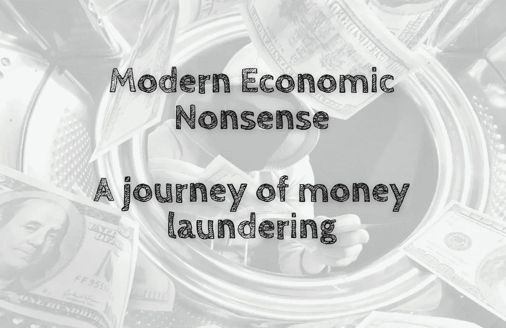

# 现代经济废话——洗钱之旅

> 原文：<https://medium.com/coinmonks/modern-economic-nonsense-a-journey-of-money-laundering-791ad2f44c04?source=collection_archive---------44----------------------->

当 UST 崩溃时，创始人道权向社区承诺，通过一个新的 Terra 2.0 提案来振兴 Terra，该提案只为社区服务。但是这个项目看起来越来越像洗钱了💸。