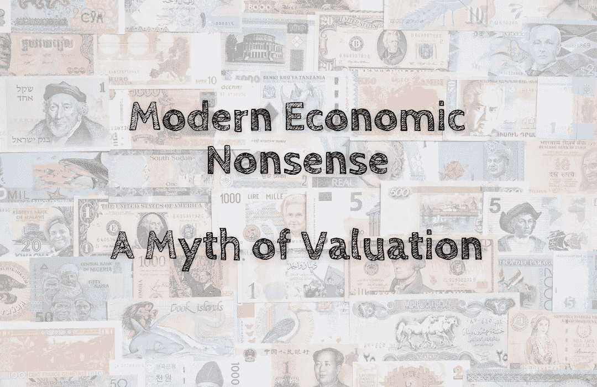

# 现代经济学废话——一个估值的神话

> 原文：<https://medium.com/coinmonks/modern-economic-nonsense-a-myth-of-valuation-fbd39788f6ef?source=collection_archive---------60----------------------->

许多人声称法定美元比加密货币更值钱。

更多的人接受了一美元钞票比一张纸更有价值的想法🤣！

这里有一个神话:一美元钞票真的值它所宣称的价值吗💵？

那么钱是什么🤔？