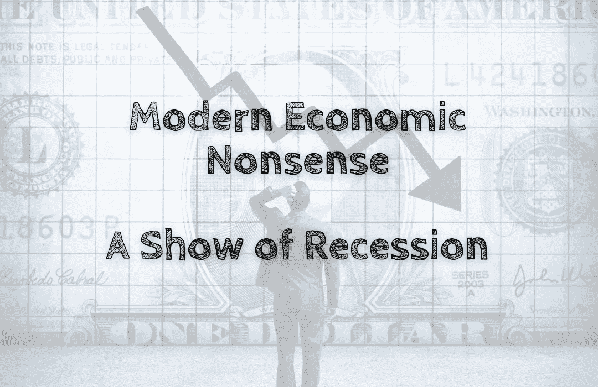

# 现代经济废话——一场衰退秀

> 原文：<https://medium.com/coinmonks/modern-economic-nonsense-a-show-of-recession-78014cbd8d56?source=collection_archive---------8----------------------->

衰退是指市场暂停☕️，放缓扩张速度。你认为由于经济衰退，所有东西都会变得买得起，你有机会买你买不起的东西。

现实是，即使经济衰退，你也可能负担不起。所有的东西都会变得比以前更贵😂。