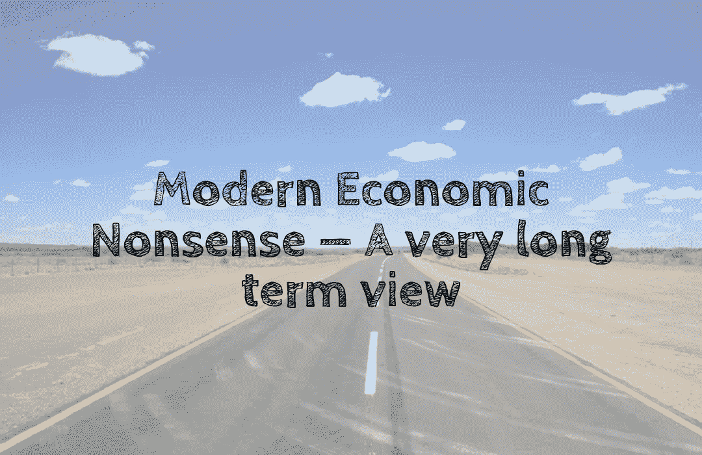

# 现代经济学废话——一个非常长远的观点

> 原文：<https://medium.com/coinmonks/modern-economic-nonsense-a-very-long-term-view-b1e643626761?source=collection_archive---------37----------------------->

经济的目的是尽可能长久地生存下去🐢。至少，这是我对经济应该如何运行的看法。

股票市场是一个短期视角，用来预测一个合理的长期目标🐇。

就像乌龟和兔子之间的赛跑，每个人都知道它是如何结束的，但没有人关注市场和…