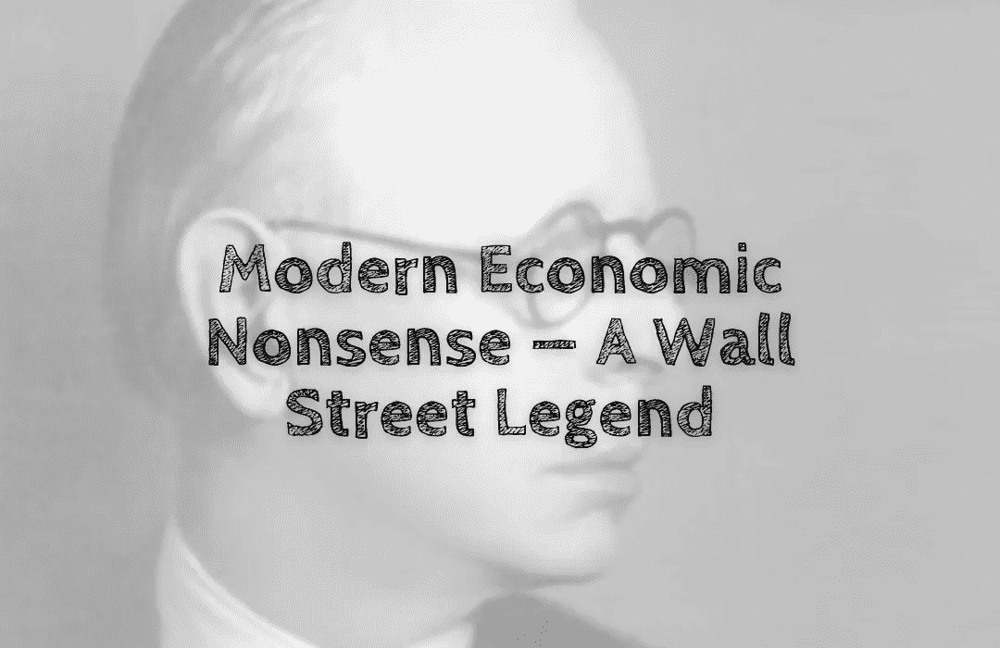

# 现代经济学废话——华尔街传奇

> 原文：<https://medium.com/coinmonks/modern-economic-nonsense-a-wall-street-legend-91ff372ebf04?source=collection_archive---------26----------------------->

每个人都相信华尔街是投资的天堂😇。至少所有的电影和宣传新闻都是这么描述的。

不幸的是，它不是🥺.

有很多交易者试图战胜市场——日内交易者🤯。

杰西·利弗莫尔是一个传奇的日内交易者。他是发明技术分析的人。