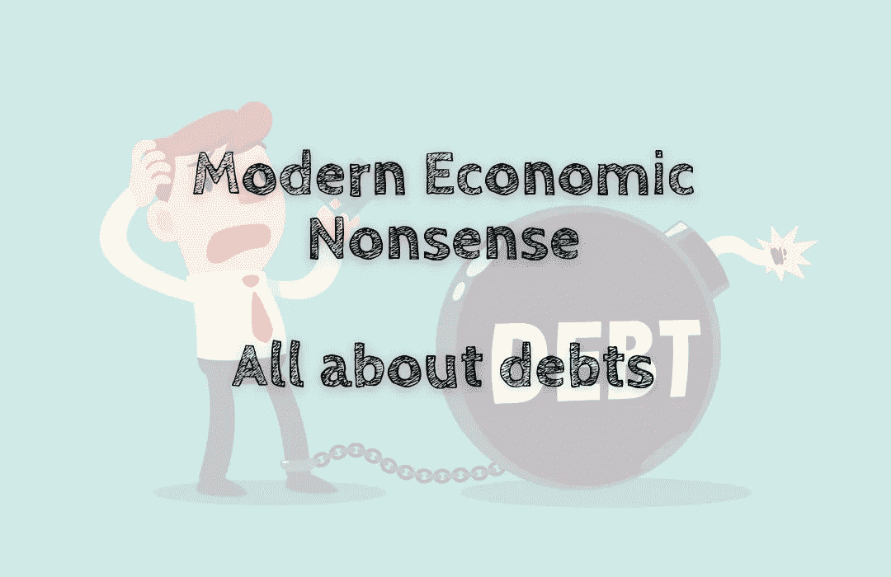

# 现代经济学废话——都是关于债务的

> 原文：<https://medium.com/coinmonks/modern-economic-nonsense-all-about-debts-6825fdef7e5f?source=collection_archive---------21----------------------->

我提到世界上最有价值的东西是债务🧾.

有价值的债务背后的原因是，与那些有价值的东西不同，所有的价格都是一个人为之付出的历史。其估值不稳定，可能贬值，而债务保证在协议规定的期限内还清。