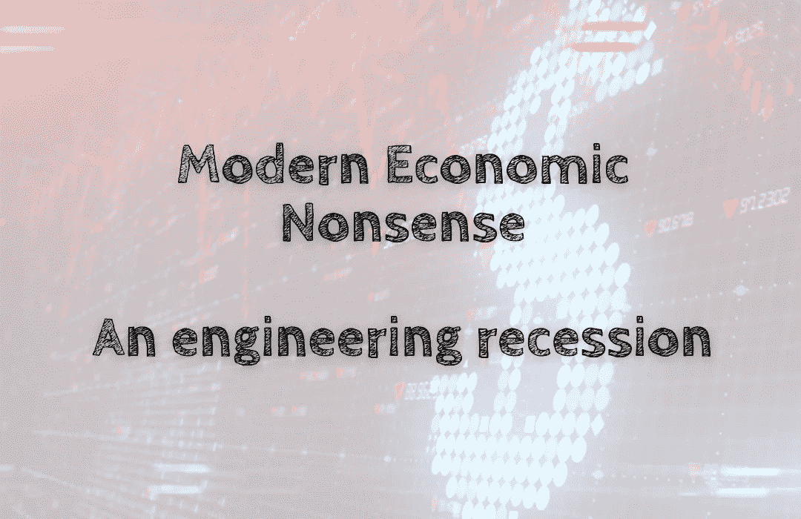

# 现代经济学废话——工程衰退

> 原文：<https://medium.com/coinmonks/modern-economic-nonsense-an-engineering-recession-298264b31802?source=collection_archive---------23----------------------->

衰退和减速是有区别的。衰退是指经济连续两个季度收缩，而不仅仅是一个季度。当经济增长比平时慢时，就会出现减速。工程衰退是指央行故意放缓经济，以应对通胀等问题。这并不是说经济有任何问题是由任何因素造成的，而是政治…