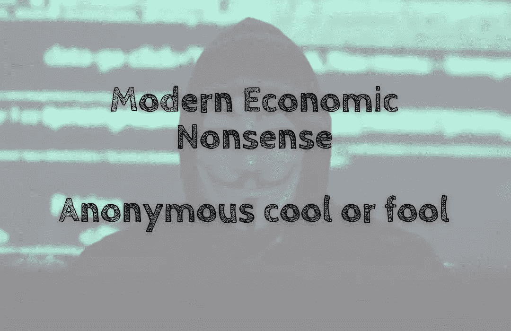

# 现代经济学废话——匿名酷还是傻瓜

> 原文：<https://medium.com/coinmonks/modern-economic-nonsense-anonymous-cool-or-fool-a58128ead29e?source=collection_archive---------51----------------------->

匿名文化曾经是加密🕵.的标准它在今天的加密领域还适用吗？

答案众说纷纭😂！

**匿名身份不好吗😈？**

为什么要匿名甚至懒得匿名呢？