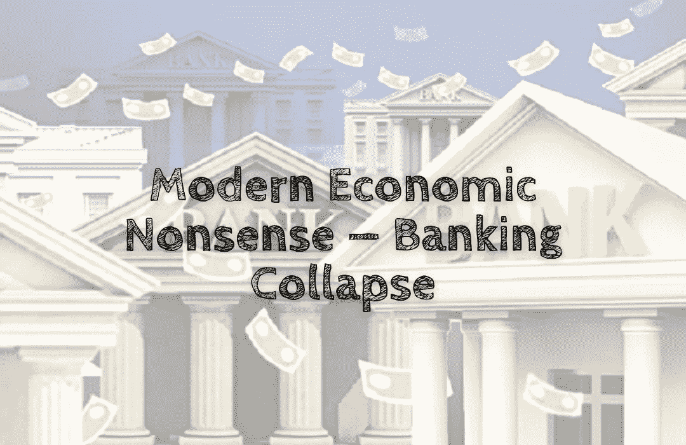

# 现代经济学废话——银行业崩溃

> 原文：<https://medium.com/coinmonks/modern-economic-nonsense-banking-collapse-9b29fbc93b8a?source=collection_archive---------27----------------------->

你可能认为国家是安全的天堂，银行和国家经济一样安全🏦。

哦，好吧。这根本不是真的。

任何国家都可以违约，你的财富可以立即化为乌有！

这发生在冰岛，它是 90 年代的经济奇迹之一，直到 2008 年全球金融危机爆发。