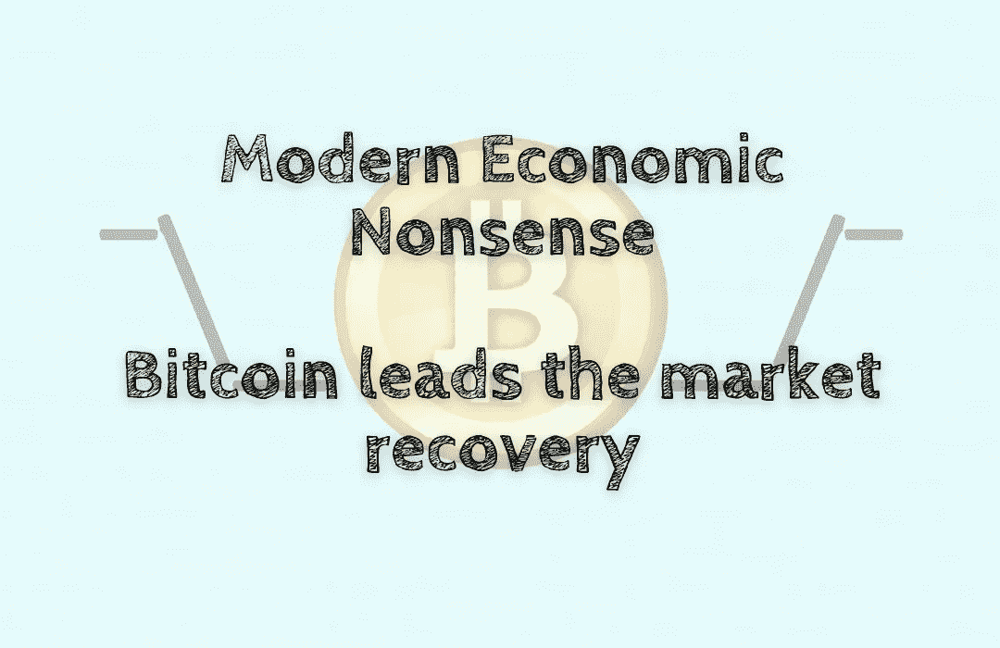

# 现代经济学废话——比特币引领市场复苏

> 原文：<https://medium.com/coinmonks/modern-economic-nonsense-bitcoin-leads-the-market-recovery-ca8310707b4f?source=collection_archive---------57----------------------->

加密货币市场继续飘红📉经过最近的抛售。比特币从 11 月中旬的历史高点 69，000 美元下跌了近 70%，而加密货币的总市值下降了约 1.9 万亿美元。然而，价格正显示出复苏的迹象。总市值已跌至 1 万亿以下，比特币占了近一半的价值。的…