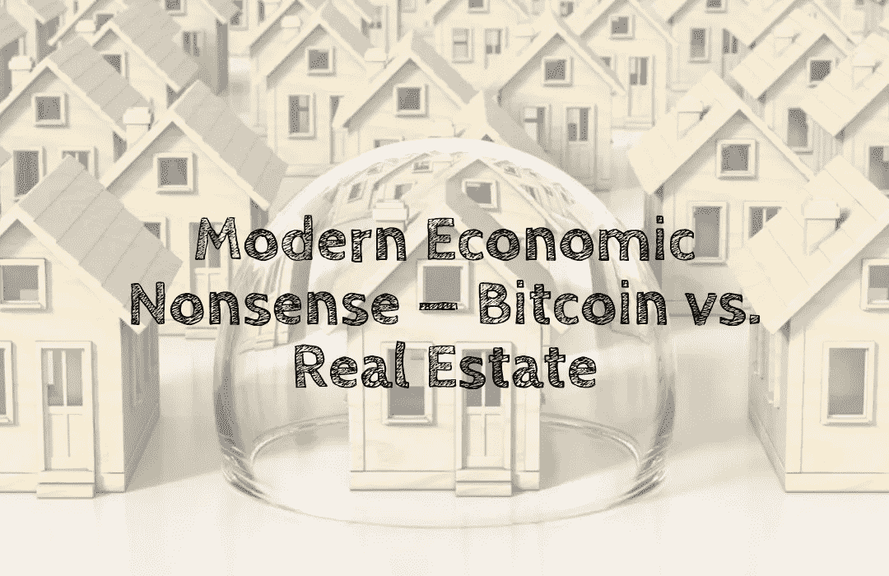

# 现代经济学废话——比特币与房地产

> 原文：<https://medium.com/coinmonks/modern-economic-nonsense-bitcoin-vs-real-estate-872dc3972507?source=collection_archive---------40----------------------->

银行讨厌比特币₿，他们对此无能为力。因此，他们一起加入。

对于摩根大通宣布投资比特币而非房地产，我并不感到意外。

房地产没有价值。它之所以昂贵，并不是因为它在任何理性意义上都有价值。人们不断购买房地产，因为…