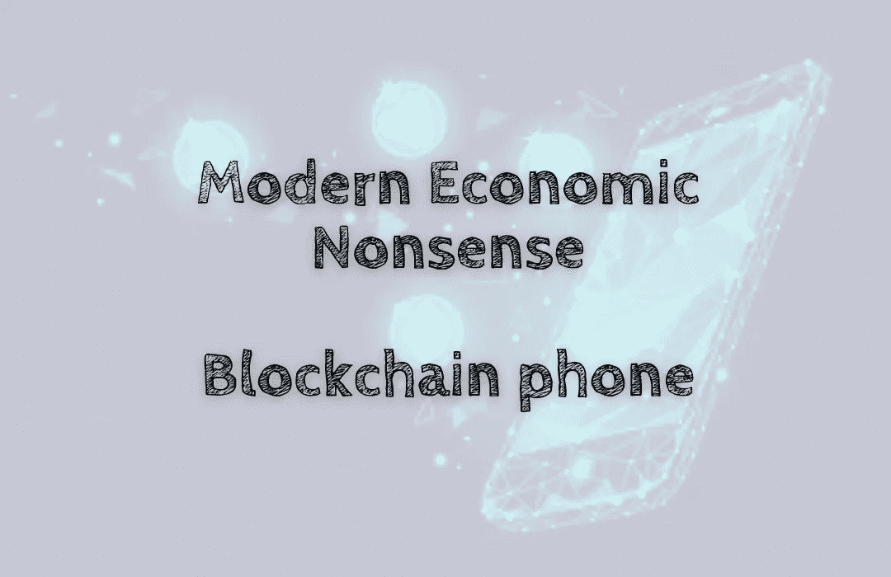

# 现代经济学废话——区块链手机

> 原文：<https://medium.com/coinmonks/modern-economic-nonsense-blockchain-phone-d013217c4ede?source=collection_archive---------27----------------------->

索拉纳实验室正在制造一款 Web3 手机📱。区块链手机将密码和手机结合在一起，会改变世界吗？

在过去的几年里，区块链智能手机市场呈指数级增长。越来越多的加密货币用户开始意识到区块链技术、其优势和用途。因此，越来越多的手机制造商开始…