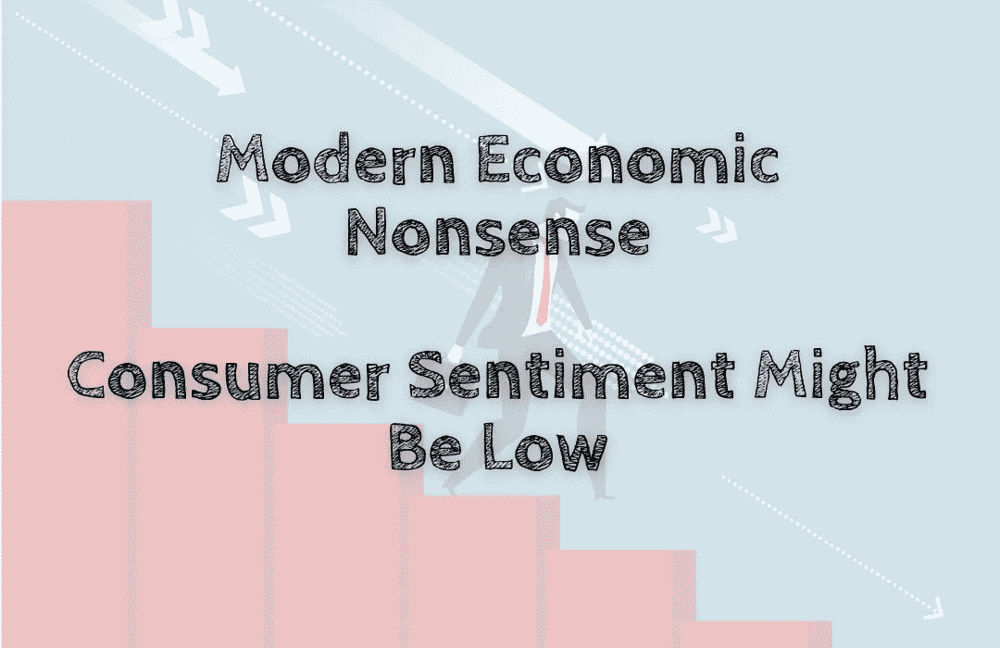

# 现代经济学废话——消费者情绪可能很低

> 原文：<https://medium.com/coinmonks/modern-economic-nonsense-consumer-sentiment-might-be-low-bd76f12c6faf?source=collection_archive---------44----------------------->

众所周知，美国消费者目前对经济感到有点悲观。事实上，今天的不确定性气候导致了消费者的普遍不信任，并使许多人不愿意花钱购买任何不是绝对必要的东西。考虑到这一点，企业必须意识到任何可能预示消费者减少的潜在危险信号…