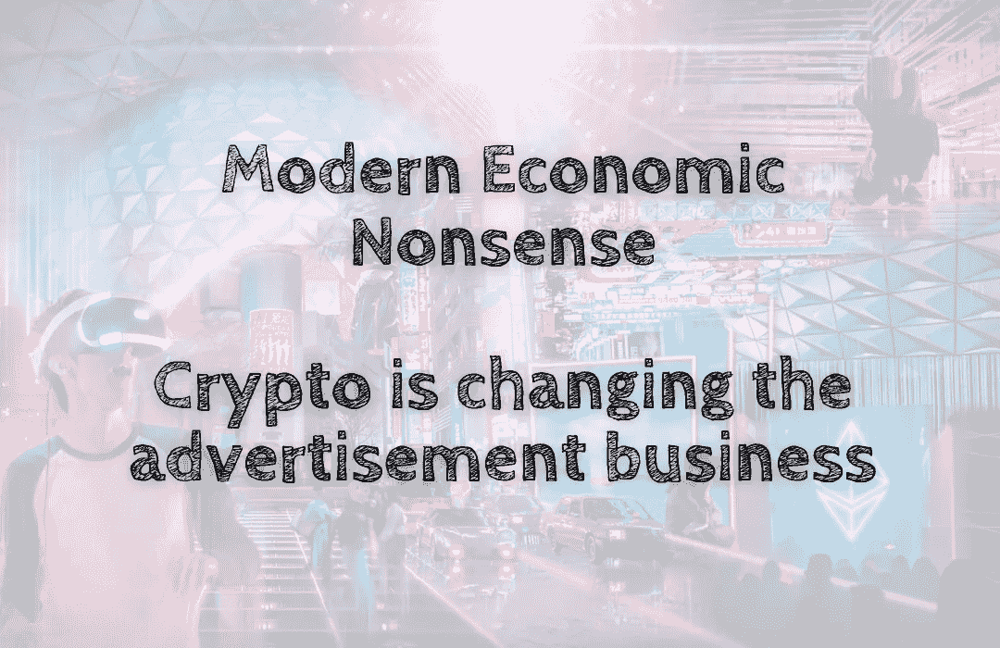

# 现代经济学废话——密码正在改变广告业

> 原文：<https://medium.com/coinmonks/modern-economic-nonsense-crypto-is-changing-the-advertisement-business-c1f41509c1a4?source=collection_archive---------56----------------------->

数字广告行业正在快速发展。根据 Statista 的数据，到 2020 年，全球市场总额预计将达到 2320 亿美元。随着社交媒体和数字内容的兴起，广告已经从传统的电视广告转向在线广告，例如出现在网站或移动应用程序中的广告。在过去的二十年里，数字广告已经…