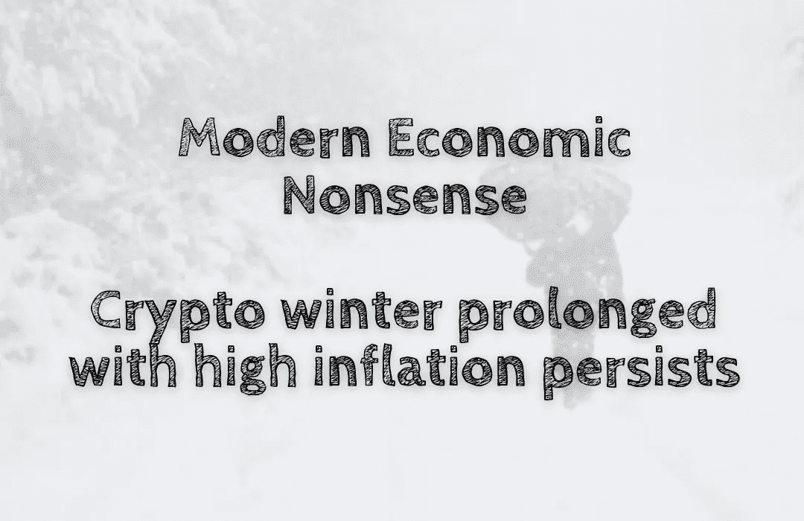

# 现代经济学废话——持续高通胀的隐性冬天

> 原文：<https://medium.com/coinmonks/modern-economic-nonsense-crypto-winter-prolonged-with-high-inflation-persists-63c2b59fb564?source=collection_archive---------36----------------------->

自 1 月初以来，随着价格下跌，这几个月对加密世界来说是具有挑战性的。然而，这也对更广泛的经济产生了影响，导致了高通胀率。加密货币被视为一种交易媒介，并不意味着要保存或储存以供未来使用。因此，持有加密货币…