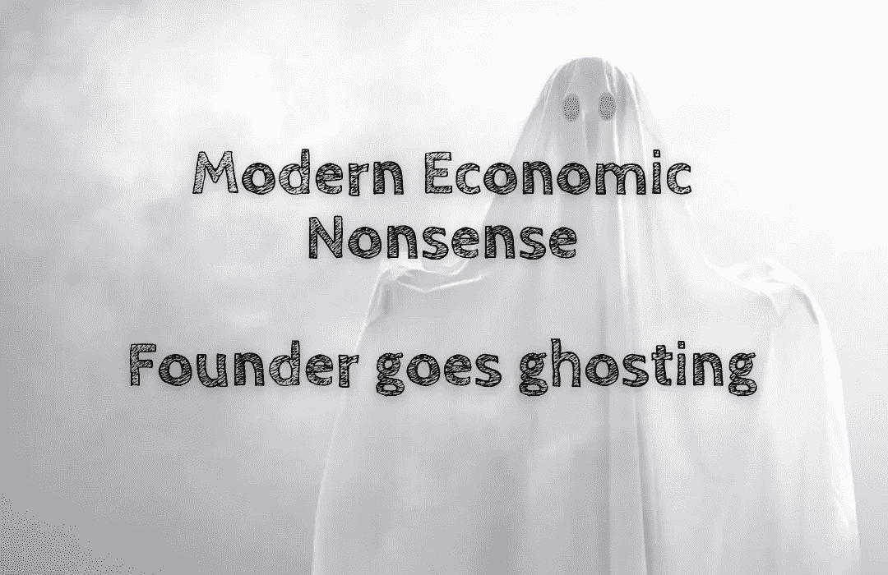

# 现代经济学废话——创始人消失了

> 原文：<https://medium.com/coinmonks/modern-economic-nonsense-founder-goes-ghosting-62a18b819ee5?source=collection_archive---------62----------------------->

当公司创始人消失时👻，你不得不担心公司会一去不复返。

然而，如果 crypto 的创始人消失了，你应该高兴的🥳！

当然，这并不能保证一个影子创始人会从 crypto 项目中受益，但它确实增强了社区可以独自运行 crypto 项目的信心。