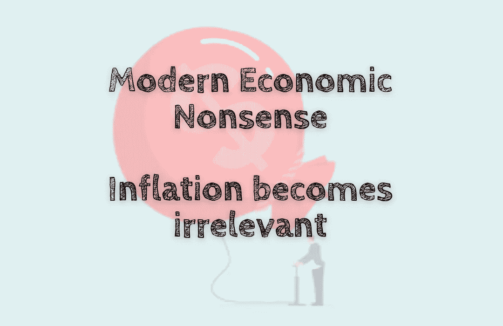

# 现代经济学废话——通货膨胀变得无关紧要

> 原文：<https://medium.com/coinmonks/modern-economic-nonsense-inflation-becomes-irrelevant-93456a1fdc9d?source=collection_archive---------43----------------------->

通货膨胀是个笑话。是作秀国放，逼着大家掏钱。

这位政府官员忽略了这句话。