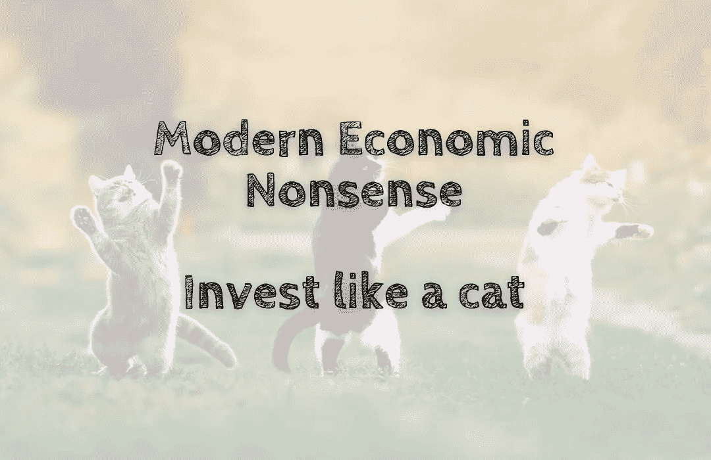

# 现代经济学废话——像猫一样投资

> 原文：<https://medium.com/coinmonks/modern-economic-nonsense-invest-like-a-cat-41fb74ba3b14?source=collection_archive---------55----------------------->

猫🐱可能是地球上最节俭和聪明的哺乳动物。他们知道如何跟踪、狩猎和捕捉猎物，如何定量供应食物，何时保存能量和停止所有不必要的活动，以及何时放弃和回家。简而言之，猫是天生的投资者。投资不是火箭科学。这是一个简单的常识，你会从任何渴望变得富有的人那里期待…