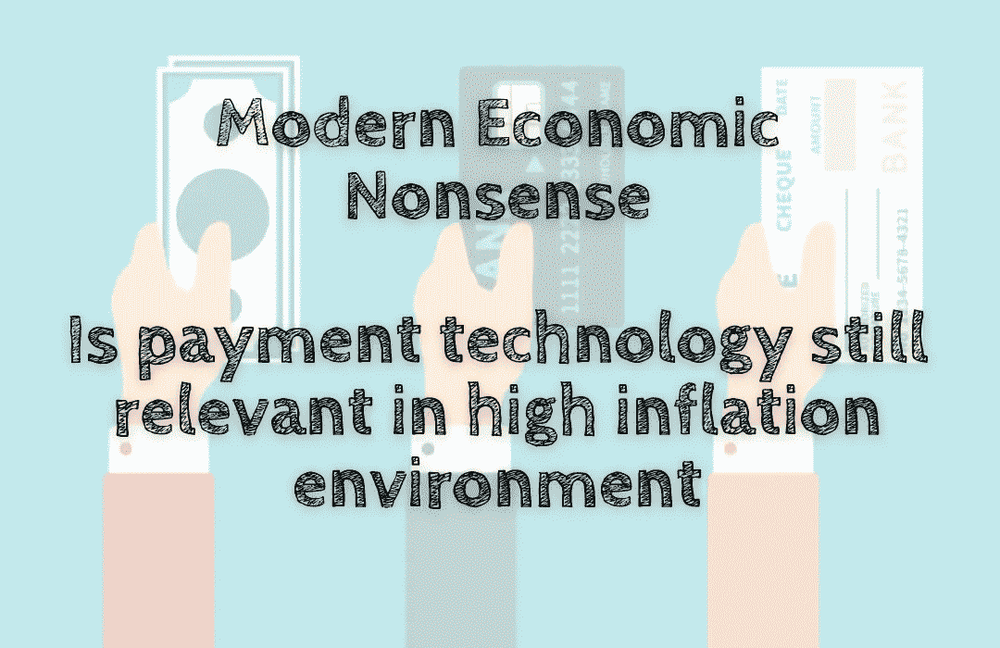

# 现代经济学废话——支付技术在高通胀环境下仍然适用吗

> 原文：<https://medium.com/coinmonks/modern-economic-nonsense-is-payment-technology-still-relevant-in-high-inflation-environment-c877f9cac35c?source=collection_archive---------42----------------------->

在高通胀的环境下，零售商和电商如何继续蓬勃发展？一种鲜为人知但非常有效的技术——虚拟货币或数字货币——可能是答案。当你考虑到千禧一代现在是美国劳动力中最大的一代，超过…