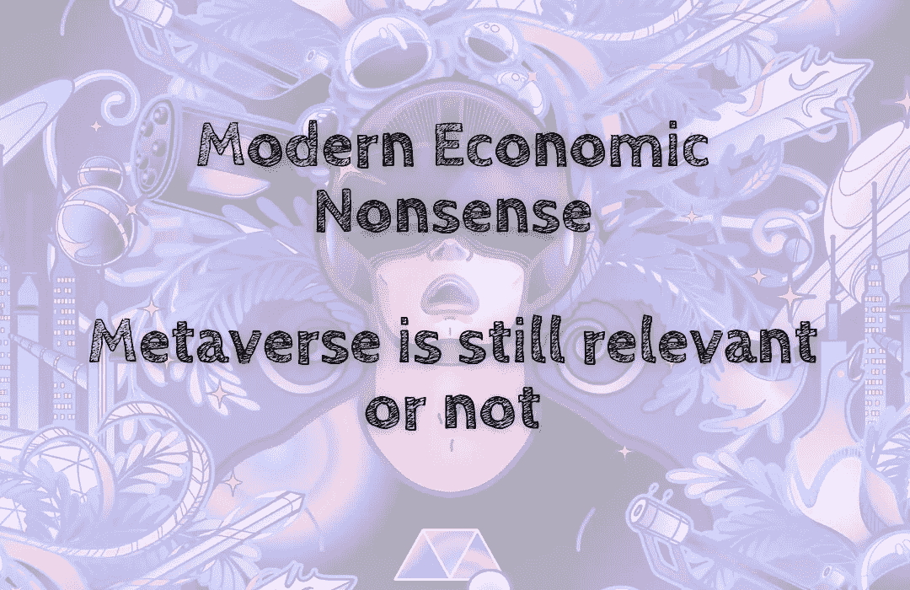

# 现代经济学废话——元宇宙是否仍然相关

> 原文：<https://medium.com/coinmonks/modern-economic-nonsense-metaverse-is-still-relevant-or-not-7795b9514796?source=collection_archive---------39----------------------->

元宇宙听起来像个失败者的藏身之处👎而不是冠军奖杯🏆。

现在年轻一代买不起任何东西。从教育到房地产，一切花费都超出了他们的想象。因此，他们没有时间在积累上一代人所能拥有的任何东西的同时积累财富。