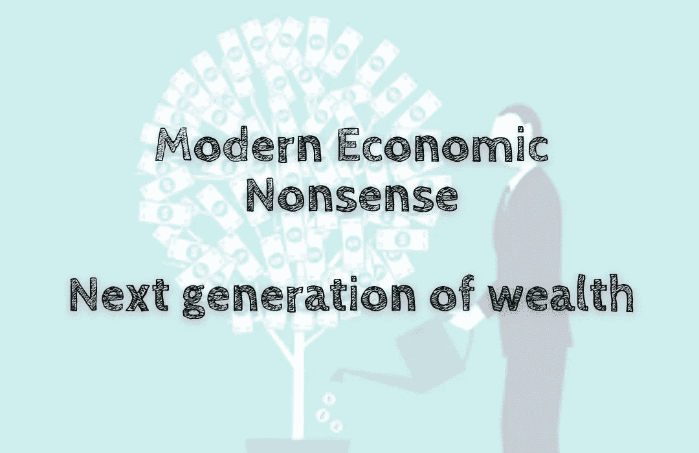

# 现代经济学废话——下一代财富

> 原文：<https://medium.com/coinmonks/modern-economic-nonsense-next-generation-of-wealth-b6d59e73bf30?source=collection_archive---------37----------------------->

个人财富现在比以往任何时候都更容易获得。开始投资比以往任何时候都更容易，投资成本也比以往任何时候都低。互联网已经使你可以在办公桌上直接投资股票市场，而且只需很少或不需要钱就可以开始投资。然而，我们看待财富的方式也发生了变化。它曾经是关于到达财务山的顶端并且停留在那里作为…