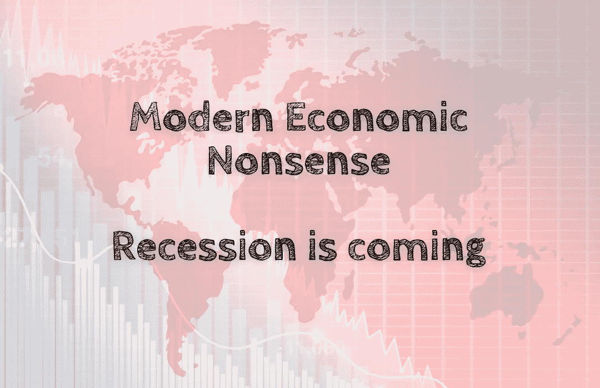

# 现代经济学废话——衰退即将到来

> 原文：<https://medium.com/coinmonks/modern-economic-nonsense-recession-is-coming-d6f1c861b344?source=collection_archive---------44----------------------->

全球经济是一个纸牌屋。2008 年的金融危机只是形势不妙的第一个迹象。自那以来，各国央行一直在通过量化宽松和创纪录的低利率人为刺激全球经济，以防止再次衰退。但是这些措施不能永远持续下去。当利率达到可能的最低点时，就没有进一步的…