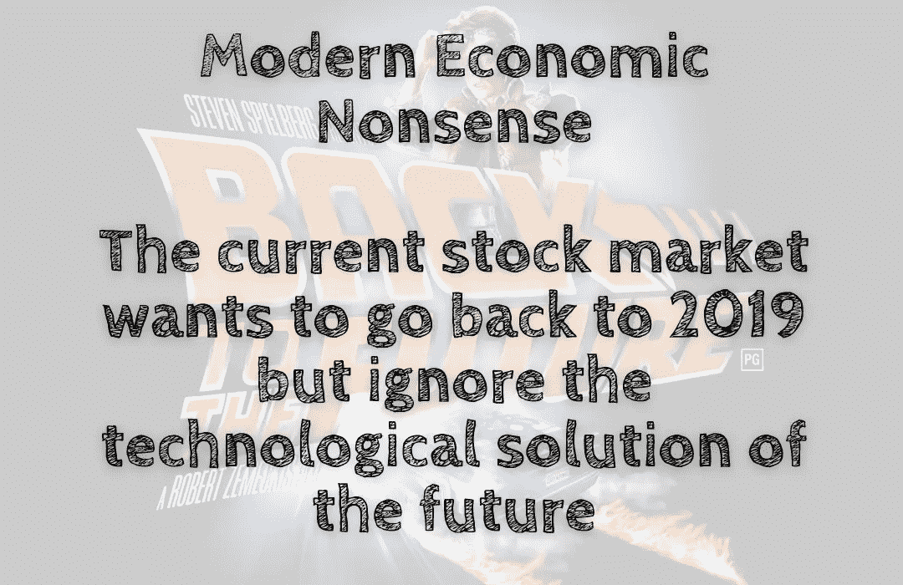

# 现代经济废话——当前的股市想要回到 2019 年，但却忽视了未来的技术解决方案

> 原文：<https://medium.com/coinmonks/modern-economic-nonsense-the-current-stock-market-wants-to-go-back-to-2019-but-ignore-the-3d246ee5aba4?source=collection_archive---------21----------------------->

当前的股票市场是向后看的，对未来感到悲观。

股市是近年来最畅销的肥皂剧。经济行为者的一举一动，一言一行，一颦一笑，都成了动股票的借口。在…