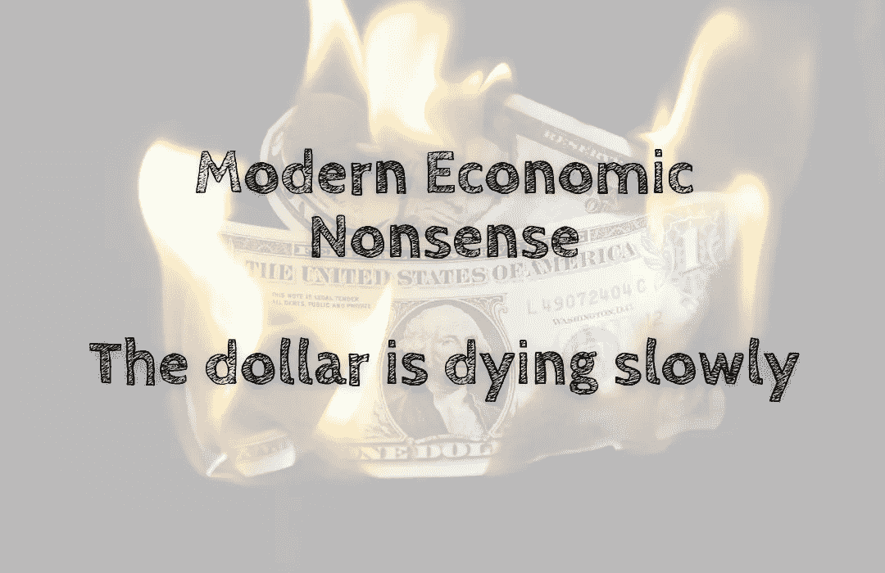

# 现代经济学废话——美元正在慢慢消亡

> 原文：<https://medium.com/coinmonks/modern-economic-nonsense-the-dollar-is-dying-slowly-2bed9ae289f1?source=collection_archive---------39----------------------->

美元不再是世界储备货币⚰️，这一点日益明显。新兴经济体正在减少对美元的敞口——有些甚至愿意付出沉重的代价。构成世界经济主体的国家已经厌倦了受美国的摆布，美国利用其全球货币超级大国的地位…