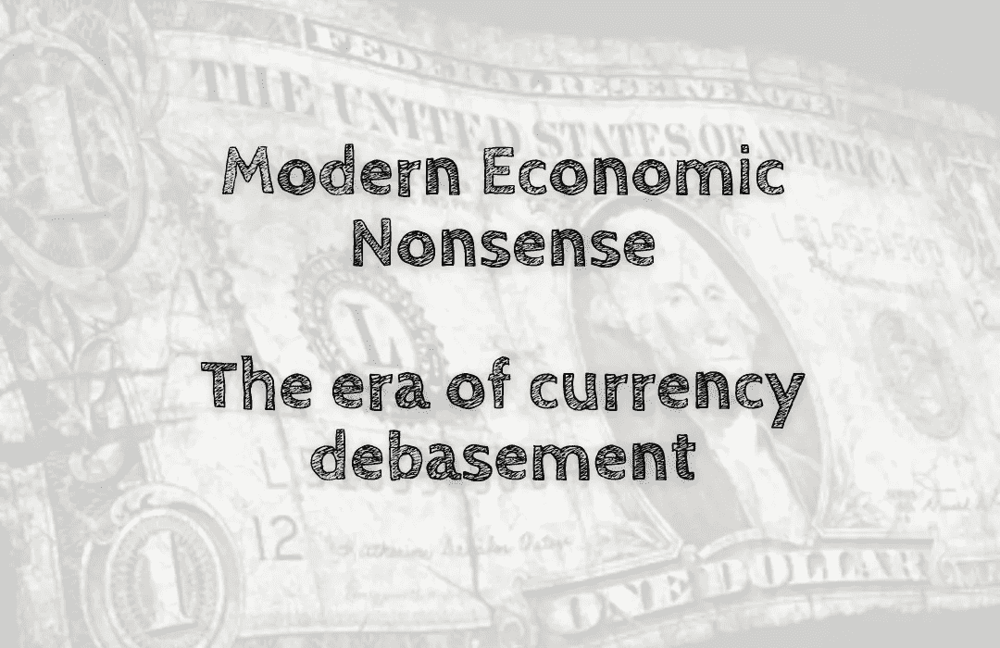

# 现代经济废话——货币贬值时代

> 原文：<https://medium.com/coinmonks/modern-economic-nonsense-the-era-of-currency-debasement-fc00d2d6b2e6?source=collection_archive---------60----------------------->

在 20 世纪早期，许多国家都在努力为一战买单。德国也不例外。到 1918 年 11 月，赔款支付已将该国债务推高至约 250 亿美元——接近其国内生产总值(GDP)的一半。面对不断增长的国债和不断萎缩的 GDP，德国的政策制定者转向了他们国家另一个丰富的资源:他们的中央银行，银行…