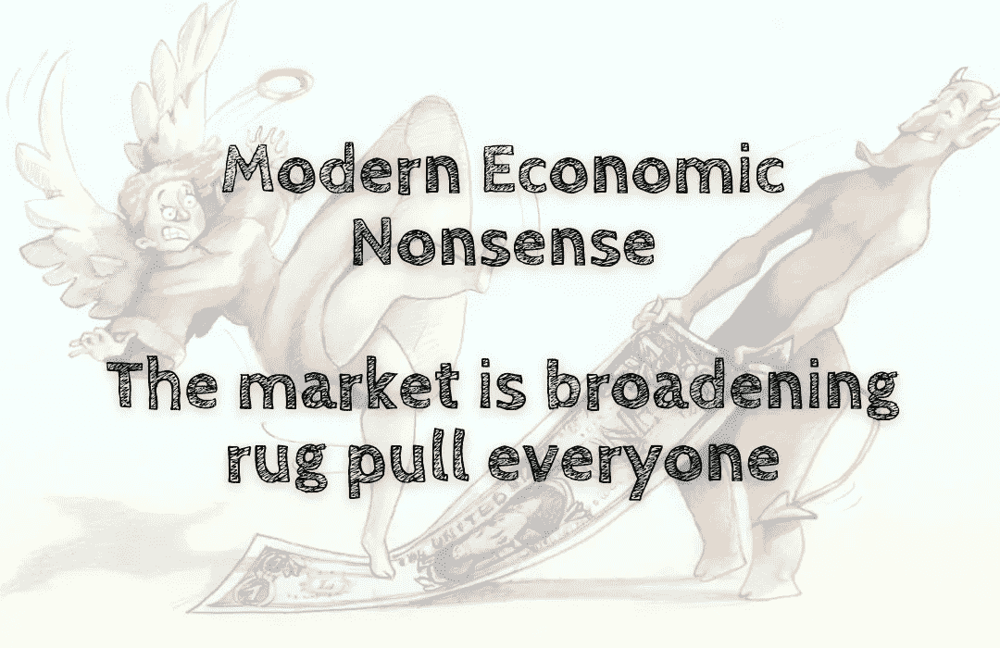

# 现代经济胡说八道——市场正在扩大，地毯拉每个人

> 原文：<https://medium.com/coinmonks/modern-economic-nonsense-the-market-is-broadening-rug-pull-everyone-8328dca4bda1?source=collection_archive---------72----------------------->

近年来，全球股市经历了一段充满挑战的时期，原因是供给和需求在不同的点出现了下降。然而，就像动荡的行业经常出现的情况一样，这种下跌带来了一些机会，如果市场保持在稳定水平，这些机会就不会出现。市场的多样性意味着每个人都能找到机会。所以……