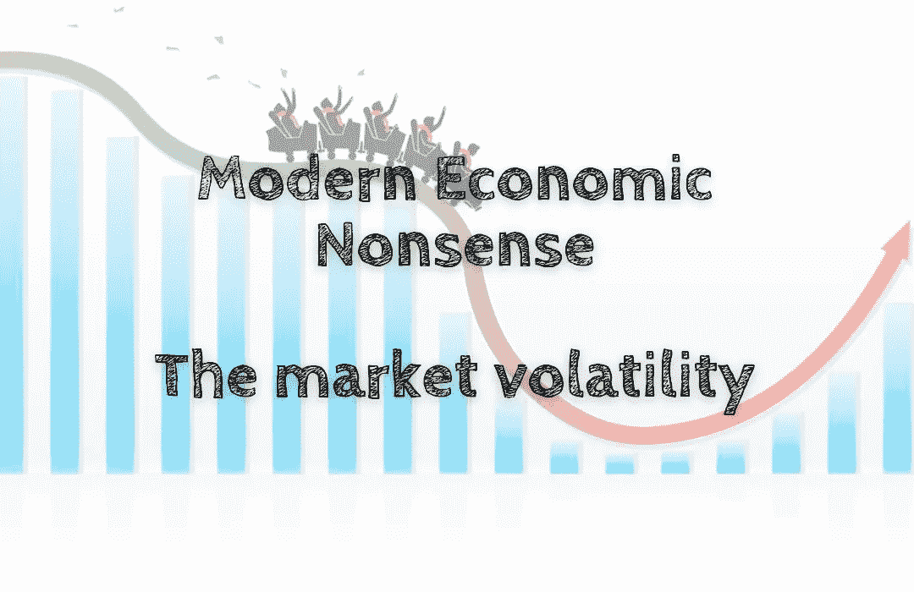

# 现代经济学废话——市场波动

> 原文：<https://medium.com/coinmonks/modern-economic-nonsense-the-market-volatility-e6ce86e20e7a?source=collection_archive---------53----------------------->

市场每天都有涨有跌。所以，如果你每天跟踪市场，你的心跳会跟着市场走💓。市场波动性描述了价格的风险程度。波动性越高，风险就越大。你应该担心波动性吗？或者你应该每天查看市场，看看它是否上涨📈或向下📉？