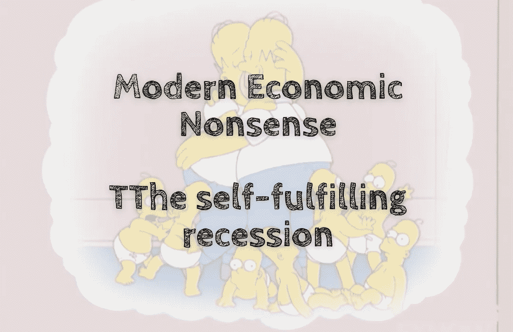

# 现代经济学废话——自我实现的衰退

> 原文：<https://medium.com/coinmonks/modern-economic-nonsense-the-self-fulfilling-recession-7456cc1637d6?source=collection_archive---------34----------------------->

全球经济陷入混乱。更糟糕的是，每个人都知道情况在好转之前只会变得更糟。消费者不敢花钱，企业不敢雇人，银行和投资者也不敢投资。在这种危险时期，企业应对风险的最佳方式是削减支出，尽可能保持流动性。不幸的是，那是…