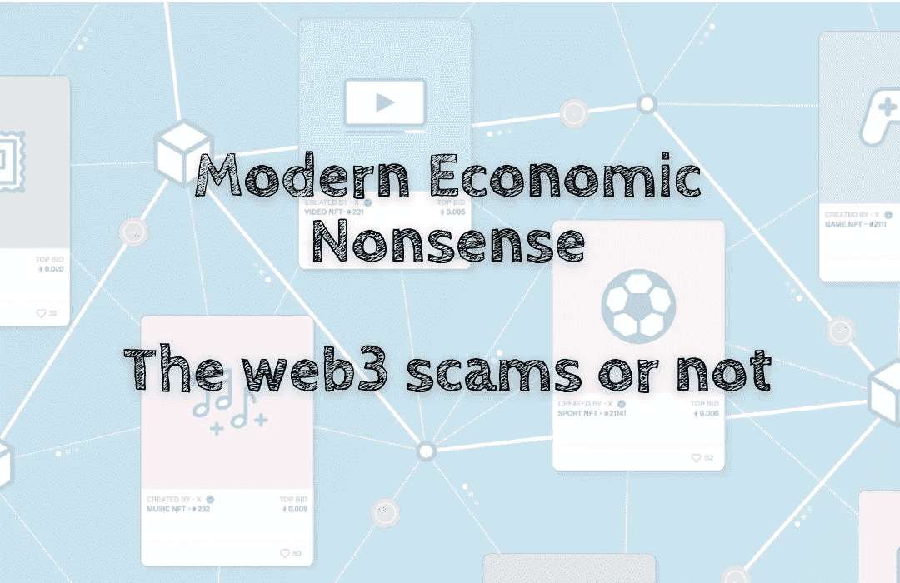

# 现代经济废话——网络 3 骗局与否

> 原文：<https://medium.com/coinmonks/modern-economic-nonsense-the-web3-scams-or-not-5bdff102e6fb?source=collection_archive---------27----------------------->

Web3 是骗局吗🤥？

是也不是。这取决于你如何看待它😶‍🌫️.

🤨不信？让我们看看 Dogecoin 吧。

Dogecoin 到底是不是🧙‍♂️的骗局币？

Dogecoin 的创始人之一杰克逊·帕尔默说他创造的 Dogecoin 确实是一个骗局！