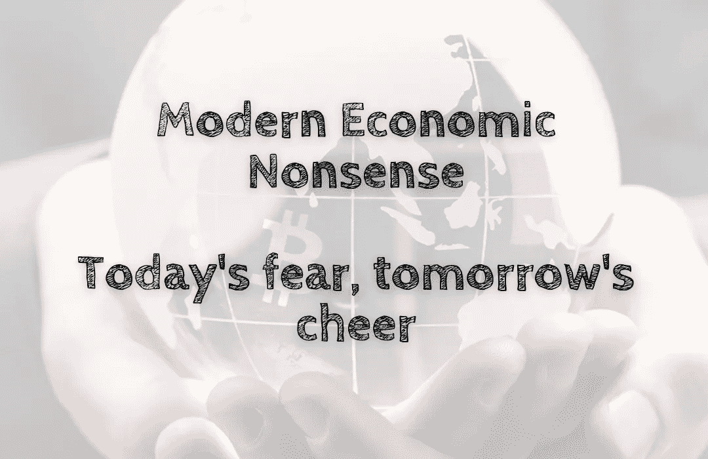

# 现代经济学废话——今天的恐惧，明天的欢呼

> 原文：<https://medium.com/coinmonks/modern-economic-nonsense-todays-fear-tomorrow-s-cheer-6055b10d6a46?source=collection_archive---------29----------------------->

我们都知道经济正在下滑👇最重要的是，你别无选择，只能跟着它走。如果你可以选择不这样做呢？

在软件、数据分析和人工智能的进步，以及移动应用程序和应用程序的日益普及的推动下，金融界正在进入一个数字化转型的时代