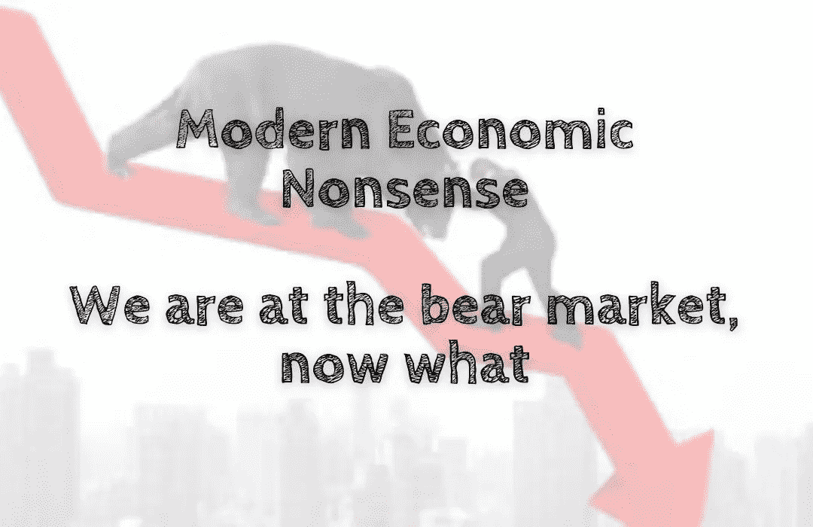

# 现代经济学废话——我们正处于熊市，现在该怎么办

> 原文：<https://medium.com/coinmonks/modern-economic-nonsense-we-are-at-the-bear-market-now-what-b51bbd63219b?source=collection_archive---------53----------------------->

是的，我们正处于熊市🐻，而且对数字货币交易者也不是很好。然而，这也是新投资者以较低价格进入市场的机会🍻。有句话叫‘危机是变相的机遇’，这句话用在这里再合适不过了。最近几个月，加密货币市场经历了大量波动。价格已经…