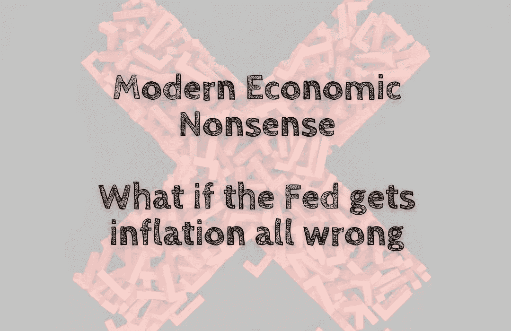

# 现代经济学废话——如果美联储完全弄错了通货膨胀会怎样

> 原文：<https://medium.com/coinmonks/modern-economic-nonsense-what-if-the-fed-gets-inflation-all-wrong-467a266d8df1?source=collection_archive---------44----------------------->

有很多关于美联储错误控制通货膨胀的新闻，但是如果他们真的错了呢😱？随着美联储开始新一轮会议，人们应该扪心自问。中国央行自 1994 年以来首次大幅加息，并暗示可能很快会进一步加息。但这并不意味着我们将看到高通胀的结束。只是……