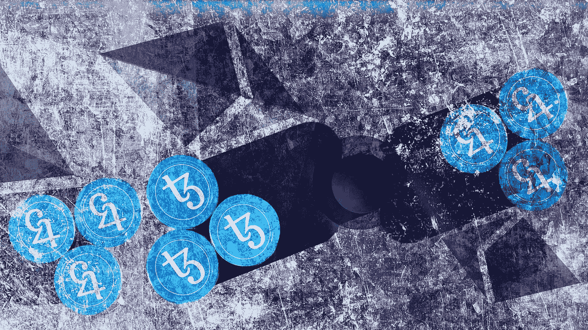

# 现代经济学废话——参与式经济

> 原文：<https://medium.com/coinmonks/modern-economical-nonsense-participatory-economy-97a2fd4e60e1?source=collection_archive---------57----------------------->

Photo by [Alejo Reinoso](https://unsplash.com/@alejoreinoso?utm_source=unsplash&utm_medium=referral&utm_content=creditCopyText) on [Unsplash](https://unsplash.com/s/photos/participation?utm_source=unsplash&utm_medium=referral&utm_content=creditCopyText)

DAO 或分散自治组织是未来 Web3 公司可能采用的经营业务的新趋势。讨论中缺少了一个可行的部分——参与者。这项技术已经开发出来，并在继续改进。但是，讨论的本质部分是如何培养参与者。最终，你是在建立一个社区，而不是一个…