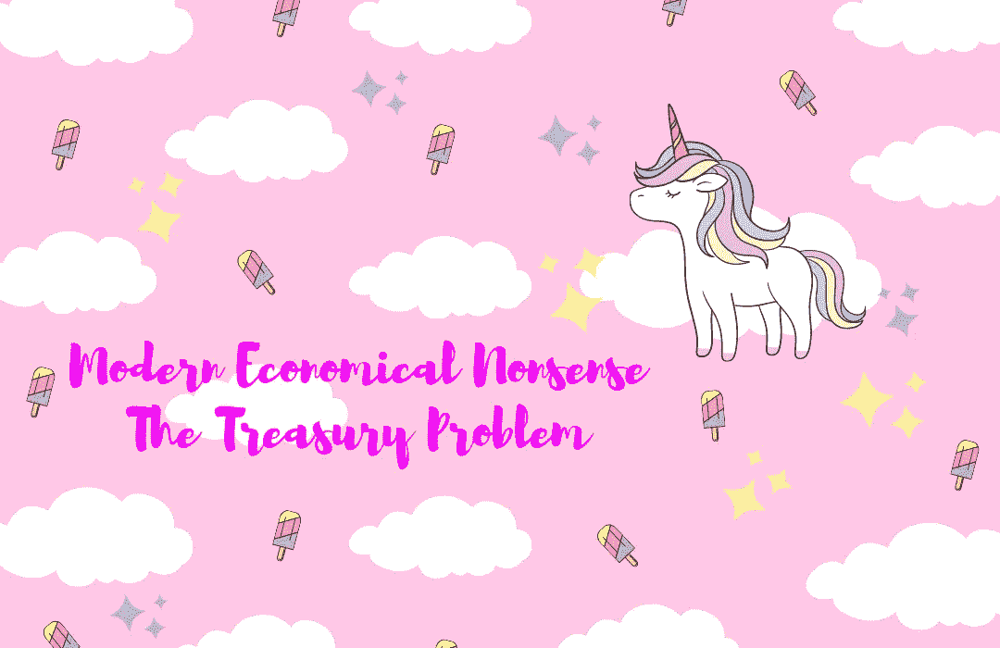

# 现代经济学废话——财政问题

> 原文：<https://medium.com/coinmonks/modern-economical-nonsense-the-treasury-problem-ca6a3a318aee?source=collection_archive---------44----------------------->

我评论了 UST 是如何崩溃的，并引用了:

> UST 是一种所谓的算法稳定币，这意味着它没有现金或现金等价物等资产的支持。相反，它依靠交易和资金管理来保持其价值。

在市场调整期间，[假流动性](https://www.bloomberg.com/news/articles/2022-05-12/yellen-says-terra-meltdown-demonstrates-crypto-stablecoin-risks)不会起作用。