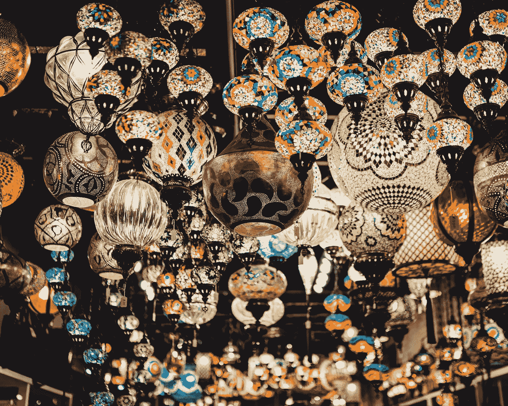

# 现代经济废话——VUCA 世界

> 原文：<https://medium.com/coinmonks/modern-economical-nonsense-the-vuca-world-9b61dd84f5c8?source=collection_archive---------50----------------------->

Photo by [Clayton Malquist](https://unsplash.com/@cmalquist?utm_source=unsplash&utm_medium=referral&utm_content=creditCopyText) on [Unsplash](https://unsplash.com/s/photos/chaotic?utm_source=unsplash&utm_medium=referral&utm_content=creditCopyText)

你认为我们正在进入一个混乱的世界吗？如果你有这种感觉，没关系。因为当我们周围存在不确定性时，人类的本能会自动感到恐惧。恐惧是完全正常的。然而，我们可以找到一种方法来度过这种可怕的情况。

我们来探索一下。