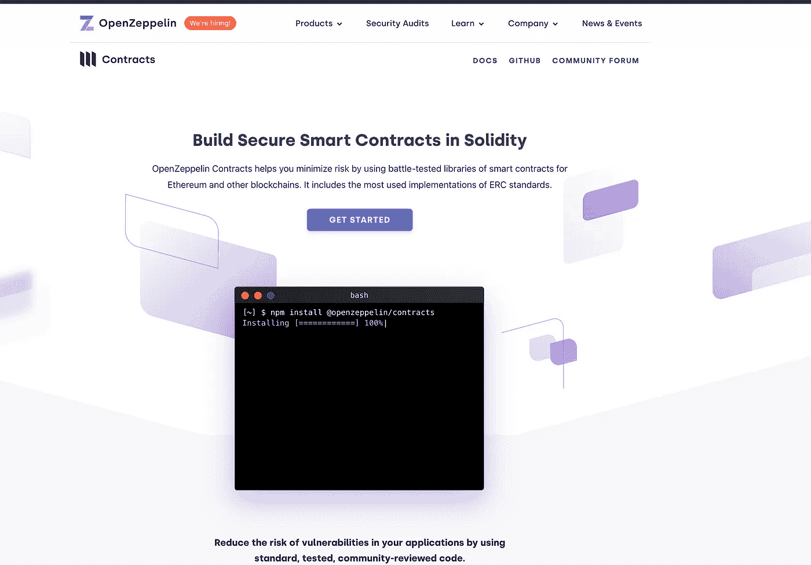

# 开发智能合同的模块

> 原文：<https://medium.com/coinmonks/module-to-develop-smart-contract-88ac98e23352?source=collection_archive---------25----------------------->

使用 OpenZeppelin

OpenZepplin website screenshot

## 在后台

学习 solidity 很有趣，也很吸引人，可能是因为它更像 javascript 和类型化语言。稳健性的学习曲线并不像预期的那样艰难，但在区块链开发智能合约也不是火箭科学。在今天的故事中，我们将讨论帮助我们…