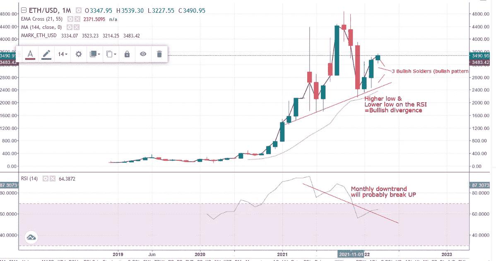

# 动量和移动平均线

> 原文：<https://medium.com/coinmonks/momentum-and-moving-averages-fa2f073b8b73?source=collection_archive---------13----------------------->

## 什么涨，只能涨，永远涨。

我对均线和动量做了一点研究，偶然发现了一些想法，并得出了一些结论。写这篇文章的时间是 2022 年 2 月 4 日，空气中弥漫着春天的气息。

Daily chart, April 2, 2022

开始我的一天，我总是看以太坊图表，这就是我的生活方式。我保留了一个移动平均交叉指标，将 21 日均线作为短均线，将 55 日均线作为长均线，您可以在您的移动平均交叉指标首选项中调整这些设置。21 日移动平均线给出了短期趋势(2-6 周)的概念，55 日移动平均线给出了中期框架(3-6 个月)的概念，21 日移动平均线穿过 55 日移动平均线，你可以计算出未来几个月-几周将有一个良好的持续上升趋势，所以你可以长期持有一些战术多头头寸。在 21 天和 55 天移动平均线旁边，我使用 144 天移动平均线来表示长期趋势(6-12 个月)。这些数字与斐波那契数列相关，在投资者和交易者中非常普遍。目前，以太坊图的价格突破了 144 天移动平均线，但中短期(21-55 天)仍然低于 144 天，所以我们有点逆转了长期趋势，即使我们还没有到那一步。

除此之外，我还在尝试动量指标，我仍然更喜欢标准设置的相对强度指数(RSI ),它能给我方向感和动量感。为了分析短期-中期-长期的趋势，我简单地在日-周-月条形图之间切换，不考虑它背后的价值和方向。

将所有这些放在一个工作表中:

My OpenOffice Calc Worsheet

正如你所看到的，平均线是向上的，所以如果你想在这里做空，要非常小心。只有这个谜让我好奇，所以我问自己，21 天的马什么时候穿过 144 天？可能吗？

如果我看的话，周线和月线的 RSI 都是向上的，但是实际趋势仍然是向下的，假设我们终止了这个趋势。我不能说谎，这是免费的财务建议。

为了完成这篇文章，我会在每周和每月的图表上做广告，以防你想弄清楚一些事情…祝你愉快&感谢阅读。

Ethereum Weekly Bar Chart, 2/04/2022

Ethereum Monthly Bar Chart, 02/04/22

> *加入 Coinmonks* [*电报频道*](https://t.me/coincodecap) *和* [*Youtube 频道*](https://www.youtube.com/c/coinmonks/videos) *了解加密交易和投资*

# 另外，阅读

*   [3 商业评论](/coinmonks/3commas-review-an-excellent-crypto-trading-bot-2020-1313a58bec92) | [Pionex 评论](https://coincodecap.com/pionex-review-exchange-with-crypto-trading-bot) | [Coinrule 评论](/coinmonks/coinrule-review-2021-a-beginner-friendly-crypto-trading-bot-daf0504848ba)
*   [莱杰 vs n rave](/coinmonks/ledger-vs-ngrave-zero-7e40f0c1d694)|[莱杰 nano s vs x](/coinmonks/ledger-nano-s-vs-x-battery-hardware-price-storage-59a6663fe3b0) | [币安评论](/coinmonks/binance-review-ee10d3bf3b6e)
*   [Bybit Exchange 审查](/coinmonks/bybit-exchange-review-dbd570019b71) | [Bityard 审查](https://coincodecap.com/bityard-reivew) | [Jet-Bot 审查](https://coincodecap.com/jet-bot-review)
*   [3 commas vs crypto hopper](/coinmonks/3commas-vs-pionex-vs-cryptohopper-best-crypto-bot-6a98d2baa203)|[赚取加密利息](/coinmonks/earn-crypto-interest-b10b810fdda3)
*   最好的比特币[硬件钱包](/coinmonks/hardware-wallets-dfa1211730c6) | [BitBox02 回顾](/coinmonks/bitbox02-review-your-swiss-bitcoin-hardware-wallet-c36c88fff29)