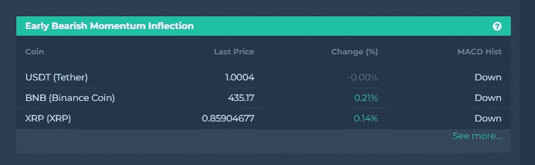
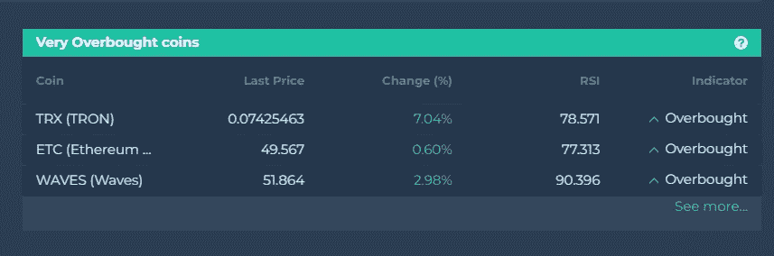
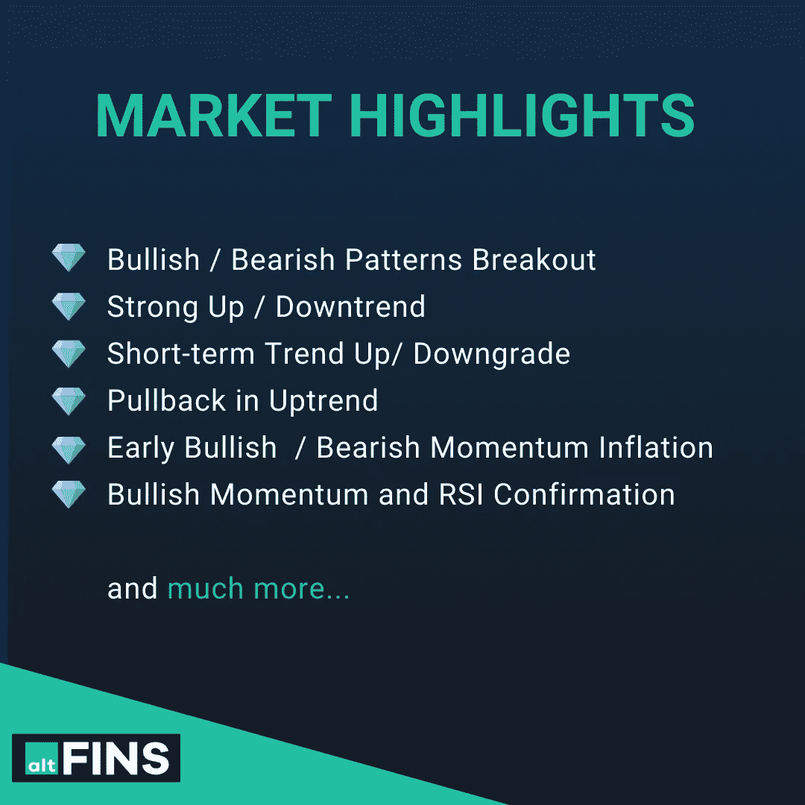

# 势头在阻力处停顿！

> 原文：<https://medium.com/coinmonks/momentum-pause-at-resistance-7b33affaf244?source=collection_archive---------37----------------------->

在[视频](https://youtu.be/xfK0J9im3w4?utm_source=sendinblue&utm_campaign=Market%20Update%20video%20Momentum&utm_medium=email)中，我们将看到一些早期迹象，表明市场涨势正在失去动力，我们可能会看到回调。忽视这些，后果自负。

Source: altFINS

**我们展示了两种简单的方法来寻找可能是回调时机的替代币，并帮助你避免损失！！…并准备在上涨趋势中逢低买入。**

我们在视频中提到的硬币有 BNB、XRP、阿达、圆点、LTC、CRO、波浪和 ZIL。

加密市场在过去的两周里经历了一个非常好的上涨，从下跌的楔形或下降的三角形模式中出现了坚实的突破，打破了阻力区，标志着趋势反转。

我们仍然看涨，并认为这一上升趋势还将继续；然而，市场从来不会直线上升，即使在上升趋势中也会有回调。

现在，如果你是那种不在乎上下波动的趋势交易者，愿意安然度过，那很好。

但是，你们中的一些人可能会选择波动的时间，当价格上涨太快时，可能会减少仓位，当市场下跌时，增加仓位。

在我们看来，在过去两周上涨 20-40%后，交易者正在获利了结，当我们接近下一个阻力区时，势头开始消退，在某些情况下，阻力非常大。

**有两个简单的市场屏幕可以帮助识别时机成熟可以回调的硬币。**您可以在我们新的[市场亮点](https://platform.altfins.com/dashboard?utm_source=sendinblue&utm_campaign=Market%20Update%20video%20Momentum&utm_medium=email)仪表盘上找到它们:

**1。前期看跌势头拐点**(见[实况结果](https://platform.altfins.com/screener?tab=COINS&timeInterval=60&filters=R%253Cmdi%252CMACD%252CMACD_SIGNAL_LINE%252C1.0%252C%253E~R%253Cmdi%252CMACD_HISTOGRAM%252CMACD_HISTOGRAM_H2%252C16.0%252C1.0%253E~A%253Cmdi%252CMARKET_CAP%252C5000000.0%252C%253E&utm_source=sendinblue&utm_campaign=Market%20Update%20video%20Momentum&utm_medium=email))

**2。非常超买的硬币**(参见[现场结果](https://platform.altfins.com/screener?tab=COINS&timeInterval=60&filters=R%253Cmdi%252CMACD%252CMACD_SIGNAL_LINE%252C1.0%252C%253E~R%253Cmdi%252CMACD_HISTOGRAM%252CMACD_HISTOGRAM_H2%252C16.0%252C1.0%253E~A%253Cmdi%252CMARKET_CAP%252C5000000.0%252C%253E&utm_source=sendinblue&utm_campaign=Market%20Update%20video%20Momentum&utm_medium=email))

[**前期看跌势头拐点**](https://platform.altfins.com/screener?tab=COINS&column=MARKET_CAP&filters=C%253CR%253Cmdi%252CMACD%252CMACD_SIGNAL_LINE%252C1.0%252C%253E%253BR%253Cmdi%252CMACD_HISTOGRAM%252CMACD_HISTOGRAM_H2%252C16.0%252C1.0%253E%253BA%253Cmdi%252CMARKET_CAP%252C5000000.0%252C%253E%253E&desc=true&utm_source=sendinblue&utm_campaign=Market%20Update%20video%20Momentum&utm_medium=email)

不管趋势方向如何(上升趋势或下降趋势)，价格都会上下波动。这些波动可以被 **MACD** 捕捉到，这是一个强有力的趋势和动力指标。

为了检测动量的早期变化，altFINS 使用了 **MACD 直方图的变化。**

这个市场屏幕显示的是价格从上涨转向下跌的硬币(**熊市动能拐点**)。

**交易规则:**

*   (做空)卖出 MACD 柱状图中出现熊市拐点(下跌)的硬币(下跌)
*   当 MACD 柱状图开始上升时买入
*   早期的看跌势头拐点也可以作为交易者在上涨后获利了结或平仓的早期警告。

阅读更多关于[**MACD 线和 MACD 信号线**](https://altfins.com/knowledge-base/macd-line-and-macd-signal-line/?utm_source=sendinblue&utm_campaign=Market%20Update%20video%20Momentum&utm_medium=email#link4)
观看教育视频 [**MACD 柱状图拐点**](https://youtu.be/W9n38V62uZo?list=PLNlNgWHBv3Z2Oj_0wtB7qMMUJDZA0Ec-4&utm_source=sendinblue&utm_campaign=Market%20Update%20video%20Momentum&utm_medium=email)
观看教程视频[**检测前期势头(MACD 柱状图)看涨或看跌拐点**](https://youtu.be/9BeFcXNfbZI?utm_source=sendinblue&utm_campaign=Market%20Update%20video%20Momentum&utm_medium=email)

Source: altFINS

[**超买严重的硬币**](https://platform.altfins.com/screener?tab=COINS&column=MARKET_CAP&filters=C%253CA%253Cmdi%252CRSI14%252C75.0%252C%253E%253BA%253Cmdi%252CMARKET_CAP%252C5000000.0%252C%253E%253E&desc=true&utm_source=sendinblue&utm_campaign=Market%20Update%20video%20Momentum&utm_medium=email)
这种摇摆交易策略寻找超买严重且有可能回调(修正)的替代硬币，尤其是在阻力区附近交易时。这是买家开始获利的地方。

**交易规则:**

*   寻找超买的替代币(RSI > 75)
*   如果价格在阻力区附近，卖出
*   当 RSI 高于 70 时，资产价格被认为是超买(由于修正)。一些交易者使用更极端的水平(75)来减少错误的读数。

**相对强弱指数(RSI)** 是一个动量指标，衡量最近价格变化的幅度，以分析超买或超卖的情况。RSI 会随着正面收盘数量和规模的增加而上升，随着亏损数量和规模的增加而下降。

RSI 值的范围从 0 到 100。

阅读更多关于 [**极度超买硬币到期回调**](https://altfins.com/knowledge-base/overbought-altcoins-due-for-pullback/?utm_source=sendinblue&utm_campaign=Market%20Update%20video%20Momentum&utm_medium=email)

观看教程视频 [**极度超买的替代币，因回调而仍处于上升趋势**](https://youtu.be/kV4YLLHwVSc?utm_source=sendinblue&utm_campaign=Market%20Update%20video%20Momentum&utm_medium=email)

Source: altFINS

欲了解更多信息，请访问 [altFINS 平台。](https://platform.altfins.com/)

Source: altFINS

> 加入 Coinmonks [电报频道](https://t.me/coincodecap)和 [Youtube 频道](https://www.youtube.com/c/coinmonks/videos)了解加密交易和投资

# 另外，阅读

*   [CoinLoan 审查](https://coincodecap.com/coinloan-review) | [YouHodler 审查](/coinmonks/youhodler-4-easy-ways-to-make-money-98969b9689f2) | [BlockFi 审查](https://coincodecap.com/blockfi-review)
*   XT.COM 评论 | [币安评论](https://coincodecap.com/xt-com-review)
*   [SmithBot 评论](https://coincodecap.com/smithbot-review) | [4 款最佳免费开源交易机器人](https://coincodecap.com/free-open-source-trading-bots)
*   [比特币基地僵尸程序](/coinmonks/coinbase-bots-ac6359e897f3) | [AscendEX 审查](/coinmonks/ascendex-review-53e829cf75fa) | [OKEx 交易僵尸程序](/coinmonks/okex-trading-bots-234920f61e60)
*   [如何在印度购买比特币？](/coinmonks/buy-bitcoin-in-india-feb50ddfef94) | [瓦济克斯审查](/coinmonks/wazirx-review-5c811b074f5b)